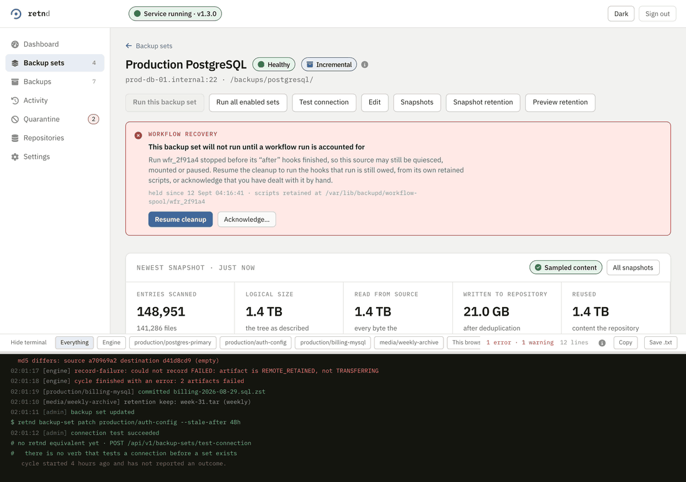
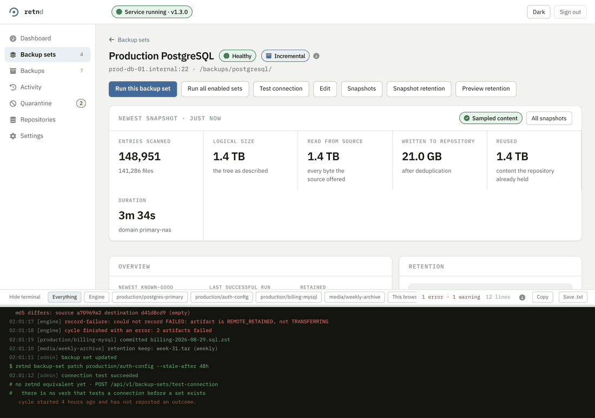
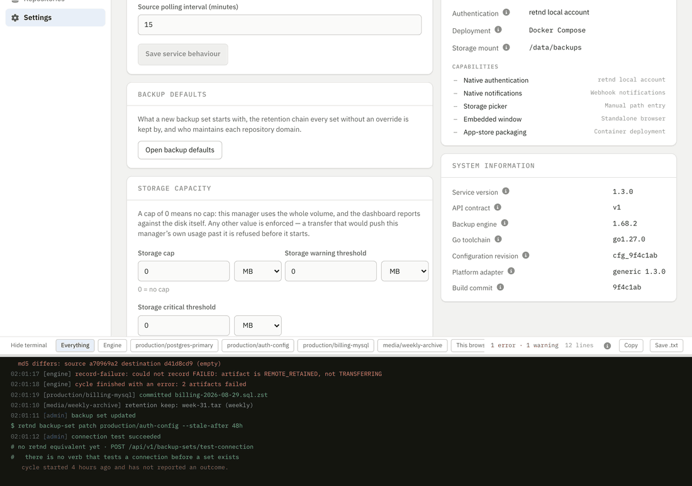

<p align="center">
  <picture>
    <source media="(prefers-color-scheme: dark)" srcset="docs/assets/logo-dark.svg">
    
  </picture>
</p>


A backup producer somewhere writes a dump, an archive or a snapshot to disk. That machine
has finite space, so something has to move the artifact off it and something has to delete
the original. retnd is the half of that job that runs on the NAS: it discovers
finished artifacts on the remote server over SFTP, pulls them, verifies them, commits them
durably, records that it did, and only then removes the remote copy.

It is a standalone Go binary that **embeds pinned rclone Go packages**. It does not fork
rclone, and it does not shell out to the `rclone` CLI for normal data movement. There are
two surfaces over the same engine: `retnd` at a terminal, and a web UI on the LAN. Everything
an operator can DO in the browser has an equivalent command, and that is a gate rather than
an intention: a route with neither a command behind it nor a written reason there is none
fails the build.

**If you just want to run it:** [Installing it](#installing-it) is two commands on any
machine with Docker.

**If you're here because a backup didn't arrive and it's 3am:** go straight to
[`docs/recovery.md`](docs/recovery.md) — or, for a backup set on the
incremental engine, [`docs/incremental-runbooks.md`](docs/incremental-runbooks.md).

**The same material as pages, with pictures**, is the published site: [the first-run
tutorial](https://retnd.github.io/retnd/first-run.html), [the web interface in
motion](https://retnd.github.io/retnd/web-ui.html), [SSH and
connections](https://retnd.github.io/retnd/ssh.html), and [the
reference](https://retnd.github.io/retnd/reference.html), which carries every
screen of the browser interface and every `retnd` command with its flags. It is generated
from [`docs/site/`](docs/site/) in this repository. The site is the source of truth for how
to install the product and how to drive it; this document is the engineering account behind
it, and where the two ever disagree about install or operator surfaces, the site is right.

## Installing it

Two commands, no arguments, on any machine with Docker:

```bash
curl -fsSLO https://raw.githubusercontent.com/retnd/retnd/main/scripts/install/install_docker_host.py
python3 install_docker_host.py install
```

[`scripts/install/install_docker_host.py`](scripts/install/install_docker_host.py)
is one file, and that is the point: it needs no checkout beside it, nothing else from this
project on disk, and nothing outside the Python standard library, because an operator
installing onto a NAS does not have a git clone there. The canonical Compose runtime is
embedded in it, generated from [`container/compose.yaml`](container/compose.yaml) and held
to that file byte for byte by a test.

```text
==> Installed.
    Web UI:  http://10.0.0.10:8080
    Compose: docker compose -p retnd --env-file /home/you/retnd/.env -f /home/you/retnd/compose.yaml -f /home/you/retnd/compose.image.yaml

    No config.yaml was written, on purpose. Issue #176 shipped a first-run setup flow
    precisely so that a fresh install does not need one hand-written before it starts.
    Open the Web UI and follow it. The enrollment link is in the engine's log:
      docker compose -p retnd --env-file /home/you/retnd/.env -f /home/you/retnd/compose.yaml -f /home/you/retnd/compose.image.yaml logs retnd | grep enroll
```

It picks every path for you — `~/retnd`, with `backups`, `state`, `config` and
`secrets` under it — generates the SSH keypair the engine will use, pins the exact image it
was built against, and refuses before it changes anything if the machine cannot run it.
Nothing needs deciding up front, and everything it chose can be changed afterwards. A
**defaulted** credential path that does not exist is created; an **explicitly named** one
that does not exist is still a refusal, because generating a different key under a path you
typed would hand you one the far host has never seen while reporting success, and an
existing key is never regenerated whatever its age. Directories it creates are born `0700`,
and ones that already exist only lose group and world write, because the engine refuses an
SSH key whose whole ancestry is not tight, not just the key file.

`python3 install_docker_host.py preflight` runs every one of those checks and installs
nothing.

### The enrolment link is minted by the engine, not by the installer

The last line of that epilog is a command rather than a result, and it is the one that
matters. The engine mints the enrolment token during startup and writes the notice to its
own log, so the installer prints the line that reads it back out:

```text
retnd-web: no administrator account exists yet. Open
http://10.0.0.10:8080/enroll?token=4zj7VCpcYLIeVNN1oZJZPaCErYXOc6s6
to create one (valid 30 minutes, single use).
```

That link claims the administrator account, and it is the only thing that can: reaching the
port is deliberately not enough. The token proves you can read the container's own log,
which is what somebody else on the network cannot do. It is single use, it expires in
thirty minutes, and the address in it is this machine's own rather than `localhost`,
because the link is opened from whichever computer you are sitting at — printing
`localhost` was the bug, and over SSH on a laptop `localhost` is the laptop.

Nothing reissues that link while the engine keeps running, so a lapsed one has its own
command:

```bash
python3 install_docker_host.py enroll-link
```

It restarts the engine, which is what mints a token, waits for the notice, and prints the
**newest** one rather than the first: the container keeps its log across the restart, and
the earlier link is the one that restart just killed. Every link printed before it is now
dead, including any still in your scrollback. On a deployment that already has an
administrator it refuses with its own exit code instead, because enrolment is a one-time
door and it closed when that account was created.

[The first-run tutorial](https://retnd.github.io/retnd/first-run.html) picks up
at that screen and walks every step of the wizard, with an example for every field.

### Command line only, no web interface

Same two commands, one flag on the second one:

```bash
python3 install_docker_host.py install --cli-only
```

The engine container runs `retnd daemon` instead of `retnd-web serve`, the `web-ui` container is
never started, and no port is published on this host at all, so nothing in the deployment
serves HTTP and the `retnd-web` binary is never executed. What drives it is the `retnd` wrapper
the installer writes to `<prefix>/bin/retnd`, which takes every command in
[the reference page's command table](https://retnd.github.io/retnd/reference.html#cli-commands)
— this document stopped carrying a generated copy of it, because the site is where
the operator surface is documented.

There is no enrolment link on such a host and nothing to enrol into, and there is no
first-run wizard either, which is why a fresh CLI-only install stages everything, starts
nothing, and prints the one command that writes the first configuration: creating the first
backup set writes the first `config.yaml` along with it. Re-running the installer later with
no flags keeps the deployment this shape; `--no-cli-only` converts it to the full stack.

### The eight subcommands

`preflight` checks and creates nothing. `install` checks and then installs. `status` reports
what is here and whether bridge networking still works, and only ever reads. `enroll-link`
mints a fresh enrolment link. `uninstall` takes the stack down and removes `compose.yaml`,
`compose.image.yaml` and `.env` — never the backups, never the state, never the
configuration, and never the firewall rules a repair added. `network-doctor` diagnoses
Docker bridge networking and repairs it when `--fix-network` says to, and `network-undo`
removes exactly what a repair added and nothing else. `migrate-identity` moves a
deployment installed before the rename onto the current mounts, the rewritten
`config.yaml` paths and the current unit names, as one transaction — see
[`docs/install.md`](docs/install.md#upgrading-a-deployment-installed-before-the-rename),
which is also where the two refusals an upgrade can meet are written down.

Installing over an install that is already there is a decision rather than a default.
`--mode upgrade` keeps every user, backup set and catalogued artifact, archiving them first,
and converges when the version already matches. `--mode factory-reset`, which needs
`--confirm-factory-reset` off a terminal, discards the administrator record, the catalog and
the configuration, archiving them first, and leaves the retained backups on disk. Left unset
with an install already here, it asks on a terminal and refuses without one, because
guessing between keeping the data and wiping it is not an installer's decision. The default,
`fresh`, refuses to run over an existing install at all.

Every flag with its default, and every exit code, is on [the reference
page](https://retnd.github.io/retnd/reference.html#installer) and in
[`docs/install.md`](docs/install.md). This is the path used on the UGREEN NAS.

### What the browser looks like while it works

Three clips from [the web interface in
motion](https://retnd.github.io/retnd/web-ui.html), which has seven more.
**Every picture this project publishes is recorded against the development server's
in-memory fixture API rather than against a running engine**: the layout, the copy, the flow
and the interaction are the real ones, and the data is not.

**The terminal is docked to the window, not to the end of the page**. One backup
set's page scrolled from the top to the bottom and back, with the panel staying put and the
content column reserving room under itself so the last row of a long table can still be
scrolled clear of it.



**A run reports an outcome, and the command it was equivalent to**. The press,
the notice, the same line arriving in the docked terminal, the *This browser* chip isolating
it, and the close control that a banner you have read needs.



**Dark mode, including the native controls**. The settings page is the worst case and
so it is the one in shot: it is mostly native `select`s and number inputs, which is exactly
what the application used to leave at the browser's default and paint black on black.




## Two engines: artifacts, and incremental snapshots

Everything above describes the `artifact` engine: a producer writes a finished
file, this manager pulls the whole thing, verifies it, commits it durably,
records that it did, and only then removes the remote copy. That is still what
a backup set does unless it says otherwise, and it is still the answer for a
source reached over SSH.

A backup set can instead run the **incremental engine** (`engine: kopia`),
which snapshots a source *tree* into an encrypted, content-addressed
repository and stores only content that repository does not already hold. It
is **off by default** and turned on deliberately:

```yaml
incremental_engine:
  enabled: true
```

`RETND_INCREMENTAL_ENGINE=1` does the same from the environment and
overrides the file in both directions. With the gate off, a configuration that
declares incremental sets still loads and still backs up every artifact set on
schedule; the incremental ones refuse with one sentence naming both ways to
enable it. **Nothing ever converts an `artifact` set into a `kopia` one** —
not on upgrade, not on reload, not as a convenience — and moving a source onto
the incremental engine is a new backup set you create beside the old one.

### Scanning is not incremental storage

This is the sentence that stops a report being misread. **Every run walks the
whole source tree, and reads all of it.** There is no incremental scan, no
change journal and no watcher: a run enumerates every entry under the source
root, streams every file's content through, and stores only content the
repository does not already hold. What is incremental is **the storage**, and
in this build that is the only thing that is — content is reused, files are
not, because skipping a file's bytes because its size and mtime look familiar
is how a rewritten file silently keeps its old content in every snapshot from
then on. So this engine buys storage, not source I/O.

Three costs, scaling with three different things:

| Cost | Scales with | Every run? |
| --- | --- | --- |
| **Scan** — enumerate, stat every entry | the number of entries | yes, all of them |
| **Read** — pull bytes off the source | the size of the tree | yes, all of it |
| **Store** — write into the repository | content the repository does not already hold | rarely, often almost nothing |

The walk is bounded in memory, which is what makes it usable on a NAS: a
million entries in one flat directory cost 4.2 MiB of peak heap streaming,
against 493.4 MiB for the slice-shaped listing this product used to build, and
the first entry arrives in 12 ms rather than after 102 seconds. Ten times the
entries is roughly 1.2× the memory.

So a run reports **five separate measurements and deliberately no total** —
entries scanned, logical size, read from source, written to repository,
reused — because only the fourth is storage growth, and a single "bytes backed
up" figure would report a 100 GB tree deduplicated down to 200 MB of new
content as a 100 GB upload every night. Every one of those counters is
nullable, and null prints `not measured` rather than `0`: "reused 0 bytes"
sends somebody hunting a fault in a backup that is working.

### What the run is allowed to claim

An incremental run reads a tree over a period while something else may be
writing to it, and this product cannot detect what the operator arranged. So
it is declared per set, and recorded on every run rather than only in the
configuration:

| `source_consistency` | What it means | A point in time? |
| --- | --- | --- |
| `live_best_effort` | read while whatever writes to the source keeps writing | **no** — the default, and the weakest claim |
| `externally_quiesced` | the writers were stopped, flushed or locked for the run | no; a mutation during the run is a **contract violation** |
| `external_snapshot` | the run reads a frozen image (LVM, ZFS, VSS, a read-only clone) | **yes**; a mutation during the run is a **contract violation** |

Only `external_snapshot` is ever rendered as "consistent". Under the other two
a run whose every file was captured coherently is *complete*, which is a
different sentence, and both appear in a run report. Declaring the stronger
arrangements buys the thing that is otherwise silent: a mutation observed
during the run is reported **against the claim**, which is how a quiesce hook
that stopped the wrong container gets found.

Underneath, no policy ever buys "trust the metadata forever". Content reuse
rests on a metadata comparison, a modification time is settable, and so every
path in every source is re-read on a bounded cadence whose interval the policy
names.

### Where to read the rest

- [`docs/incremental-engine.md`](docs/incremental-engine.md) — the whole
  engine: repository domains, verification levels, retention and holds,
  maintenance, the configuration reference, and what this build does not do.
- [`docs/incremental-runbooks.md`](docs/incremental-runbooks.md) — putting a
  source on it, a repository that will not open, credential recovery, and the
  gate refusing.
- [the reference page](https://retnd.github.io/retnd/reference.html#cli-commands)
  — `retnd snapshot` and `retnd repository`, and the screens behind them.
- [ADR 0018](docs/adr/0018-shipping-the-incremental-engine-behind-a-gate.md) —
  why it ships behind a gate, and what the twelve decisions before it settled.

One limit belongs up here rather than in a footnote: an incremental set's
source must be a backend whose directory listing this process can bound —
`local_volume` or `s3`. **`sftp` is not one**, and a `kopia` set pointed at an
SFTP source is refused at run time rather than walked. Pulling a producer's
finished files off a remote machine over SSH is the `artifact` engine's job,
and it stays the right answer for it.


## When it will not work and the log says nothing

Diagnostics are opt-in, and all three switches are in one place:
[**Turning on diagnostics**](docs/deployment.md#turning-on-diagnostics). The short
version is `LOG_LEVEL=debug` in `container/.env` — which both containers read, and
both have to have, because one request's story is written half in each — and
`?debug=1` on the page itself for the half only the browser can see. `?debug=0`
turns that one back off. Every response carries an `X-Correlation-Id` and every
request carries the browser's own attempt id, so a console screenshot and a
container log can be matched up even when the browser never got a response at all.


## Licence

Apache License 2.0. The full text is in [`LICENSE`](LICENSE).

Every third-party component that reaches a shipped artifact is permissive
(MIT, BSD-2-Clause, BSD-3-Clause, Apache-2.0, CC0-1.0) except two:
`go-cleanhttp` and `go-retryablehttp` are MPL-2.0 and arrive under
rclone's `s3` backend, which cannot be registered without them. MPL-2.0 is
file-level weak copyleft and §3.3 permits this Larger Work to ship under
Apache-2.0, so the choice stands, and the §3.2 obligation it carries is
recorded in `compliance.json` and discharged in `NOTICE` and
[`docs/compliance/source-offer.md`](docs/compliance/source-offer.md), which
name both modules at their exact versions and give the immutable address their
source is served from.
