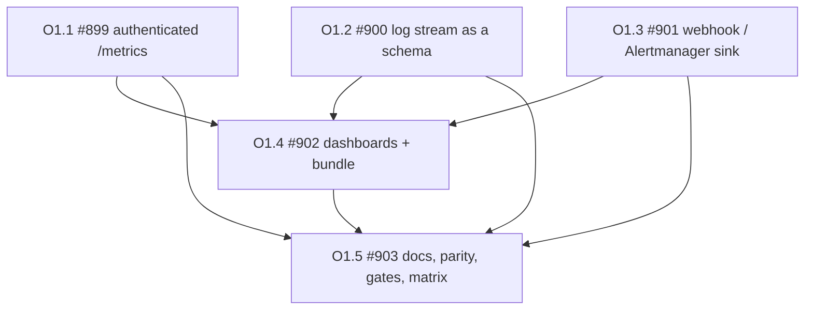

# Observability Integrations: Grafana/Prometheus, Loki and Alertmanager

## Status

**Type:** EPIC / Detailed implementation specification
**Repository:** `backupdproject/backupd`
**Parent / predecessor EPICs:** #807 (FR-24's health verdict and the metrics rendering it left unwired), #813/#812 (EPIC L's seven workflow metric families and the `obs` event catalog they extended), #830 (the SMTP secret-custody pattern this EPIC reuses for a webhook credential), EPIC B §71 (#159, proactive alerting: one sink, no framework)
**Primary implementation root:** `core/internal/metrics/`, `core/internal/obs/`, `core/internal/alert/`, `apps/common/webhost/`, `container/observability/`
**Tracker issue:** #898 (sub-issues #899 through #903, O1.1–O1.5; this document and the conformance matrix land under #897)
**FR numbering:** this specification continues the product's FR series at **FR-45**, and claims **FR-45 through FR-50**. FR-1 through FR-24 are defined in `docs/EPIC.md`; FR-26 is claimed by the `version` command; FR-27 through FR-35 are EPIC E (`docs/EPIC-E-alternative-storage.md`); FR-36 through FR-44 are EPIC R (`docs/EPIC-R-rename-backupd-to-retnd.md`, #885, in flight as PR #896, so this range is claimed in review rather than on `main` -- EPIC O starts above it deliberately and collides with it either way). FR-25 is an unclaimed hole and stays one: anything citing "FR-25" today is citing nothing, and filling it would make that citation resolve to something it never meant. Nothing here renumbers an existing FR.
**Shape:** ONE phase, five sub-issues, per `docs/epic-checklist.md` §1. The cut list is §6.

---

# Adversarial Review, Five-Expert Panel

Same discipline as `docs/EPIC-B-multi-nas.md`, `docs/EPIC-E-alternative-storage.md` and `docs/EPIC-R-rename-backupd-to-retnd.md`: each reviewer was instructed to **reject** this EPIC if it could expose an unauthenticated surface, put a credential in a payload, a log line or a label, grow unbounded metric cardinality, weaken the alert dispatcher's observe-once guarantee, ship a guard that cannot fail, or add a knob the terminal cannot set.

The panel was given the measured current state first (§2), because three of the five initial verdicts turned on the draft having described a surface this product does not have.

## Expert 1, Prometheus, Metric Cardinality and Scrape Security

### Initial verdict: REJECT

Critical findings:

1. The draft said "expose the existing exposition over HTTP behind auth". This product has **no credential a scraper can present.** `apps/common/auth/local/session.go` issues exactly one: a `backupd_session` HTTP-only cookie minted by an interactive sign-in, and `apps/common/webhost/auth.go` consults `platform.Authenticator()` and nothing else. Prometheus offers `basic_auth`, `authorization` (bearer) and mTLS; it cannot complete an interactive login, and a cookie pasted into `scrape_configs` expires. The draft's "behind auth" therefore resolved to either an unauthenticated endpoint or an endpoint no scraper can read. Both are ship-blocking.
2. The draft put `/metrics` inside the `/api/v1` group. That group carries `recordActions(cfg.Recorder)` across the **whole** group (`router.go`), so a 15-second scrape would write 5,760 action-log rows a day into an append-only, cursor-paged feed (`docs/epic-checklist.md` §4: "a new high-volume event is a performance decision"). It would also make the scrape a CSRF and destructive-gate question it has no business being.
3. The draft did not say which renderer it serves. There are **two**, they have different lifetimes, and only one of them is a pure function: `metrics.Render(health.Report)` (34 families, gauges and info only, sorted, byte-stable) needs a health report built from the journal per scrape, and `BackupService.WorkflowMetrics()` (7 families, 5 counters and 2 histograms) is a live in-process counter set that returns `""` when no engine was ever built. Serving them concatenated without saying so leaves a dashboard unable to tell "no workflow has failed" from "this process runs no workflows", which is the exact distinction `WorkflowMetrics`'s own doc was written to preserve.
4. Building a health report per scrape is a **journal read per scrape**. A dashboard on a 15-second interval turns FR-24 into a query load nobody sized, and `listRepositories`'s own comment already warns that a route which opens every repository is not a route a dashboard polls.

Required corrections, all adopted:

- the scrape endpoint gets a **dedicated bearer credential**, verified in constant time against an at-rest **hash**, never a plaintext token in `config.yaml` (FR-45, FR-50). The token is minted by the product (`backupd settings observability rotate-scrape-token`), shown exactly once, and stored under the `#830` `PasswordRef` custody shape: a mode-0600 file of its own in a 0700 directory, referenced by an opaque name. `basic_auth` is accepted as the same credential in the password position, because Prometheus's `basic_auth` is the form every Grafana Agent example uses;
- `/metrics` is registered as a **sibling of `/health/live` and `/health/ready`**, outside the `/api/v1` group: no `recordActions`, no CSRF, no destructive gate, its own middleware that does authentication and nothing else. One counter (`backupd_scrape_rejected_total`, labelled by reason from a closed three-value vocabulary) replaces the per-request action-log row, and the route's absence from the action log is an asserted property, not an omission;
- the response is the concatenation of both renderers **with the workflow half omitted entirely when `WorkflowMetrics()` returns `""`**, which is the same convention `metrics.Render` already follows for an unknown gauge: no series rather than a fabricated zero;
- the health report behind a scrape is served from a **bounded cache** with a configured minimum rebuild interval (`observability.metrics.min_rebuild_interval`, default 15s), so N scrapers cost one journal read per interval, and the exposition carries `backupd_report_generated_timestamp_seconds` already, which is what tells a reader how old the cached view is. No new timestamp is invented for it;
- **no label may carry a scraper-derived value.** `labels_test.go`'s existing rule (every label value comes from a closed vocabulary or a `model.BackupSetID`) is extended over the new counter, with a positive control.

### Consensus position: APPROVE AFTER REVISION

## Expert 2, Loki, Log Schema and Secret Leakage

### Initial verdict: REJECT

Critical findings:

1. The draft proposed "an opt-in structured-JSON log mode". **This product has no other mode.** `obs.New` (logger.go) writes newline-delimited JSON through `log/slog`'s JSON handler, unconditionally, and both production wirings (`core/cmd/backupd/setup.go:402`, `core/service/service.go:443`) point it at `os.Stdout`. Shipping a "JSON mode" toggle would add a knob whose off position does not exist, and §5's tooltip rule ("a field whose effect cannot be stated from the code gets no entry") would forbid explaining it. The draft was describing work that is already done and missing the work that is not.
2. What is actually missing is a **schema**. `events.go` pins 27 event names and `events_test.go` holds them, but the *field set* around them is whatever `slog` and each helper happen to emit: `time`, `level`, `msg`, `event`, the three reserved marks (`result`, `action`, `action_id`), a `backup_set` the context may add, and per-event attrs that nothing outside their own helper pins. A Loki pipeline is built against field names. Renaming one is exactly as breaking as renaming an event, and today only half of that contract is guarded.
3. The draft wanted a `schema_version` on every line. That is bytes on every line of a high-volume stream to answer a question that changes once a year, and Loki's own model already has the right place for it: a stream label.
4. **The draft's most dangerous line** was "documented labels". It listed `backup_set` as a Loki label. A Loki label is a stream dimension; one stream per backup set is fine, but the draft's example pipeline also promoted `event` and `action_id` to labels. `action_id` is minted per action: that is unbounded label cardinality in Loki, which is the same failure Expert 1 is guarding in Prometheus and is worse here, because Loki charges for it in index size and a chunk per stream.
5. Redaction is opt-in per endpoint. `Logger.WithRedaction` is built from `config.Remote.Sensitive` (#295), so a deployment that opted nothing in ships un-redacted `msg` strings to a third-party log store the moment it points Promtail at stdout. The draft treated "we have a Redactor" as "logs are safe to ship".

Required corrections, all adopted:

- **no JSON toggle.** FR-46 documents and *pins* the stream that already exists: a reserved-key contract (`time`, `level`, `msg`, `event`, `result`, `action`, `action_id`, `backup_set`), a golden-line fixture in `core/internal/obs` that goes red when a key is added, removed or renamed, and a statement that these keys are a wire contract in the same sentence `events.go` already uses for event names;
- the schema version is a **stream label set by the shipped Promtail/Alloy configuration** (`schema="1"`), plus the version on the `startup` event, which every process emits once. Per-line versioning was rejected on bytes and on there being a better place for it;
- the documented label set is **`job`, `instance`, `level`, `schema`, and nothing else**. `event`, `action`, `action_id` and `backup_set` stay as parsed *fields*, with the shipped pipeline's `labels` stage naming only the four, and a note in `docs/observability.md` saying what promoting `action_id` would cost. The shipped config is the documentation that is executable;
- `docs/observability.md` states plainly that **log shipping is an egress decision**: the stream may contain operator-authored text (hook script output, `msg` strings, refusal reasons), so the secret-absence guarantee EPIC O makes is FR-50's — no *resolved* secret, ever, on any surface — and it is not, and cannot be, a promise about text an operator typed into a hook. Saying that is the honest half; the mechanised half is the FR-50 corpus;
- the FR-50 corpus is run over the **log stream** as well as the endpoint and the webhook: a deployment loaded with a known passphrase, an S3 secret key, an SMTP password, a scrape token and a webhook credential runs a cycle, and the byte sequence of each secret must appear in none of the three surfaces.

### Consensus position: APPROVE AFTER REVISION

## Expert 3, Alert Delivery Semantics, SSRF and Secret Safety

### Initial verdict: REJECT

Critical findings:

1. The draft said "a webhook sink **beside** SMTP". Neither half is true of this tree. There is no SMTP alert channel: `apps/common/email` is the account-recovery and verification mailer (#830), reached from `apps/common/auth/local`, and it has never been an `alert.Sink`. And "beside" is the thing §71 and `core/service/alerts.go` explicitly refuse: "one sink and no registry, no fan-out and no per-condition routing... the cheapest way to keep a framework from growing is to give it nowhere to start". A second sink installed beside the first is that framework's first line.
2. The finding that makes this EPIC worth doing: **`alerts.enabled: true` today delivers nothing on any shipped deployment.** The only `alert.Sink` in the tree is `notify.PlatformSink`, which refuses unless the adapter declares `NativeNotifications`, and `apps/common/platform/profile/profile.go` says in its own comment "today no profile does". So an operator can turn on alerting, be told it is on, and never be told anything again. That is the gap FR-47 closes, and it reframes the webhook from "another channel" to "the first channel that works".
3. **Alertmanager is not a notifier, it is a state-sync protocol.** `POST /api/v2/alerts` expires an alert after `resolve_timeout` (5 minutes by default) unless it is re-sent. `Dispatcher.Observe` delivers exactly once and then stays quiet until the condition resolves. Push once into Alertmanager and the alert self-resolves in five minutes while the backup is still stale — a **silent false all-clear on a backup product**, which is the worst outcome in this document.
4. The draft's SSRF section named "block private IPs". That is wrong for this product: the overwhelmingly common correct target *is* private (`http://alertmanager:9093` on the compose network). A blanket private-range block would break the shipped bundle. The real exposures the draft missed: redirect following (a 302 to `169.254.169.254` turns an operator's webhook into a cloud-metadata read), a URL that *is* a credential (Slack/Teams/Discord webhook URLs carry their secret in the path), unbounded response reads, and a non-HTTP scheme.
5. The draft let the operator template the payload body. A templated body is an injection surface into whatever receives it and makes the redaction guarantee untestable, because the corpus cannot enumerate templates that do not exist yet.

Required corrections, all adopted:

- **selection, not fan-out.** `alerts.delivery` is `platform` (default, today's behaviour) or `webhook`, and **exactly one** `alert.Sink` is constructed either way. `NewDispatcher` keeps its single-sink signature, there is no registry, no chain and no fallback, and a test asserts that no code path builds two. §71's rule survives intact because the seam it forbade is still absent;
- the webhook ships **two payload dialects**, `generic` and `alertmanager`, both **fixed schemas built in Go from `service.Alert`'s five fields**. No templating, ever. `generic` is a single JSON object; `alertmanager` is the v2 array with `labels.alertname` from `Kind`, `labels.backup_set`/`labels.repository_domain` from `Scope`, `annotations.summary`/`annotations.description` from `Title`/`Message`, and `startsAt` from `ObservedAt`;
- **the Alertmanager dialect carries FR-47's refresh contract, and it is the one behaviour change in this EPIC's alerting.** In `alertmanager` mode a still-observed, already-delivered condition is **re-sent** on a cadence strictly below the configured `resolve_ttl` (default 4m refresh under a 10m `endsAt`, both configurable, both validated so refresh < ttl), and a condition that stops being observed gets one send with `endsAt` = now. This is not a second delivery decision: the refresh reads the dispatcher's existing `firing` map and the `delivered` flag it already keeps, and an operator is still notified *once* per occurrence by Alertmanager, which is the component whose job that is. `generic` mode keeps observe-once exactly as it is today, and the difference is documented in one sentence per mode;
- **the recommended topology is stated in the docs and shipped in the bundle**: Prometheus alerting rules over `backupd_*` (O1.4) feeding Alertmanager is the canonical wiring, and the push dialect exists for deployments that scrape nothing. A product that pushes what its own metrics already expose is a product with two sources of truth about staleness;
- the SSRF guard is written as what it actually is: **scheme allowlist (`https`, or `http` only with `allow_insecure_http: true` explicitly set, which the bundle sets for its own compose network), redirects never followed (`CheckRedirect` returns an error, and a 3xx is a delivery failure with the location NOT logged), response body read bounded and discarded, TLS verification never disableable, no scheme-relative or userinfo-bearing URL accepted.** Private targets are allowed, deliberately, and the reason is written down;
- the **URL is treated as a credential**: stored as a `secretref`-shaped reference or a `PasswordRef`-custody value, never echoed by `GET /settings/observability`, never in an error, never in a log line — carried as `obs.Secret` everywhere inside the process. A failure reports host-and-status, not the URL. Optional `Authorization` header material takes the same custody;
- delivery stays inside `deliveryTimeout` (30s, already enforced by `Dispatcher.deliver`) and inherits the existing 5-minute-to-1-hour retry ladder. The sink adds no timer of its own.

### Consensus position: APPROVE AFTER REVISION

## Expert 4, Deployment, Providers and the Compose Bundle

### Initial verdict: REJECT

Critical findings:

1. The draft "added a metrics port". `container/compose.yaml` is the canonical definition, `scripts/install/embed_compose.py` embeds a copy into the installer, and nine of the eleven providers ship their own `apps/*/compose/backupd.{yml,yaml,env}` plus two Unraid XML templates and a TrueNAS catalog template, with `distribution/packaging/{canonical,submission,conformance,compliance}.json` holding the derived truth. A second listener is **eleven** operator-facing edits and a derivation regeneration, for no benefit: the web host already has a listener, and `/metrics` on it costs zero new ports, zero new mappings and zero provider edits.
2. The draft put a Grafana admin password in the committed compose file. `distribution/packaging/scan_endpoints.go` exists precisely to fail on committed credential and endpoint *shapes*, and it would be right to. The bundle also must not name a real host: `RulePinnedEndpoint` is there because a hostname pasted into an example is one commit by one person in a hurry.
3. A second compose file in `container/` risks being picked up by `embed_compose.py` or by the packaging derivation as though it were canonical. The draft did not say where the bundle lives or what stops that.
4. Dashboards rot silently. A panel querying `backupd_backup_set_stale` (a name this product has never emitted) renders an empty graph that reads exactly like a healthy one. Nothing in the draft could fail on that, which makes a shipped dashboard a claim with no evidence — the class of thing `docs/epic-checklist.md` §12 calls a guard that cannot fail.

Required corrections, all adopted:

- **no new listener and no new port.** `/metrics` is served by the existing web host on `LISTEN_ADDR`, and the canonical compose file changes by **zero lines**. The eleven providers' compose files, the Unraid templates, the TrueNAS catalog and the packaging manifests are therefore untouched, and O1.4's exit gate asserts that as a diff-shaped claim (`git diff --stat` over those paths is empty) rather than as a hope;
- the bundle lives at **`container/observability/`** as an explicitly non-canonical example — `compose.observability.yaml` (an overlay joining the existing `backupd` service's network by name), `prometheus/prometheus.yml`, `prometheus/rules/backupd.rules.yml`, `grafana/provisioning/{datasources,dashboards}/*.yml`, `grafana/dashboards/*.json`, `promtail/promtail.yaml`, `alloy/config.alloy` and a `README.md` whose first line says it is an example and not a supported deployment. A test asserts `embed_compose.py` embeds `container/compose.yaml` and nothing from `container/observability/`, and that the packaging derivation's file set does not grow;
- **no credential and no real endpoint in the bundle**: Grafana's admin password comes from a required environment variable with no default, the bundle refuses to start without it with a message naming it, the scrape token is read from a file the operator mints, and every hostname is a compose service name or a `.invalid`/reserved-range literal so `scan_endpoints.go` stays green;
- **the dashboards and rules are gated against the exposition.** A new guard extracts every `backupd_[a-z_]+` identifier from every dashboard JSON and every rules file and fails on any name the two renderers do not emit, computed from a golden `health.Report` plus the workflow counter set rather than from a hand-typed list. Its mutation self-test plants `backupd_backup_set_stale` in a panel and watches the guard go red, plus a positive control that a real name passes;
- **provider-visible** in the checklist's §8 sense means documented, not shipped: `docs/acceptance/` gains one paragraph per provider only where the answer differs (whether that provider's gateway can reach the web host's port at all), and the capability contract is **not** touched, because serving a route the router already hosts is not new platform behaviour.

### Consensus position: APPROVE AFTER REVISION

## Expert 5, CLI/Web/API Parity, Configuration and Migration

### Initial verdict: REJECT

Critical findings:

1. The draft added six knobs and named no CLI path. `TestEveryAPIRouteNamesItsCLIEquivalentOrTheGap` (`apps/common/webhost/actionlog_test.go`) fails a route with neither builder nor `why`, so the gated direction would have caught it — but the **ungated** direction (§3's last item: a command with no way to do it in the browser, and its mirror) is the one that decides whether an operator who only has a browser can turn any of this on.
2. The draft invented a new top-level `observability:` block *and* left `alerts.delivery` in the existing `alerts:` block without saying how the two relate. `Load` uses `KnownFields(true)`: every new key is a one-way door for a rolled-back build, and two blocks means two doors.
3. The draft had no compat fixture and no statement about `Validate`. The retention override flags were a silent no-op for exactly this reason (§2: "re-resolve after any mutation of the global"), and a `PATCH /settings/observability` that writes a value nothing re-resolves is the same defect with a new name.
4. The draft said "per-set override for every knob" as a box-tick. A per-backup-set scrape token is meaningless, and a per-set log level cannot be honoured by a single process-wide writer whose daemon, API and startup lines have no set to attribute. Adding fields to satisfy a checklist is how a config grows knobs whose effect cannot be stated — and §5 then forbids writing a tooltip for them.
5. The draft claimed "no migration needed" without checking. Nothing here is journal state, so that happens to be right, but it has to be asserted: `core/migrations/` is at `0012_workflow_runs.sql`, and the claim EPIC O must make is that it stays there.

Required corrections, all adopted:

- **one block, one door.** Everything EPIC O adds lives under a single new top-level `observability:` key, including `observability.alerts.delivery`, `observability.alerts.webhook.*`. The existing `alerts:` block is not extended and not moved, so an operator who never touches EPIC O's features keeps a byte-identical `config.yaml` and a rollback finds one unknown key instead of several. The one-way-door sentence goes in the CHANGELOG, as §2 requires;
- **the per-set question is answered in writing, per knob, and the answer is "no" for all of them** — with the reason, not with a field. Nothing in EPIC O is a property of a backup set: a scrape endpoint, a log stream and an alert channel are properties of a deployment, and `alerts.repeated_failure_threshold` (which *is* per-set-meaningful) is EPIC B's knob and stays out of scope. §2's "where meaningful" is discharged by a decision, and the spec is where it is recorded;
- **compat fixtures are mandatory and gated**: one valid fixture exercising the whole block, one valid fixture omitting it entirely (the upgrade case), and three invalid fixtures — an inline plaintext token, a `file://`-scheme webhook URL, and `refresh_interval` >= `resolve_ttl` — following the `53-invalid-inline-medium-secret.yaml` precedent;
- **parity is structural**: `GET`/`PATCH /settings/observability` as a sub-resource of `/settings` (EPIC L's `/settings/workflow` precedent, for the same two reasons: the block is a collection with identities, and the settings page's poll does not want it), a `backupd settings observability [patch|rotate-scrape-token]` sub-noun following `settings workflow`'s own dispatch shape, a `cliecho` builder for each route in `core/cliecho/routes.go`, and `openapi.json` regenerated into **both** bindings. The reverse-direction check (§3's ungated item) is a named line in the exit gate: every knob is settable from `SettingsPage.tsx`, and the one action that is CLI-only by design — minting a token whose plaintext is shown once — is **not** CLI-only: it is a `POST` sub-resource returning the plaintext once in the response body, because an operator with only a browser must be able to wire Prometheus;
- **the hot-reload path is asserted, not assumed**: a `PATCH` that changes the block triggers the same `Validate` and in-process reload the existing settings write does, `AdoptAlerts`'s existing "re-read `enabled` from the new config, carry the de-duplication state" rule extends to `delivery`, and a test drives a `platform` -> `webhook` switch through the route and asserts the next pass delivers through the new sink with the firing map intact;
- **no migration**: `core/migrations/` stays at `0012`, asserted by the exit gate, and `core/tests/compat/capture_*.go` captures are updated because config and CLI output both move.

### Consensus position: APPROVE AFTER REVISION

## Five-Expert Consensus

**APPROVE AFTER REVISION**, revisions incorporated below. The findings are **release requirements, not optional hardening**, and each one has a row in `docs/conformance/epic-o-matrix.md` with the mutation that must turn it red.

| Finding | Required change |
|---|---|
| This product has no credential a scraper can present; "behind auth" resolved to unauthenticated or unscrapable | **FR-45**: a dedicated bearer/basic scrape credential, minted by the product, shown once, stored as a hash under #830's `PasswordRef` custody. Never a plaintext token in `config.yaml` |
| `/metrics` inside `/api/v1` writes an action-log row per scrape into an append-only cursor-paged feed | Registered beside `/health/live`, outside the group: no `recordActions`, no CSRF, no gate. One rejection counter replaces the rows, and "not in the action log" is asserted |
| Two renderers with different lifetimes; `WorkflowMetrics()` returns `""` on purpose | Concatenated, with the workflow half **omitted** when empty — the same "no series rather than a fabricated zero" rule `metrics.Render` already follows |
| A health report per scrape is a journal read per scrape | A bounded cache with `min_rebuild_interval` (default 15s); age is read from the existing `backupd_report_generated_timestamp_seconds` |
| "Opt-in JSON log mode" describes work already done: `obs.New` writes NDJSON unconditionally | **FR-46**: no toggle. Pin the field schema (8 reserved keys) with a golden-line fixture, the way `events_test.go` already pins the 27 event names |
| `action_id` promoted to a Loki label is unbounded index cardinality | Documented label set is `job`, `instance`, `level`, `schema` and nothing else; `event`/`action`/`action_id`/`backup_set` stay parsed fields. The shipped pipeline is the executable documentation |
| A `schema_version` on every line costs bytes forever | Stream label `schema="1"` in the shipped Promtail/Alloy config, plus the version on the once-per-process `startup` event |
| Redaction is opt-in per endpoint, so "we have a Redactor" is not "safe to ship" | **FR-50** guarantees no *resolved* secret on any surface and says plainly that it is not a promise about operator-authored hook output. The corpus proves the first half over all three surfaces |
| `alerts.enabled: true` delivers nothing on any shipped deployment: the only sink refuses unless `NativeNotifications`, which no profile declares | **FR-47** is the first working channel, not an extra one |
| "A sink beside SMTP" contradicts §71's one-sink rule, and there is no SMTP alert channel to sit beside | Selection (`delivery: platform|webhook`), not fan-out. Exactly one `alert.Sink` is ever constructed; a test asserts no path builds two |
| Pushed once into Alertmanager, an alert self-resolves after `resolve_timeout` while the backup is still stale — a silent false all-clear | **FR-47's refresh contract**: in `alertmanager` mode a still-observed condition is re-sent below `resolve_ttl` off the existing `firing` map, and a resolved one is sent with `endsAt`=now. `generic` mode keeps observe-once unchanged |
| "Block private IPs" would break the shipped bundle, whose target is `http://alertmanager:9093` | The real guards: scheme allowlist, redirects **never** followed (a 3xx is a failure and the `Location` is not logged), bounded response read, TLS verification not disableable, no userinfo in the URL. Private targets allowed, with the reason written down |
| A templated payload is an injection surface and makes redaction untestable | Two fixed dialects built in Go from `service.Alert`'s five fields. No templating, ever |
| A webhook URL frequently *is* the credential (Slack/Teams/Discord) | The URL is a secret: `obs.Secret` in-process, custody at rest, never in `GET /settings/observability`, an error or a log line. Failures report host and status |
| A second listener is eleven provider edits plus a derivation regeneration | No new port. The canonical compose file changes by zero lines, asserted as an empty diff over `container/compose.yaml`, `apps/*/compose/`, the Unraid/TrueNAS templates and `distribution/packaging/*.json` |
| A dashboard querying a metric this product never emitted renders an empty graph that reads like a healthy one | A guard extracts every `backupd_*` identifier from dashboards and rules and fails on any name the renderers do not emit, with a planted-violation self-test and a positive control |
| A Grafana admin password or a real hostname in a committed example | Required env var with no default and a refusal that names it; every host is a compose service name or a reserved literal, so `scan_endpoints.go` stays green |
| A second compose file could be embedded or derived as canonical | `container/observability/` is example-only, asserted: `embed_compose.py` embeds `container/compose.yaml` alone and the packaging file set does not grow |
| Two new config blocks are two one-way doors under `KnownFields(true)` | One new top-level `observability:` key. The existing `alerts:` block is neither extended nor moved; the door is named in the CHANGELOG |
| "A per-set override for every knob" as a box-tick | The per-set answer is **no**, per knob, in writing, with the reason. Nothing EPIC O adds is a property of a backup set |
| A settings write nothing re-resolves is the retention-override no-op with a new name | The `PATCH` runs the same `Validate` and hot reload; a `platform`->`webhook` switch is driven through the route with the firing map asserted intact |

---

# 1. Purpose

Three integrations an operator expects from a backup product, none of which this product has, all of which it is one wiring away from:

1. **Grafana/Prometheus.** 41 metric families already exist and **nothing serves them.** `metrics.Render` has no caller outside its own tests; `BackupService.WorkflowMetrics()` has no caller at all. The exposition is correct, low-cardinality and byte-stable, and unreachable.
2. **Loki.** The log stream is already newline-delimited JSON with a 27-event catalog, and its *field* names are pinned by nothing, with no shipped shipping configuration and no documented label discipline.
3. **Alertmanager / webhook.** `alerts.enabled` can be turned on, and on every deployment this repository ships it delivers nothing, because the only sink refuses without a `NativeNotifications` capability no profile declares.

## The primary invariant

**Every surface EPIC O adds is either authenticated or carries nothing worth authenticating, and no resolved secret appears on any of them.**

Three surfaces, one rule, mechanised once: the HTTP exposition, the JSON log line, and the webhook request (URL, headers and body). FR-50 is the corpus that holds it, and it is the row in the conformance matrix that blocks the epic.

## The second invariant

**Every knob EPIC O adds is settable from the terminal, from the browser and from `api/v1`, and every new control explains itself.** Not "has parity in the gated direction": both directions, plus a `tooltips.json` entry and a three-part `fieldHelpCopy.ts` entry for every control whose effect the code can state.

---

# 2. Scope: the measured current state

Everything in this section was read off `origin/main` at `e028bc22`.

| # | Surface | Today | Gap EPIC O closes |
|---|---|---|---|
| 1 | `core/internal/metrics/metrics.go` (452 lines) | `Render(health.Report) string`. 34 families, all gauge or info: `backupd_process_info`, `backupd_report_generated_timestamp_seconds`, `backupd_backup_set_state` (one-hot over 4 states), 28 `backupd_backup_set_*` gauges, 3 `backupd_workflow_*` health gauges. `ContentType = "text/plain; version=0.0.4; charset=utf-8"`, `namePrefix = "backupd_"`, sets sorted so output is byte-identical, unknown value renders **no** sample | **No caller outside tests.** No HTTP route, no CLI flag (`docs/adr/0002-phase-5-scope.md` describes `status --prometheus` as a possibility; it was never built) |
| 2 | `core/internal/metrics/workflow.go` (586 lines) | EPIC L's 7 families: 5 `_total` counters and 2 duration histograms. Live process-lifetime counters. Label vocabulary closed by construction (scope 2, phase 2, target 2, status 5, disposition 6, plus backup-set id), held by `labels_test.go` against a snapshot deliberately loaded with secrets and paths | `BackupService.WorkflowMetrics()` exists and **nothing calls it**. Returns `""` when no engine was built, deliberately |
| 3 | `core/internal/obs` (logger 305, events 676 lines) | `obs.New(w, level)` writes NDJSON via `log/slog`; 27 `Event*` constants pinned by `events_test.go`; reserved marks `result`/`action`/`action_id`; `backup_set` from context; `WithRedaction` from `config.Remote.Sensitive` (#295); `obs.Secret` forecloses every `fmt`/`json`/`slog` rendering path; in-process `Sink` tap (#573) | The **field** set is unpinned. No documented label discipline, no shipped Promtail/Alloy configuration, no schema version anywhere |
| 4 | Log wiring | `core/cmd/backupd/setup.go:402` and `core/service/service.go:443`, both `obs.New(os.Stdout, obs.LevelFromEnv())`. Level from `BACKUPD_LOG_LEVEL`, with `BACKUPD_DEBUG=1`/`RM_DEBUG=1` shortcuts | Level is environment-only: not in `config.yaml`, not in the browser, not in `api/v1` |
| 5 | `core/internal/alert/alert.go` (550 lines) | One `Sink` per `Dispatcher`, set at construction, never replaced. `NewDispatcher(nil, …)` returns nil. Observe-once keyed on `Condition.Key()`; resolution on absence; an `unevaluated` list so a pass that could not look does not clear state; retry 5m doubling to 1h; `deliveryTimeout` 30s; delivery outside the lock. 5 kinds: `STALE_BACKUP`, `REPEATED_FAILURE`, `HOST_KEY_CHANGED`, `CRITICAL_STORAGE_PRESSURE`, `MAINTENANCE_FAILED` | No webhook, no HTTP sink, and no resolved-notification concept |
| 6 | The only sink | `apps/common/platform/notify.PlatformSink` over `capabilities.Notifier`; refuses unless the adapter declares `NativeNotifications`. `profile.go`: "today no profile does" | **Alerting delivers nothing on any shipped deployment.** This is the epic's strongest motivation |
| 7 | SMTP | `apps/common/email` + `apps/common/auth/local/secrets.go`: account recovery and verification (#830), password under `PasswordRef` custody in a 0600 file in a 0700 directory | Not an alert channel, and EPIC O does not make it one. It is the **custody pattern** EPIC O reuses |
| 8 | HTTP surface | `apps/common/webhost/router.go` (762 lines): `/health/live`, `/health/ready` unauthenticated; everything else inside one `/api/v1` `chi` group behind `authMiddleware` + `recordActions`. Sole credential: the `backupd_session` cookie (argon2id-hashed password). No bearer, no basic, no mTLS | No `/metrics`, and no credential a scraper could use if there were |
| 9 | Settings surface | `GET`/`PATCH /settings`, plus EPIC L's `GET`/`PATCH /settings/workflow` sub-resource; CLI `settings [patch]` and `settings workflow`; `cliecho` builder per route, held by `TestEveryAPIRouteNamesItsCLIEquivalentOrTheGap` | The precedent EPIC O follows exactly |
| 10 | Config | `Load` uses `KnownFields(true)`; `Alerts{Enabled, RepeatedFailureThreshold}`; `core/internal/secretref` is the operator-declared file/env/command secret shape; `53-invalid-inline-medium-secret.yaml` is the precedent for refusing an inline credential | No `observability:` block |
| 11 | Deployment | `container/compose.yaml` canonical (`LISTEN_ADDR: ":8080"`, distroless, read-only, non-root, `cap_drop: ALL`), embedded by `scripts/install/embed_compose.py`; 11 providers, 9 compose files + 2 Unraid templates + 1 TrueNAS catalog; `distribution/packaging/*.json` derived; `scan_endpoints.go` fails on committed credential/endpoint shapes | No Prometheus, Grafana, Loki or Promtail example anywhere |
| 12 | Gates | 18 `ci.yml` jobs; `release-gate` with a `needs` list held by `scripts/tests/release-gate-covers-every-job.test.sh`; `scripts/ci-local.sh` is the local mirror and the pre-commit hook; `core/migrations/` at `0012_workflow_runs.sql`; next ADR is `0023` | No observability job, no dashboard guard |

## Out of scope, stated so the boundary is not argued later

OpenTelemetry traces (no span model exists and inventing one is a different epic); an OTLP exporter; pushing metrics (a push gateway is the wrong shape for a gauge exposition); a bundled Grafana/Prometheus *as a supported deployment* rather than an example; per-condition alert routing and fan-out (§71, and the consensus keeps it out); a `status --prometheus` CLI flag (§6 says why); changing any metric name (that is EPIC R's surface, and colliding with it is how two epics both go red).

---

# 3. Functional Requirements

## FR-45, The Scrape Endpoint

`GET /metrics` is served by the existing web host, on the existing listener, outside `/api/v1`.

- **Off by default.** `observability.metrics.enabled: false`. Disabled, the route answers `404` with no hint that the feature exists, which is the same reasoning `auth.go` gives for ordering authentication before the destructive gate: a disabled feature must not be an unauthenticated fingerprint.
- **Enabled, it requires a credential**: `Authorization: Bearer <token>`, or HTTP basic with the token in the password position (Prometheus's `basic_auth`). Comparison is constant-time against an argon2id hash. No credential, a wrong credential, or a malformed header yields `401` with an empty body.
- **The token is minted by the product**, never typed into `config.yaml`: `POST /api/v1/settings/observability/scrape-token` and `backupd settings observability rotate-scrape-token` both return the plaintext **once**. At rest: the hash only, in a mode-0600 file in a 0700 directory, referenced by an opaque name (#830's `PasswordRef` shape). A config that carries a plaintext token is refused at `Load` with a message naming the command that mints one properly.
- **Body** is `metrics.Render(report)` followed by the workflow exposition, separated by a newline, with the workflow half omitted entirely when `WorkflowMetrics()` returns `""`. `Content-Type` is `metrics.ContentType` and nothing else.
- **The report is cached** for at least `observability.metrics.min_rebuild_interval` (default `15s`, floor `1s`), so N scrapers cost one journal read per interval. Age is readable from the existing `backupd_report_generated_timestamp_seconds`.
- **No action-log row per scrape.** The route is outside the `recordActions` group. Refusals increment `backupd_scrape_rejected_total{reason}` with `reason` from exactly `{"disabled","unauthenticated","method"}`, and no label value is derived from the request.
- **`/metrics` is not `/health/live`.** The liveness probe keeps saying nothing about backup freshness (failure-safety invariant 14), and the exposition keeps saying nothing about whether traffic should be routed here.

## FR-46, The Log Stream Is a Schema

The stream this product already writes becomes a documented, guarded contract.

- **Reserved keys**, pinned by a golden-line fixture in `core/internal/obs`: `time`, `level`, `msg`, `event`, `result`, `action`, `action_id`, `backup_set`. Adding, removing or renaming one turns the fixture red. These keys are a wire contract in exactly the sense `events.go`'s doc already claims for the 27 event names.
- **No new output mode and no toggle.** `obs.New` writes NDJSON unconditionally today; a switch whose off position does not exist would be a control §5 forbids explaining.
- **One new knob:** `observability.logs.level` (`debug|info|warn|error`, default `info`), as the configured floor. The environment keeps winning — `BACKUPD_LOG_LEVEL`, `BACKUPD_DEBUG`, `RM_DEBUG` — because a diagnostic knob an operator reaches for during an incident must not need a config edit and a reload, and `core/internal/config/incrementalengine.go` already documents that precedence rule for this exact variable. Which one is in force is reported by `GET /settings/observability` and by `backupd settings observability`, so the answer to "why is it not debug" is never a guess.
- **Label discipline is shipped, not just written**: the Promtail and Alloy configurations in `container/observability/` set `job`, `instance`, `level` and `schema="1"` as labels, parse the rest as fields, and carry a comment saying what promoting `action_id` would cost in index size.
- **The schema version lives in two places and neither is a per-line field**: the stream label above, and an attribute on the once-per-process `startup` event.
- `docs/observability.md` states that shipping logs is an egress decision, that the stream may carry operator-authored text, and that FR-50's guarantee is about *resolved secrets this product holds* — the honest boundary, stated rather than implied.

## FR-47, Webhook Alert Delivery, Selected Not Fanned Out

- **Selection.** `observability.alerts.delivery` is `platform` (default: today's behaviour, unchanged) or `webhook`. Exactly one `alert.Sink` is constructed in either case. No registry, no chain, no fallback; a test asserts no code path constructs two. §71's "give a framework nowhere to start" survives.
- **Two fixed dialects**, both built in Go from `service.Alert`'s five fields, neither templatable:
  - `generic`: one JSON object — `kind`, `scope`, `title`, `message`, `observed_at` (RFC 3339), `deployment` (the operator's own deployment description, already in config), `schema` (`1`).
  - `alertmanager`: the v2 array — `labels.alertname` from `Kind`, `labels.backup_set` or `labels.repository_domain` from `Scope`, `annotations.summary`/`annotations.description` from `Title`/`Message`, `startsAt` from `ObservedAt`, `endsAt` = `ObservedAt + resolve_ttl`.
- **The refresh contract, `alertmanager` mode only.** Alertmanager expires an alert after its own `resolve_timeout` unless re-sent, so a single push self-resolves while the condition persists — a false all-clear. In this mode a still-observed, already-delivered condition is **re-sent** every `observability.alerts.webhook.refresh_interval` (default `4m`), and a condition that stops being observed is sent once with `endsAt` = now. `Validate` refuses `refresh_interval >= resolve_ttl` (default `10m`). The refresh reads the dispatcher's existing `firing` map and `delivered` flag; it makes no new decision about what is alert-worthy, and it does not touch `generic` mode, which keeps observe-once exactly as it is.
- **The recommended topology is documented**: Prometheus rules over `backupd_*` (shipped by O1.4) into Alertmanager. The push dialect is for deployments that scrape nothing. Two sources of truth about staleness is a defect, and the docs say which one is canonical.
- **Transport guards**: `https` only, unless `allow_insecure_http: true` is explicitly set (the bundle sets it for its own compose network, and says so); redirects **never** followed, a 3xx is a delivery failure and the `Location` is not logged; response body bounded and discarded; TLS verification not disableable by any knob; a URL carrying userinfo, a non-HTTP scheme, or no host is refused at `Load`. Private and link-local targets are **allowed**, deliberately: the common correct target is `http://alertmanager:9093` on a compose network, and a blanket private-range block would break the bundle this epic ships.
- **The URL is a credential.** Slack, Teams and Discord webhook URLs carry their secret in the path. It is `obs.Secret` in-process, under `PasswordRef`/`secretref` custody at rest, absent from `GET /settings/observability` (which returns host and scheme only), absent from every log line and every error. A failure reports host and status code.
- Delivery stays inside the existing 30s `deliveryTimeout` and inherits the existing 5m-to-1h retry ladder. The sink adds no timer.

## FR-48, The Dashboards and the Example Bundle Ship With the Product

- `container/observability/` holds a **non-canonical example**: a compose overlay joining the existing `backupd` service's network by name, `prometheus.yml` with a scrape job carrying the bearer token from a file, `rules/backupd.rules.yml`, Grafana datasource and dashboard provisioning, the dashboard JSON, and a Promtail and an Alloy configuration. Its `README.md`'s first line says it is an example, not a supported deployment.
- **The canonical deployment does not move.** `container/compose.yaml`, every `apps/*/compose/*`, the two Unraid templates, the TrueNAS catalog template and `distribution/packaging/*.json` change by **zero lines**, because `/metrics` is on the listener that already exists. Asserted as an empty diff.
- **No credential and no real endpoint** in the bundle: Grafana's admin password is a required environment variable with no default and a refusal naming it; the scrape token is read from an operator-minted file; every host is a compose service name or a reserved/`.invalid` literal, so `scan_endpoints.go` stays green.
- **Every query names a metric that exists.** A guard extracts every `backupd_[a-z_]+` identifier from every dashboard JSON and every rules file and fails on any name the two renderers do not emit, where the emitted set is computed from a golden `health.Report` and the workflow counter set rather than hand-typed. A panel querying a name this product never emitted is an empty graph that reads like a healthy one, which is the one failure a shipped dashboard must not be able to have.
- **Two dashboards, no more**: "Backup health" (state, freshness, failures, quarantine, capacity) and "Workflow hooks" (run and step outcomes, durations, truncations, remote-exec failures). Each panel's title states what the panel would look like when nothing is wrong, so an empty graph is readable.

## FR-49, One Block, Reachable From All Three Surfaces

- **One new top-level key**, `observability:`, holding `metrics`, `logs` and `alerts` sub-blocks. The existing `alerts:` block is neither extended nor moved. One new key is one one-way door under `KnownFields(true)`, and the CHANGELOG names it, as §2 requires for anything an operator reaches for during an incident.
- **Global default good enough that nobody has to set it**: everything off, `min_rebuild_interval: 15s`, `logs.level: info`, `delivery: platform`. A deployment that never writes the block behaves exactly as it does today, and a compat fixture omitting the block proves it.
- **No per-set override, per knob, with the reason**: a scrape endpoint, a log stream and an alert channel are properties of a deployment, not of a backup set; and a per-set log level cannot be honoured by one process-wide writer whose daemon, API and startup lines have no set to attribute. §2's "where meaningful" is discharged by this decision. `alerts.repeated_failure_threshold` is EPIC B's knob and stays where it is.
- **Parity, structurally**: `GET`/`PATCH /settings/observability` and `POST /settings/observability/scrape-token`; `backupd settings observability [patch|rotate-scrape-token]`; a `cliecho` builder for each of the three routes; `api/v1/openapi.json` authoritative with `core/apicontract/contract.gen.go` and `ui/shared/src/api/generated/contract.ts` regenerated from it.
- **Both directions of §3's gap.** Every knob is settable from `SettingsPage.tsx`, and the token mint — the one action a terminal-first design would have left CLI-only — returns its plaintext once in the `POST` response, because an operator with only a browser has to be able to wire Prometheus.
- **Re-resolve on mutation.** The `PATCH` runs the same `Validate` and in-process reload the existing settings write does; `AdoptAlerts`'s rule (re-read the decision from the new config, carry the de-duplication state) extends to `delivery`, and a test drives `platform` -> `webhook` through the route and asserts the next pass delivers through the new sink with the firing map intact. This is the defect class the retention override flags shipped once.

## FR-50, No Secret On Any Observability Surface

One corpus, three surfaces, one rule. A deployment is loaded with a known repository passphrase, a known S3 secret key, a known SMTP password, a known scrape token and a known webhook URL-with-embedded-credential; a cycle runs, a scrape is taken, an alert is delivered to a local receiver that records the raw request.

**The byte sequence of every one of those secrets must appear in none of:** the exposition (any metric name, label name, label value, `# HELP` line), any log line written during the run, the webhook request's URL as logged, its headers as logged, or its body.

- Plus the shape rules, so the corpus cannot pass by accident: no metric label value is derived from anything but a closed vocabulary or a `model.BackupSetID` (`labels_test.go`'s existing rule, extended to the new counter); `GET /settings/observability` returns no secret material, only host, scheme and whether a credential is set; every new secret-bearing field is `obs.Secret` in-process and its plaintext reachable only through `Reveal`.
- **NOTICE and the licence inventory** are regenerated if the module graph moves. The intended dependency delta is **zero**: `net/http`, `encoding/json` and `log/slog` cover the endpoint, the payload and the stream. If a dependency does move, `NOTICE` and `distribution/packaging/compliance.json` move with it in the same PR (§11).
- The corpus lives with the other compat corpora and runs in `ci-local.sh`, and its mutation self-test plants a resolved secret into a label, a log attribute and a payload field, each of which must turn a different row red.

---

# 4. TDD Contract and Planted Violations

Every guard this epic adds lands with a mutation that must turn it red, per §12. Six planted violations, each automated in `scripts/observability/selftest.sh`:

| # | Planted violation | Must go red |
|---|---|---|
| PV1 | A build serving `/metrics` without consulting the credential | The unauthenticated-scrape row: `401` expected, `200` observed |
| PV2 | A config carrying `observability.metrics.token: <plaintext>` | `Load` refuses, naming the mint command; the invalid compat fixture |
| PV3 | A resolved secret planted into a metric label, a log attr and a webhook body field | Three separate FR-50 rows, one per surface |
| PV4 | A dashboard panel querying `backupd_backup_set_stale` | The dashboard/rules name guard, plus a **positive control**: a panel querying a real family passes |
| PV5 | An `alertmanager`-dialect build that delivers once and never refreshes | The refresh row: the receiver sees exactly one request where it must see a second before `resolve_ttl` |
| PV6 | A second `alert.Sink` constructed alongside the first | The single-sink assertion |

Plus three negative controls, because a guard that only ever fires is as useless as one that never does: a `/metrics` scrape with a valid token returns `200` and parses as exposition; a webhook to `http://alertmanager:9093` with `allow_insecure_http: true` is **allowed** (a private target is not an SSRF finding here); and a config omitting the whole `observability:` block loads, validates and behaves exactly as `origin/main` does.

---

# 5. Phase 1, the only phase

One phase, five issues, per §1. §6 is the cut list.

## Dependency graph

O1.1, O1.2 and O1.3 are independent: three different packages, three different surfaces, one shared config block whose shape is fixed by FR-49 in this document before any of them starts, so none of them has to negotiate it with the others. O1.4 consumes all three (the dashboards query O1.1's exposition, the pipelines parse O1.2's fields, the rules feed O1.3's receiver). O1.5 is last because a conformance matrix whose rows are `BLOCKED` is a plan, and the epic's completion signal is that none of them are.

## Phase 1 entry gate

Checkable claims, all of which hold before O1.1 starts:

1. `origin/main` is green: `scripts/ci-local.sh` ok, `check-contract-drift.sh` and `check-client-paths.sh` pass.
2. This specification and `docs/conformance/epic-o-matrix.md` are merged, and every matrix row is `BLOCKED` with its issue named. Nothing is green because nobody looked.
3. The FR range **FR-45 through FR-50** collides with nothing. On `origin/main` today `grep -oE 'FR-[0-9]+' docs/*.md` tops out at FR-35 (EPIC E); FR-36 through FR-44 are claimed by EPIC R's spec, in flight as PR #896, and EPIC O starts above that claim rather than beside it. Re-run at this gate, the maximum is FR-44 once #896 has landed and FR-35 until it does — in either case nothing in the tree cites FR-45 or higher. FR-25 is still a hole.
4. The letter `O` is unused by any existing EPIC spec, tracker or label.
5. The config block's shape (FR-49) is fixed in this document, so the three parallel issues share a contract rather than inventing three.
6. `core/migrations/` is at `0012_workflow_runs.sql`, and EPIC O's claim is that it stays there.

## Phase 1 exit gate

Checkable claims. Each is a row in `docs/conformance/epic-o-matrix.md` with a falsification that has been run and watched to fail.

1. **An unauthenticated `GET /metrics` is refused** with `401` and an empty body when the feature is enabled, and `404` when it is disabled; a scrape with a valid bearer token, and the same token through `basic_auth`, both return `200` with `Content-Type: text/plain; version=0.0.4; charset=utf-8` and a body that parses as exposition.
2. **No resolved secret appears in any metric name, label or `# HELP` line, in any log line, or in a webhook URL-as-logged, header-as-logged or body**, proven by the FR-50 corpus over a deployment loaded with five known secrets, with a mutation self-test that plants one into each of the three surfaces.
3. **No plaintext scrape token is persisted anywhere**: the store holds an argon2id hash in a 0600 file in a 0700 directory, a config naming a plaintext token is refused at `Load`, and the plaintext appears exactly once, in the mint response.
4. **`/metrics` writes no action-log row**, asserted by scraping 50 times and observing an unchanged feed cursor, and refusals are counted by `backupd_scrape_rejected_total{reason}` over a closed three-value vocabulary.
5. **The workflow exposition is absent, not zero**, when no engine was built, and present when one was.
6. **The eight reserved log keys are pinned** by a golden-line fixture that goes red when one is added, removed or renamed; the 27 event names still pass `events_test.go`.
7. **The shipped Promtail and Alloy configurations label exactly `job`, `instance`, `level`, `schema`** and parse the rest as fields, proven by running each configuration's pipeline over a captured log file and asserting the resulting label set.
8. **`generic` webhook delivery is observe-once** (one request per occurrence, nothing while the condition persists, and an occurrence after resolution alerts again), and **`alertmanager` delivery refreshes**: a still-observed condition produces a second request before `resolve_ttl`, and a resolved one produces exactly one request with `endsAt` <= now.
9. **Exactly one `alert.Sink` is ever constructed**, on both `delivery` values, asserted by a test no fan-out path can pass.
10. **The webhook refuses what it must and allows what it must**: a `file://` URL, a userinfo-bearing URL and a plain-`http` URL without `allow_insecure_http` are refused at `Load`; a 302 is a delivery failure whose `Location` appears in no log line; `http://alertmanager:9093` with the flag set is delivered.
11. **Every `backupd_*` identifier in every shipped dashboard and rules file is a name the renderers emit**, with `backupd_backup_set_stale` planted in a panel turning the guard red and a real name passing.
12. **The canonical deployment is untouched**: `git diff origin/main --stat` over `container/compose.yaml`, `apps/*/compose/`, the Unraid templates, the TrueNAS catalog and `distribution/packaging/*.json` is empty, and `embed_compose.py` embeds `container/compose.yaml` and nothing from `container/observability/`.
13. **The bundle carries no credential and no real endpoint**: `scan_endpoints.go` green, and the stack refuses to start without the Grafana admin variable, with a message naming it.
14. **Parity in both directions**: every one of the three new routes has a `cliecho` builder; `TestEveryAPIRouteNamesItsCLIEquivalentOrTheGap`, `TestNoGapClaimsAVerbThisBinaryShips` and `routeparity_test.go` pass; `settings observability` is in the dispatch table and has a row in `docs/site/reference.html`; and every knob is settable from `SettingsPage.tsx` — the reverse direction, checked by hand and recorded in the matrix as such.
15. **Every new control explains itself**: a `tooltips.json` entry under an `observability.*` prefix and a three-part `fieldHelpCopy.ts` entry for each, the tag-allowlist and opt-out tests green with the preference explicitly ON, and no entry that nothing names.
16. **The contract is regenerated, not hand-edited**: `api/v1/openapi.json` is authoritative and `check-contract-drift.sh`, `check-client-paths.sh` and `contract.conformance.test.ts` pass.
17. **Config compat**: five new fixtures (one full, one omitting the block, three invalid), `core/tests/compat/capture_*.go` updated, `core/migrations/` still at `0012`, and a config that never mentions `observability:` is byte-identical and behaves as it did.
18. **A settings write re-resolves**: a `platform` -> `webhook` `PATCH` takes effect on the next pass with the firing map intact, and a `logs.level` `PATCH` changes the floor without a restart, with the environment override still winning and `GET` reporting which is in force.
19. **Gates**: `scripts/ci-local.sh` green; a new `observability` job in `ci.yml` **and in the release gate's `needs` list** (`release-gate-covers-every-job.test.sh` green); `scripts/observability/selftest.sh` red for each of PV1–PV6 and green for the three negative controls; no new `RM_`/`BM_`/`bm_`/`rbm_` identifier.
20. **Docs**: `docs/observability.md`, `README.md`, `docs/site/index.html`'s "What has not been proven" section saying honestly what was and was not demonstrated (nobody here runs an 11-provider Grafana fleet), `docs/adr/0023-observability-integration-boundaries.md`, a CHANGELOG entry under `[Unreleased]` naming the issue, the one-way-door sentence and what an existing deployment sees, `docs/api/contract.md`, and the package-doc baselines regenerated for the three packages whose overviews change.
21. **`docs/conformance/epic-o-matrix.md` has no `BLOCKED` row**, and every `PASS` row's falsification has been run and watched to fail.

## Sub-issues

Each scope names the `docs/epic-checklist.md` sections it must satisfy. A section named here is that issue's to close; a section named in no issue is a section this epic does not touch, and saying so is the point of the map in §7.

### O1.1 — The authenticated Prometheus scrape endpoint (#899)

**Owns FR-45, and FR-50 for the exposition surface.**

Serve the 41 existing metric families over HTTP: `GET /metrics` on the existing listener, registered beside `/health/live` and outside the `/api/v1` group, off by default, `404` when disabled, `401` when enabled without a valid credential. Bearer or `basic_auth`, constant-time against an argon2id hash under #830's `PasswordRef` custody; mint/rotate through `POST /api/v1/settings/observability/scrape-token` returning the plaintext once. Body is `metrics.Render` plus the workflow exposition, the latter omitted when empty. Health report cached behind `min_rebuild_interval`. `backupd_scrape_rejected_total{reason}` over a closed vocabulary, and no per-scrape action-log row. The renderer stays where it is: this issue wires it, and changes no metric name.

The seam matters and is not negotiable: `apps/common/webhost` cannot import `core/internal` (§7.1, and `auth/local/secrets.go` documents hitting exactly this wall with `secretref`), so the resolved credential verifier and the two renderers reach the handler as plain types through `core/service`, the way `service.AlertSink` already does.

**Checklist sections it must satisfy:** §2 (the `observability.metrics` knobs: global defaults, the written per-set decision, a valid and an invalid compat fixture) · §3 (a `cliecho` entry for each new route; the refusals match on both routes; the `settings observability` verb in the dispatch table **and** in `docs/site/reference.html`) · §5 (Settings-page controls, their `tooltips.json` entries and three-part `fieldHelpCopy.ts` entries, the opt-out preference tested ON) · §6 (`openapi.json` authoritative, both bindings regenerated, `docs/api/contract.md`) · §11 (no credential reaches a log, a label or a response; `NOTICE` regenerated if the module graph moves — the intent is zero new dependencies) · §12 (a mutation self-test for the auth guard: PV1 and PV2).

### O1.2 — The log stream as a pinned, documented schema (#900)

**Owns FR-46, and FR-50 for the log surface.**

Pin the eight reserved keys with a golden-line fixture in `core/internal/obs`; add `observability.logs.level` with the environment keeping precedence and `GET` reporting which is in force; write the label discipline into `docs/observability.md` **and** into the shipped Promtail and Alloy configurations (authored here, shipped by O1.4); put the schema version on the `startup` event and in the stream label. No new output mode and no toggle: the stream is already NDJSON, and this issue's job is to make it a contract rather than a coincidence.

**Checklist sections it must satisfy:** §2 (`observability.logs.level`: default `info`, the written per-set decision, compat fixtures) · §3 (the level is settable from both surfaces) · §4 (the `startup` event gains an attribute — the FR-23 catalog's strings are a wire contract, so this is an addition and never a rename; no new high-volume event is introduced, so the cursor-paged feed's paging is unaffected, and that is asserted rather than assumed) · §5 (the level control's tooltip and field-help, stating the effect from the code including the environment override) · §6 (the level in the settings contract; bindings regenerated) · §9 (`docs/observability.md`'s schema and label sections; the package-doc baseline for `core/internal/obs`) · §11 (the FR-50 corpus over the stream; the honest boundary about operator-authored hook output written down) · §12 (the golden-line fixture's own mutation self-test: add, remove and rename a key).

### O1.3 — The webhook / Alertmanager alert sink (#901)

**Owns FR-47, and FR-50 for the webhook surface.**

`observability.alerts.delivery: platform|webhook`, exactly one sink constructed either way. Two fixed dialects, no templating. The `alertmanager` refresh contract off the dispatcher's existing `firing` map, with `refresh_interval < resolve_ttl` validated. Transport guards: scheme allowlist, no redirect following, bounded response, TLS verification not disableable, private targets allowed on purpose. The URL and any header material are secrets at rest, in-process and on every surface. This is the first alert channel that works on a shipped deployment, and the issue body says so.

**Checklist sections it must satisfy:** §2 (the `observability.alerts.webhook` knobs; the re-resolve rule — a `delivery` change through the settings route must take effect on the next pass, which is the retention-override no-op class; a valid fixture plus the inline-credential and `refresh_interval >= resolve_ttl` invalid fixtures) · §3 (routes, `cliecho` entries, CLI sub-noun, matching refusals) · §4 (delivery outcome reaches the FR-23 catalog through the existing `EventAlert`, with a `Result` rather than an inferred success; the activity feed and `CommandEcho.tsx` carry the configuration change) · §5 (the delivery-mode control, the URL field and the dialect selector, each with a tooltip and three-part field help; a control whose effect the code cannot state gets neither) · §6 (`openapi.json` + both bindings; the URL is write-only in the contract) · §11 (no credential in a payload, a log line or an error; `NOTICE` if a dependency moves) · §12 (mutation self-tests: PV5's missing refresh and PV6's second sink).

### O1.4 — Grafana dashboards and the example observability bundle (#902)

**Owns FR-48.**

`container/observability/` as an explicitly non-canonical example: compose overlay, `prometheus.yml`, alerting rules, Grafana provisioning and two dashboards, Promtail and Alloy configurations (authored in O1.2, shipped here), and a `README.md` that says what it is. No credential and no real endpoint. The name guard over dashboards and rules, with its planted violation and its positive control. The canonical deployment changes by zero lines, and the empty diff is the claim.

**Checklist sections it must satisfy:** §8 (the eleven providers: **nothing shipped changes**, asserted as an empty diff over their compose files, the Unraid templates, the TrueNAS catalog and the derived packaging manifests; the cross-provider conformance suite green; `docs/acceptance/` gains a paragraph only where a provider's gateway answer differs; the capability contract is deliberately not touched, because serving a route the router already hosts is not new platform behaviour) · §9 (`docs/deployment.md` and `docs/install.md` where they describe what a deployment exposes) · §11 (`scan_endpoints.go` green: no committed credential shape, no real hostname) · §12 (the dashboard/rules name guard is a new guard and therefore needs PV4 and its positive control; the guard joins `ci-local.sh`).

### O1.5 — Docs, parity, tooltips, gates and the conformance matrix (#903)

**Owns FR-49 and the cross-cutting half of FR-50.**

The written and gated surfaces the other four leave behind: `docs/observability.md` as the one page an operator reads; `README.md`'s subcommand list; the site's "What has not been proven" section saying honestly what this epic did and did not demonstrate; `docs/adr/0023-observability-integration-boundaries.md` recording the four decisions a later reader would otherwise have to reconstruct (one sink selected not fanned out; `/metrics` outside `/api/v1`; no per-line schema version; private webhook targets allowed); the CHANGELOG entry with the issue number, the one-way-door sentence and what an existing deployment sees. The parity sweep in **both** directions, the tooltip and field-help entries for every new control, the FR-50 corpus as one suite across all three surfaces, the new `observability` CI job **in the release gate's `needs` list**, `scripts/observability/selftest.sh` with all six planted violations and three negative controls, and `docs/conformance/epic-o-matrix.md` with no `BLOCKED` row left.

**Checklist sections it must satisfy:** §1 (the matrix, every row falsified and watched to fail; every PR closes an issue) · §3 (the ungated direction: a knob with no browser path, checked by hand and recorded) · §5 (the tooltip rules end to end, including refusing an entry for anything whose effect the code cannot state) · §6 (`docs/api/contract.md`) · §7 (the claim that no migration is needed, asserted: `core/migrations/` still at `0012`; compat captures updated) · §9 (README, the site pages, the ADR, the CHANGELOG, the prose docs, the package-doc baselines, and any comment this epic falsified — `metrics.go`'s package doc says "nothing outside this package calls Render yet", which stops being true the moment O1.1 lands) · §10 (a Settings-page screen changes, so the capture step goes into `capture-web-ui.mjs`, against the mock API with the clock pinned, never a hand-taken picture; store-submission screenshots are unaffected because no listed screen changes, and that is stated rather than assumed) · §11 (`docs/compliance/` where what is *sent* changes — a webhook is new egress) · §12 (`ci-local.sh`, the release-gate `needs` list, mutation self-tests for every new guard, and tests red before green).

---

# 6. What I cut to fit one phase, and why

- **OpenTelemetry traces and an OTLP exporter.** There is no span model in this product, and inventing one to export it is a larger epic than all five issues here. A log line with an `action_id` is already the correlation handle, and `docs/observability.md` says so rather than implying a trace exists.
- **`status --prometheus`.** `docs/adr/0002-phase-5-scope.md` floated it in 2024 and nothing needed it since. A CLI flag that writes exposition to a file for a cron to serve is a second, unauthenticated path to the same bytes, with its own file-permission question, in an epic whose primary invariant is about authenticated surfaces. If somebody asks for it, it is four lines and its own issue.
- **A supported bundled Grafana/Prometheus/Loki deployment.** The bundle is an example. Supporting it means owning Grafana upgrades, its own auth surface and its own store-submission consequences across eleven providers. That is EPIC-sized and it is not this one.
- **Per-condition alert routing, fan-out and a second simultaneous channel.** §71 rules it out for v1, `core/service/alerts.go` is written to give it nowhere to start, and the consensus kept it out. Selection covers every case an operator has actually asked for.
- **Metric renames, and a `retnd_*` prefix.** EPIC R owns the naming surface (FR-36–FR-44). Two epics renaming the same 41 families is how both go red.
- **A per-backup-set log level.** Rejected with a reason rather than deferred: one process-wide writer cannot honour it for the daemon, API and startup lines, so half the stream would disobey the knob.
- **Alert history in the UI.** The activity feed already carries `EventAlert`; a separate alert-history surface is a UI epic.

Everything cut here becomes a follow-up issue or nothing. It does not become phase 2.

---

# 7. Checklist coverage map

`docs/epic-checklist.md` section by section, with the issue that closes it. A section with no owner is one this epic genuinely does not touch, and the reason is in the row.

| § | Section | Owner | Note |
|---|---|---|---|
| 1 | The shape of the epic | O1.5 (matrix), this document | One phase, five issues, cut list in §6, FR-45–FR-50, letter `O`, adversarial review above |
| 2 | Global default plus per-set override | O1.1, O1.2, O1.3 | Every knob deployment-level, with the per-set decision written per knob; five compat fixtures; the re-resolve rule asserted through the settings route |
| 3 | No CLI/web gap | O1.1, O1.3, O1.5 | `cliecho` entries, the CLI sub-noun, `reference.html`, matching refusals, and the ungated reverse direction checked by hand |
| 4 | Progress reaches the terminal and the feed | O1.2, O1.3 | No new high-volume event; the `startup` event gains an attribute; `EventAlert` states a `Result`; the scrape endpoint deliberately writes **no** feed row, and paging is unaffected |
| 5 | Web UI design and tooltips | O1.1, O1.3, O1.5 | A Settings-page section with a Claude Designer mockup landed in `docs/design/` as a dated per-issue note; a tooltip and a three-part field-help entry per control; nothing gets an entry whose effect the code cannot state |
| 6 | The API contract | O1.1, O1.3, O1.5 | Three new routes; `openapi.json` authoritative; both bindings regenerated; `docs/api/contract.md` |
| 7 | Storage, state and migrations | O1.5 | **No migration.** Nothing here is journal state; `core/migrations/` stays at `0012`, asserted, and the compat captures are updated |
| 8 | Providers | O1.4 | Deployment-visible, and the answer is that **nothing shipped changes**: no new port, no compose edit, an empty diff over all eleven plus the derived manifests; acceptance docs only where a gateway answer differs; the capability contract untouched |
| 9 | Documentation | O1.5 | `docs/observability.md`, README, the site's honest section, ADR 0023, CHANGELOG with the one-way-door sentence, package-doc baselines, and the `metrics.go` comment this epic falsifies |
| 10 | Screenshots and GIFs | O1.5 | One Settings screen changes: a capture step in `capture-web-ui.mjs`, mock API, clock pinned. No store-listing screen changes, stated rather than assumed |
| 11 | Compliance and supply chain | O1.1, O1.2, O1.3, O1.4 | FR-50 over all three surfaces; `scan_endpoints.go` over the bundle; `docs/compliance/` updated because a webhook is new egress; `NOTICE` regenerated if the module graph moves (intent: zero new dependencies) |
| 12 | Gates | O1.5, plus a self-test per new guard | `ci-local.sh`; a new `observability` job in `ci.yml` and in the release gate's `needs`; PV1–PV6 and three negative controls; no new `RM_`/`BM_`/`bm_`/`rbm_` identifier; tests red before green |

---

# 8. Compatibility and migration summary

| Question | Answer |
|---|---|
| What does an existing deployment see after upgrading, having changed nothing? | Nothing. Every feature is off by default: `/metrics` answers `404`, the log stream is byte-for-byte what it was (no new field on any existing event except the once-per-process `startup` line), and `delivery` defaults to `platform`, which is today's behaviour |
| Is this a one-way door? | Yes, once: a `config.yaml` carrying `observability:` cannot be parsed by an older build, because `Load` uses `KnownFields(true)`. One new top-level key rather than several, and the CHANGELOG says so |
| Can an operator roll back? | Yes, by deleting the `observability:` block. Nothing else changes: no schema version, no state-directory layout, no cookie, no metric name |
| Does any metric name change? | No. EPIC R owns that surface |
| Does any event name change? | No. One attribute is added to `startup`; the 27 names are untouched |
| Does the journal schema change? | No. `core/migrations/` stays at `0012` |
| Does the canonical container contract change? | No. No new port, no new mount, still distroless, read-only, non-root, `cap_drop: ALL` |
| What is genuinely new egress? | The webhook. `docs/compliance/` records it, the URL is a secret, the payload is a fixed schema built from five fields, and the corpus proves no resolved secret is in it |
