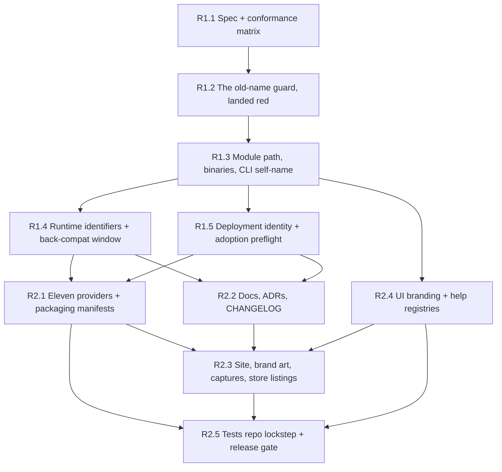

# Rename the Product to `retnd`

## Status

**Type:** EPIC / Detailed implementation specification
**Repository:** `backupdproject/backupd`
**Parent / predecessor EPICs:** #794 (the `RM_`/`bm_` runtime-identifier rename and the brand-drift guard it left behind), #687/#699 (the two earlier renames and everything they missed)
**Primary implementation root:** the whole tree; the load-bearing roots are `core/`, `container/`, `scripts/install/` and `ui/shared/`
**Tracker issue:** #885 (sub-issues #886 through #895)
**FR numbering:** this specification continues the product's FR series at **FR-36**, and claims **FR-36 through FR-44**. FR-1 through FR-24 are defined in `docs/EPIC.md`; FR-26 is claimed by the `version` command in `core/cmd/backupd` and `core/internal/app`; FR-27 through FR-35 are EPIC E. FR-25 is an unclaimed hole and stays one: anything citing "FR-25" today is citing nothing, and filling it would make that citation resolve to something it never meant. Nothing here renumbers an existing FR.

---

# Adversarial Review, Five-Expert Panel

Same discipline as `docs/EPIC-B-multi-nas.md` and `docs/EPIC-E-alternative-storage.md`: each reviewer was instructed to reject this EPIC if the rename could cause data loss, a silent behaviour change in an upgraded deployment, a guard that cannot fail, an unrecoverable one-way door, or a user-visible surface left claiming a name the product no longer answers to.

This is the third rename of this product. The first two are the reason the review is adversarial rather than a formality: `rclone-manager` left `RM_` environment variables behind, `backup-manager` left `bm_` cookies behind, four separate follow-up issues (#653, #658, #687, #699) exist solely to finish work a rename declared done, and the `docs/design/` directory still contains a file called `Backup Manager.dc.html`. The panel was given that history first.

## Expert 1, Go Build, Module Path and Toolchain

### Initial verdict: REJECT

Critical findings:

1. The draft treated the module-path sweep as "a big search and replace". It is 2,163 occurrences of `github.com/backupdproject/backupd` across 840 files, five `go.mod` files and `go.work`, and it is atomic: there is no intermediate commit in which the tree compiles. The draft spread it across two issues.
2. The draft renamed the module path without saying what happens to the GitHub coordinates, which are *inside* the module path. The coordinates now move too (FR-41), which makes this a **sequencing** question rather than a mismatch question, and the draft had no sequence: it left open whether the org transfer happens before or after a 2,163-occurrence sweep. Doing both at once means a failed transfer and a half-swept tree in the same afternoon.
3. `container/Dockerfile` copies `core/` one named directory at a time (`apicontract`, `cliecho`, `cmd`, `internal`, `service`, `migrations`) so a stray untracked file cannot reach the build context. Renaming `core/cmd/backupd` to `core/cmd/retnd` is invisible to that COPY list (it copies `cmd`, not `cmd/backupd`), but the *binary output path* and the two build-stage `go build` invocations are not, and neither is `apps/generic/cmd/backupd-web`. `cliname.go`'s own header documents this exact trap catching `core/apicontract` once already.
4. `scripts/docs/package-doc.baseline` pins package overviews by import path. Every one of them moves. The draft did not mention it, and this repository has an open bug (#882) from a package-doc baseline not being regenerated after an unrelated change.

Required corrections, all adopted:

- the module path, the two command directories, `cliecho.Binary`/`WebBinary` and the Dockerfile's build invocations are **one issue and one commit** (R1.3), because the tree does not compile between any two parts of it;
- the module path is swept **once, straight to its final value** `github.com/retnd/retnd`, and the GitHub transfer is a discrete LATE step after the in-tree rename is green (FR-41). The window between them is a declared transient in which the module path does not match its fetch location, and the no-`go install`/`go get` check is what keeps that transient harmless for its duration;
- the `retnd` organisation name is **reserved before R1.3 sweeps to it**, as a precondition rather than a cutover step: losing the name after 2,163 occurrences already say it would invalidate the module path and the image path at once;
- `scripts/docs/package-doc.baseline`, the layer manifest in `scripts/architecture/layers.conf`, `go.work`, `go.work.sum` and `.golangci.yml` path patterns are named in R1.3's scope rather than discovered by a red gate;
- `verify-core-without-distribution.sh` and the architecture checks run inside R1.3, not at the phase gate, because a path-shaped check that silently stops matching anything is the failure mode here.

### Consensus position: APPROVE AFTER REVISION

## Expert 2, Packaging, Release Engineering and Provider Submission

### Initial verdict: REJECT

Critical findings:

1. `container/compose.yaml` names `/backupd-web` in four `command:` arrays and two `healthcheck:` tests, and its own header paragraph warns that an image without that path dies with `exec /backupd-web: no such file or directory`. Every operator who pinned a compose file and pulls a new image gets exactly that. The draft called this "acceptable, it fails loudly" and moved on, which is true and insufficient: a stack that will not start is an outage on a backup product.
2. The draft moved the image inside the existing org and then the scope changed to move the org as well, which would rename the image reference **twice** — two operator-facing edits for one rename. Worse, the draft assumed GitHub's transfer redirects cover everything they cover for git and web URLs. They do not cover a container registry path: `ghcr.io/backupdproject/backupd` is not redirected to a new owner, and `raw.githubusercontent.com` does not follow repository redirects either. Those are the two references an operator has *pinned in a file*, and they are exactly the two the redirect does not save.
3. `container/release-manifest.json` keys per-platform digests by binary name (`backupd-web`). Rewriting a released manifest's keys would rewrite the record of what was published.
4. The eleven providers ship nine `apps/*/compose/backupd.{yml,yaml,env}` files, two Unraid XML templates and a TrueNAS catalog template, and `distribution/packaging/{canonical,submission,conformance,compliance}.json` hold the derived truth about all of them. The draft renamed the compose files and left the manifests to the gate.
5. `docs/submission/screenshots.md` requires real hardware, a real installation and a real SFTP source. Every store listing that shows a screen with the product name on it is invalidated by this epic, and nothing in the draft said so.
6. The signing identity is not a string in a doc. `cosign verify`'s `certificate-identity` is the OIDC subject of the release workflow, derived from the repository path, and it is baked immutably into every signature already published. After a transfer, new releases carry a new identity and old releases still carry the old one, so a single documented command cannot verify both — and any downstream policy pinning the old identity silently starts rejecting new releases.
7. Everything that is repository *configuration* rather than repository content has to be rebuilt by hand on the other side: branch protection and required checks, Actions secrets, GHCR package ownership and visibility, the Pages source and any custom domain, and the label set this EPIC just added. None of it is in the tree, so none of it is in the diff, and nothing in the repository will notice it is missing until a release fails.

Required corrections, all adopted:

- the image ships `/retnd-web` **and keeps `/backupd-web` as a one-release alias entrypoint** (a second hardlinked name in the final stage, not a shell wrapper: the image is distroless), so a pinned compose file starts on a new image and the operator's upgrade is a compose edit at their own pace (FR-37);
- **the image reference moves exactly once**, at the cutover, from `ghcr.io/backupdproject/backupd` to `ghcr.io/retnd/retnd`. Phase 1 does not touch it: renaming it inside the old org first would cost operators two edits and buy nothing (FR-39);
- because a registry path is not redirected, `ghcr.io/backupdproject/backupd` is **mirrored for one release from a thin retained repository in the retained `backupdproject` organisation**, which makes "do not delete the old org" an explicit requirement rather than an oversight, and the mirror goes on the guard's alias list with the issue that deletes it (FR-41);
- the cosign identity is **re-issued, not re-pointed**: the documented `verify` command presents the old identity for releases published before the cutover and the new one for releases after it, keyed by version, and the release gate asserts both (FR-41);
- the repository-configuration checklist (branch protection, required checks, secrets, GHCR ownership and visibility, Pages source, labels) is written down in R2.5 as a checklist with a rollback note, because it is the part of the move that is invisible to every diff (FR-41);
- `container/release-manifest.json` entries for already-published releases are **history and are not rewritten**; the new binary name appears in new entries only, and the manifest's consumer accepts both keys for the overlap (FR-37);
- providers and their packaging manifests are one issue (R2.1), regenerated through `distribution/packaging`'s own derivation rather than hand-edited, with the gated matrix tests as the check;
- every store-listing row that shows the product name goes back to **outstanding** in `docs/conformance/submission-preflight.md` rather than quietly keeping the old picture, and R2.3 records that as its outcome instead of claiming a pass it cannot have.

### Consensus position: APPROVE AFTER REVISION

## Expert 3, Config, State and Upgrade Safety

### Initial verdict: REJECT

Critical findings:

1. **The draft's single worst defect, and it is a data-loss-class defect.** The draft renamed the container-internal state directory from `/var/lib/backupd` to `/var/lib/retnd`. An operator with a pinned compose file bind-mounts their host state directory onto `/var/lib/backupd`; the new binary looks at `/var/lib/retnd`, finds no state database, and takes the *fresh install* path. The first-run flow claims the administrator account and burns the enrollment token. A running deployment with years of journal would present a setup wizard, and the operator's first instinct — complete it — is the action that makes it worse. `docs/epic-checklist.md` §10 already documents this hazard for capture scripts pointed at a real instance; the draft reintroduced it as a shipped default.
2. `config.yaml` stores **absolute container paths**: `state.database` is `/var/lib/backupd/state.db` in every deployment that ever saved settings, and `ssh.known_hosts` is `/etc/backupd/known_hosts`. Renaming the mount point without rewriting those values leaves a config naming a path that no longer exists.
3. `Load` uses `KnownFields(true)`, so the draft's throwaway line "we could add a `legacy_paths:` key" is a one-way door: a config carrying that key cannot be parsed *at all* by an older build, which is the situation an operator rolling back an upgrade is in.
4. The draft had the installer "handle migration" with no statement of what happens to an operator who does not use the installer, which is every Unraid, Portainer, Dockge and hand-rolled-compose deployment.

Required corrections, all adopted:

- **FR-38, the state-adoption preflight, is the epic's central safety requirement**, and the panel rejected the reviewer's own first instinct along with the draft: when the resolved state directory holds no state database *and* the legacy directory holds one, the process **adopts the legacy directory** and warns on every start, naming the compose line to change. It **never** falls through to the first-run path, and it does not refuse either — refusing is a self-inflicted outage on a backup product, and an operator staring at a stopped stack reaches for the wizard as readily as one staring at a fresh install. Refusal is reserved for the genuinely ambiguous cell, two different populated directories, with a same-device-and-inode test so it cannot fire on one directory mounted twice;
- the same rule generalises: no rename in this epic may turn "the state I had" into "no state at all". Where a legacy location can be detected, detection is mandatory and the outcome is stated in FR-38's four-cell table, never left to whichever path the code checks first;
- **no new config key.** The legacy paths are compiled-in constants, not configuration, precisely because of `KnownFields(true)`: an operator who rolls back to the previous build must find a byte-identical `config.yaml` (FR-42);
- the installer (`scripts/install/install_docker_host.py` and its embedded compose copy) performs the mount move **and** rewrites the persisted absolute paths in `config.yaml`, transactionally through the same temp-file-in-the-config-directory discipline `#196` established, and the non-installer path is carried by FR-38's adoption;
- a downgrade after this epic is a supported operation for one release: the previous build meets an unchanged schema version, an unchanged `config.yaml` and its own paths still mounted, because the compose file the installer wrote mounts both.

### Consensus position: APPROVE AFTER REVISION

## Expert 4, Runtime Contract, Metrics and Back-Compat

### Initial verdict: REJECT

Critical findings:

1. The draft hard-cut the `BACKUPD_*` environment variables. Twenty of the forty-six are **exported into operator-authored Bash hook scripts** by EPIC L's workflow engine (`BACKUPD_BACKUP_STATUS`, `BACKUPD_STEP_NAME`, `BACKUPD_RECOVERY`, and so on). A Bash script reading `$BACKUPD_BACKUP_STATUS` after a hard cut does not fail: it gets the empty string. A hook that notifies on failure silently stops notifying, and a hook that branches on status takes the wrong branch. This is the **silent** breakage class, and it is worse than an outage because nothing reports it.
2. The draft hard-cut the fourteen `backupd_*` metric series. An alert rule that no longer matches anything does not fire. A dashboard that no longer matches anything is blank. Both look like "everything is fine".
3. The draft renamed `backupd_session` and `backupd_csrf` with no read-compat, signing out every browser session on upgrade — the exact regression #794 deliberately avoided with `bm_session`/`bm_csrf`, in this same repository, with a read-compat window that is still in the tree and still documented in `api/v1/openapi.json`.
4. The draft applied the same back-compat treatment to everything, including `x-backupd-proxy-error`, which is produced and consumed by two halves of the same binary served from the same image.

Required corrections, all adopted:

- the classification is **by failure mode, not by category** (FR-37). Anything whose breakage is *silent* gets a one-release compat window; anything whose breakage is *loud* is hard-cut and the loudness is the argument:
  - **hook environment**: both names exported for one release, `RETND_*` and `BACKUPD_*`, with identical values;
  - **input environment**: both names read, new wins, one deprecation warning per name per process start (the `RM_DEBUG` precedent, exactly);
  - **metrics**: `retnd_*` primary, `backupd_*` duplicated for one release. Only gauges and info series are duplicated, never a counter, and the legacy series' `# HELP` text says it is deprecated and names its replacement, so a scrape carries its own deprecation notice;
  - **cookies**: `retnd_session`/`retnd_csrf` issued, `backupd_session`/`backupd_csrf` accepted on a read, and a request arriving with only the old name has its token re-issued under the new one — the #794 mechanism, reused rather than reinvented;
  - **`x-backupd-proxy-error`**: hard cut, no alias, because `serve-ui` and the bundle it serves ship in one image and cannot disagree;
- a dual-emitted metric's double-count hazard is stated where an operator reads it, not only here: a query summing across both names double-counts, which is why only gauges are duplicated and why the deprecation window is one release;
- the deprecation window has a **named closing issue filed by this epic**, and the guard's alias list is its ledger: `check-brand-drift.sh` reports an alias entry that no longer matches anything, so the window closes by the guard telling somebody, not by somebody remembering.

### Consensus position: APPROVE AFTER REVISION

## Expert 5, The Guard, Docs and User-Visible Naming

### Initial verdict: REJECT

Critical findings:

1. The draft's guard was "grep for `backupd`, case-insensitively". This repository contains **7,774 occurrences of `BackupSet`**, 1,989 of `backup-set` and 40 of `BACKUP_DIR`, and — the case that kills the naive pattern — **50 occurrences of `BackupD[a-zA-Z]`** across nine real identifiers: `BackupDetailPage`, `BackupDefaultsPage`, `BackupDomainPolicy`, `BackupDetail`, `TestBackupDataAreSeparateMounts`, `BackupDomain`, and three test names beginning `TestBackupDoes…`. A case-insensitive `backupd` pattern flags every one of them. A guard that produces fifty false positives on the tree it ships with is a guard somebody deletes, which is the failure the existing `check-brand-drift.sh` header spends a paragraph avoiding for `CONFIRM_DELETE` and rclone's `ibm_signer.go`.
2. The draft's guard had no self-test. §12 of the checklist requires a mutation self-test for every new guard, and "three checks here were found in one day that could not fail".
3. The draft deleted the existing `RM_`/`BM_`/`bm_`/`rbm_` patterns and replaced them. Those still guard live occurrences: `RM_DEBUG` is a kept alias, and twenty-three `RM_*` token-and-path pairs are the *environment contract of another repository* (`backupdproject/backupd-tests`, pinned at `scripts/e2e/tests-repo.pin`).
4. The draft renamed `docs/design/Backup Manager.dc.html`. §5 of the checklist says design notes are a record of a decision at the moment it was taken and are deliberately not kept in step with later work. Renaming it would falsify a dated record.
4b. **The draft said "reletter the wordmark" and left it there, which is the one class of surviving old name that no text guard can ever see.** The product's name is drawn as artwork: the split two-tone wordmark from `0cfad66f`, the logo mark, a dozen SVG sources, PNG and ICO exports at every declared size, three provider icons, the store-listing icons, the `docs/design/` mockup PNGs and 44 site screens. `check-brand-drift.sh` greps tracked source; it cannot read text baked into an SVG `<path>`, and it cannot read a raster at all — the guard's own header says `-I` means a binary file is never scanned. So an epic that goes entirely green can still ship a favicon that says `backupd`, and nothing in the repository would object.
5. The draft claimed the site could be re-captured. It can, but only by borrowing Playwright out of the `backupd-tests` checkout at the pinned sha, against the mock API, with the clock pinned — four constraints from §10, none of which the draft mentioned, and one of which (never against a real deployment) is the same first-run hazard Expert 3 raised.

Required corrections, all adopted:

- the guard **extends** rather than replaces: the four existing patterns stay, and the `backupd` family joins them, anchored on both sides — `backupd` followed by a non-lowercase-letter for the lowercase spelling, `BACKUPD_[A-Z]`, `Backupd` followed by a non-lowercase-letter, and the module-path token as a single named alias. `BackupDetailPage` is green because `D` is followed by `e`; `backupd_session` is red because `_` is not a lowercase letter (FR-40);
- the guard lands **red**, in Phase 1, with every surviving occurrence on its `pending` list, and each later issue deletes its own pending entries. The list going empty is the epic's completion signal, and it is mechanical rather than a judgement;
- `scripts/rename/selftest.sh` gains a red case per new pattern and a green case per lookalike above, with the nine `BackupD*` identifiers planted by name (FR-40);
- `docs/design/Backup Manager.dc.html` and the dated per-issue design notes are **not renamed**, and this document is where that decision is recorded so the next reader does not file it as a miss;
- **brand art is redrawn and re-exported, never text-substituted** (FR-44): the wordmark is redrawn for a four-glyph name, every SVG source is regenerated, and every PNG/ICO export is re-exported at every declared size;
- because the text guard structurally cannot cover artwork, FR-44 adds the two things that can: a **manifest inventory** of every brand asset, so a file cannot be missed by being forgotten, and an **automated string scan of SVG `<text>`, `<title>` and `<desc>`** for the source SVGs, which catches the cheap half. The expensive half — text that is now a `<path>`, and every raster — gets a named **human-in-the-loop acceptance step** with the asset list in front of the reviewer, and it is a matrix row of its own so it cannot be absorbed into a neighbour that automation does cover;
- the captures are re-recorded through the four scripts in `docs/site/tools/` against `ui/shared`'s own dev server and `createMockApi`, clock pinned, Playwright borrowed at the pin — and if the e2e gate has not run on the machine, the capture says so rather than guessing (R2.3);
- the site's "What has not been proven" section states plainly which surfaces were re-captured and which store screenshots still show the old name.

### Consensus position: APPROVE AFTER REVISION

## Five-Expert Consensus

> **A rename is judged by what it breaks silently. Every identifier in this epic is classified by its failure mode before it is touched: silent breakage earns a one-release compat window with a guard entry as its ledger, loud breakage is hard-cut and the loudness is the argument, and the one case that is both silent and unrecoverable — an upgraded deployment whose state directory moved out from under it — is answered by adopting the state that exists and saying so on every start, never by a first run, with refusal reserved for the one cell where two journals are visible at once. The end state carries no surviving `backupd` anywhere: every alias is a time-boxed upgrade-safety shim with a named removal release, never a permanent home for the old name, and the one class a text guard structurally cannot see — the name drawn as artwork — is redrawn, inventoried and accepted by a human on the record. The repository's own coordinates move too, once, as a discrete late cutover after the tree is green, because the redirect GitHub gives a transfer covers git and web but not the two references an operator has pinned in a file. The guard lands red with the whole surface on its pending list, so "finished" is a list going empty rather than somebody's opinion.**

---

# 1. Purpose

The product is renamed from `backupd` to **`retnd`**. That is 10,522 case-insensitive occurrences across 1,339 of 1,938 tracked files in this repository, 124 filenames, and a further 759 occurrences across 178 files in `backupdproject/backupd-tests`.

This epic exists because the previous two renames did not finish, and their unfinished parts are still visible:

- `rclone-manager` → `backup-manager` left `RM_` environment variables, one of which (`RM_DEBUG`) is still a kept alias today;
- `backup-manager` → `rbm` → `backupd` left `bm_session`/`bm_csrf` cookies, a compliance-docs miss (#699), a design file still called `Backup Manager.dc.html`, and four issues whose entire content was "finish the rename".

The mechanism that stops a fourth repetition already exists: `scripts/rename/check-brand-drift.sh`, with its self-test, its three-list vocabulary (aliases kept on purpose, pending deletions in transit, pre-existing occurrences pinned to a path) and its gate step in `scripts/ci-local.sh` and `.github/workflows/ci.yml`. This epic's first mechanical act is to point that guard at the name it is about to retire, **red**, with the entire surface enumerated on its `pending` list. Everything after that is deleting entries from a list a gate holds.

## The primary invariant

**After EPIC R there is no mention of `backupd` anywhere in the current, going-forward product.** Every asset, every package, every identifier, every filename and all content says `retnd`. This is FR-43, it is the first line of the Definition of Done, and it is checkable rather than asserted: the org-wide deep grep for `backupd|backupdproject|rclone[-_ ]manager|backup[-_ ]manager|RCLONE_MANAGER_|RM_[A-Z]|BM_[A-Z]|bm_|rbm_`, across **both** repositories, returns only the enumerated allowlist, and that allowlist shrinks to history-only after the named removal release.

Three carve-outs, stated up front so the invariant is truthful rather than aspirational. `backupd` legitimately survives in, and only in:

1. **Immutable history.** `CHANGELOG.md` entries and git commit messages that describe what the software *was* called. Rewriting them would be dishonest, and the record of two unfinished renames is the reason this document exists.
2. **Already-published, immutable records.** `provenance/**` (checksums, SBOM, release provenance, third-party licences) and `container/release-manifest.json` entries for releases that shipped, whose digests history pins. These grow forward; they are never rewritten.
3. **Time-boxed compat shims**, each with a **named removal release** in FR-43's table, guard-tracked on `check-brand-drift.sh`'s `aliases` list, and deleted by a filed issue. After that release the allowlist is history-only.

Anything else is a defect.

What this epic deliberately is not:

- It **is** a re-brand of the repository: the organisation becomes `retnd`, the repositories become `retnd/retnd` and `retnd/retnd-tests`, and that move is a discrete late cutover with its own rollback note (FR-41). What it is not is a re-brand done in the middle of the sweep.
- It is not a functional change. No behaviour changes except the names of things, the one-release compat shims, and FR-38's adoption of state found at a legacy path, which replaces a first run that should never have happened.
- It is not a deprecation-window close. This epic *opens* windows; a follow-up issue closes them, and the guard's alias list is what reminds anybody. Every window has a **named removal release** in this document (FR-43), so "transitional" is a date rather than a mood.

# 2. Scope: the surface inventory

The committed, actionable, token-by-token enumeration across **both** repositories in the organisation lives at **`docs/EPIC-R-rename-inventory.md`**: 23 token classes, each with its target, its repositories, its file/line/occurrence counts, its owning sub-issue, whether anything gates it, and its compat note. That file is where the guard's `pending` entries are derived from, and it carries the reproduction command for every number. The table below is the same surface grouped by the kind of work it is.

**The previous two renames did not finish, and EPIC R finishes them.** The deep grep over both trees found three brands' worth of live identifiers, not one: `rclone-manager`'s `RCLONE_MANAGER_*` and `RM_*` environment prefixes (48 and 350 lines), `backup-manager`'s `bm_` cookies and prose (71 and 123 lines), and `backupd` itself (8,206 lines org-wide). All of them go to `retnd`. The sharpest single finding is that **none of the existing guard's four patterns matches `RCLONE_MANAGER_`**, so a first-brand environment prefix — including `RCLONE_MANAGER_SOURCE_PORT`, which `docs/install.md` documents to operators — has sat green through two renames. `BM_[A-Z]` and `rbm_[a-z]`, by contrast, have zero real occurrences in either tree: their only matches are the strings the guard's own self-test plants.

Counts are from `origin/main` at `6a528c98` for this repository and `35b15e2` for `backupd-tests`, `git grep` over tracked files. "Hits" are occurrences, "files" are files containing at least one; the inventory gives lines as well, because lines and occurrences differ by a third on the largest token.

| # | Category | What changes | Files / hits | Gated? | Risk and ordering |
|---|---|---|---|---|---|
| 1 | **Go module path and imports** | `github.com/backupdproject/backupd` → `github.com/retnd/retnd` in five `go.mod`, `go.work`, `go.work.sum`, `.golangci.yml`, `scripts/architecture/layers.conf` and every import line | 840 files / 2,163 hits (2,058 import lines) | **Gated** — nothing compiles | One atomic sweep in one commit, straight to the final value; no intermediate state builds. Must precede everything that reads a symbol, and the org name must be reserved before it runs. |
| 2 | **Binary and command name** | `core/cmd/backupd/` → `core/cmd/retnd/`, `apps/generic/cmd/backupd-web/` → `retnd-web/`, `cliecho.Binary`/`WebBinary` in `core/cliecho/cliname.go`, the dispatch table in `main.go`, `core/cliecho/routes.go`, `legacyName` in `selfname_test.go` (`rbm` → `backupd`) | 129 filenames / ~1,100 hits | **Gated** — `site_reference_test.go`, `dispatchtable_test.go`, `TestUsage_EveryRegisteredCommandIsPinned`, `routeparity_test.go`, `argv0_test.go`, `cliechogaps_test.go`, `selfname_test.go` | Same commit as row 1. `cliname.go` is the one spelling of the command and its header already enumerates the three things that look like it and are not. |
| 3 | **Container image, compose, labels** | `ghcr.io/backupdproject/backupd` → `ghcr.io/retnd/retnd` **at the cutover only** (R2.5), not in Phase 1; `container/compose.yaml` service `backupd`, the four `/backupd-web` command arrays and two healthchecks; container names `backupd-backupd-1`/`backupd-web-ui-1`; `com.docker.compose.project=backupd`; `container/release-manifest.json` digest keys | 46 files / 121 image hits; `container/` 4 files / 95 hits | **Gated** — `distribution/compose` contract and release tests, `runtime-contract.json`, `release-gate-covers-every-job` | COMPAT-BREAKING but **loud**: a pinned compose file naming `/backupd-web` against an image without it dies at start. Mitigated by the one-release alias entrypoint (FR-37). A registry path is **not** covered by transfer redirects, so the old image path is mirrored for one release from the retained old org (FR-41). Published manifests are history and are not rewritten. |
| 4 | **Container-internal paths and persisted config values** | `/etc/backupd` → `/etc/retnd`, `/var/lib/backupd` → `/var/lib/retnd`; the `state.database` default `/var/lib/backupd/state.db`; `known_hosts`, `ssh_keys/`, the workflow spool | 99 files / 296 + 53 files / 80 hits | Partly gated (`config` suite, compat cells) | **COMPAT-BREAKING and silent, and the one data-loss-class item in the epic**: a moved mount point makes a live deployment look fresh and hands it the first-run wizard. Answered by FR-38's adopt-and-warn table plus installer migration; refusal is reserved for two visible journals. |
| 5 | **Environment variables** | 46 distinct `BACKUPD_*` names → `RETND_*`. Two populations: engine **inputs** (`BACKUPD_DEBUG`, `BACKUPD_INCREMENTAL_ENGINE`, `BACKUPD_SIGNAL_EXIT_CHILD_MODE`) and workflow-hook **exports** read by operator-authored Bash (`BACKUPD_BACKUP_STATUS`, `BACKUPD_STEP_*`, `BACKUPD_WORKFLOW_STATUS`, `BACKUPD_RECOVERY`, `BACKUPD_RUN_ID`, …) | 84 files / 279 hits | Gated only by the extended guard | **COMPAT-BREAKING and silent**: a hook script reading a renamed variable gets the empty string, not an error. Both names exported / both read for one release (FR-37). |
| 6 | **Metrics** | 14 `backupd_*` series in `core/internal/metrics/metrics.go`, pinned in `metrics_test.go` and `snapshot_test.go` | 22 files / 76 lowercase-identifier hits | Gated (the metric-name pin) | **COMPAT-BREAKING and silent**: an alert rule that matches nothing never fires. Dual emission of gauges only, for one release, with the deprecation in the `# HELP` text. |
| 7 | **Cookies and wire identity** | `backupd_session` (`apps/common/auth/local/session.go`), `backupd_csrf` (`apps/common/csrf/csrf.go`), both in `core/internal/apiclient/client.go`, both declared in `api/v1/openapi.json`; the client's default `User-Agent` | 8 files / ~20 hits | Gated (contract drift, auth suites) | COMPAT-BREAKING: a hard cut signs every browser session out on upgrade. Read-compat window, reusing #794's exact mechanism. |
| 8 | **API contract** | `"title": "Backupd /api/v1"`, the two cookie `securitySchemes` and their prose, two CLI-quoting descriptions, `x-backupd-proxy-error` in `ui/shared/src/api/transport.ts`; both generated bindings regenerated | `api/v1/openapi.json` 8 hits; 2 files for the header | **Gated** — `check-contract-drift.sh`, `check-client-paths.sh`, `contract.conformance.test.ts` | **No error code carries the brand** — verified, and it removes a whole category from this epic. `x-backupd-proxy-error` is hard-cut: producer and consumer ship in one image. |
| 9 | **systemd units and the installer** | `backupd-bridge.service`, `backupd-bridge.timer`, `backupd-workflow-runner.service`; `scripts/install/install_docker_host.py` (embedded compose, unit names, compose-label parsing), `embed_compose.py`, `test_install_docker_host.py` | 50 files / 585 hits in `scripts/` | **Gated** — installer suite, embedded-compose equality | The installer is the only automated migration path for rows 3, 4 and 9 together; it owns the mount move, the unit rename and the persisted-config rewrite. |
| 10 | **The eleven providers and packaging** | Nine `apps/*/compose/backupd.{yml,yaml,env}`, `apps/unraid/template/backupd{,-ui}.xml`, `apps/truenas/catalog/templates/docker-compose.yaml`, `apps/ugos`/`casaos`/`zimaos` icons; `distribution/packaging/{canonical,submission,conformance,compliance}.json` and their derivation | `apps/` 183 files / 893 hits; `distribution/` 47 files / 501 hits | **Gated** — `apps/common/tests`, the packaging matrix tests | Manifests are **derived**, so they are regenerated, never hand-edited. Filenames move, which makes this a rename-detection-sensitive diff. |
| 11 | **Store listings and submission** | `docs/submission/*.md` (11 provider listings plus `description.md`, `release-notes.md`, `permission-rationale.md`, `privacy-disclosure.md`), `docs/submission/icon.svg`, `docs/conformance/submission-preflight.md` | 10 files / 14 hits | **Ungated** | `screenshots.md` requires real hardware and a real SFTP source and **cannot be regenerated here**. Every listing screenshot showing the name goes back to outstanding. |
| 12 | **Docs and ADRs** | `README.md`, 56 `docs/*.md` (`install.md`, `deployment.md`, `runtime-contract.md`, `recovery.md`, `recovery-without-a-terminal.md`, `storage-mediums.md`, `ssh-setup.md`, `incremental-engine.md`, …), 13 of 22 ADRs, `docs/api/contract.md`, `CONTRIBUTING.md`, `CONTRIBUTOR-LICENSE-AGREEMENT.md` | 92 doc files; `docs/*.md` 436 hits, ADRs 41 | Partly gated (`reference.html` command table, package-doc baselines) | `CHANGELOG.md` is the **record of the renames** and is not rewritten; it gains an entry. A new ADR records FR-41's sequence and its irreducible costs. |
| 13 | **Site, brand art and captures** | Five pages and their `<title>`s, `topbar.js`, `copy.js`, `tooltip.js`, `theme.css`; the split two-tone wordmark **redrawn** for a four-glyph name and every export regenerated (FR-44) across `assets/logo-mark.svg`, `docs/assets/logo-{dark,light}.svg`, `docs/site/assets/{icon,logo-mark-light}.svg`, the three favicons and `apple-touch-icon.png`, `ui/shared/public/favicon.svg`, `docs/submission/icon.svg`, three provider icons; 44 `docs/site/screens/` files, 10 animated, re-captured through the four scripts in `docs/site/tools/` | `docs/site` 12 files / 139 hits; 10 art files | Partly gated (`site_reference_test.go`) | The art is the one class the text guard cannot see: it needs an inventory, an SVG string scan and a human acceptance step (FR-44). Captures run against `createMockApi` on `ui/shared`'s own dev server, **never a real deployment** (the first-run hazard again), clock pinned, Playwright borrowed from the `backupd-tests` checkout at `scripts/e2e/tests-repo.pin`. |
| 14 | **UI branding and help copy** | 201 files containing `Backupd`: `App.tsx` titles, `failure.ts`'s operator-facing sentences, `BackupdError`, `ErrorBoundary`, `LoginPage`/`EnrollmentPage` copy, `mock.ts` strings, `ui/shared/src/tooltips/tooltips.json` (425 entries), `fieldHelpCopy.ts` | 201 files / 757 hits | **Gated** — tooltip copy and wiring tests, typecheck, eslint, vitest, build | The nine `BackupD[a-zA-Z]` identifiers (`BackupDetailPage`, `BackupDefaultsPage`, …) **must not move**; they are the guard's principal false-positive risk. |
| 15 | **The separate black-box test repository** | `backupdproject/backupd-tests` → `retnd/retnd-tests`: `suites/cli` (105 files), `suites/web-ui` (29), `suites/equivalence` (13), `fixtures/`, `tools/getbuild`, `tools/equivstate`, `build-under-test.json`, `Makefile`, `scripts/gate-local.sh`; and this side's `scripts/e2e/tests-repo.pin` | 178 of 230 files / 759 hits | Gated on both sides, out of step by construction | Two-repository lockstep with a pin bump in the middle, and both repositories transfer in the same cutover. Their `RM_*` environment contract is **not** renamed by this epic and stays on the guard's `preexisting` list. |
| 16 | **Repository coordinates and URLs** | GitHub org `backupdproject` → `retnd`; `backupdproject/backupd` → `retnd/retnd`; `backupdproject/backupd-tests` → `retnd/retnd-tests`; `https://backupdproject.github.io/backupd/*` → `https://retnd.github.io/retnd/*` (8+ links); four `raw.githubusercontent.com/backupdproject/backupd/main/…` installer and icon URLs; cosign/OIDC `certificate-identity`; `.github/workflows/*` | 2,369 `backupdproject` hits (206 outside the module path); `.github/` 3 files / 11 hits | Gated (release gate, Pages workflow) | **IN SCOPE (FR-41)**, as a discrete LATE cutover owned by R2.5, after the whole in-tree rename is green. Redirects cover git and web and preserve every `#N`; they do **not** cover `raw.githubusercontent.com`, the GHCR path, the Pages origin or the signing identity, and those four are the work. |
| 17 | **Compliance and provenance** | `NOTICE` (6), `distribution/packaging/compliance.json` (23), `provenance/{checksums.txt,release-provenance.json,sbom.spdx.json,third-party-licenses.json}` (285) | 5 files / 314 hits | **Gated** — licence-inventory regeneration | `provenance/**` records **released artifacts** and is append-only history; it is regenerated forward, never rewritten. The guard already excludes it for this reason. |
| 18 | **The guard itself** | `scripts/rename/check-brand-drift.sh` gains the `backupd` family and three list entries per surviving occurrence; `scripts/rename/selftest.sh` gains a red case per pattern and a green case per lookalike; the `gate_step` wording in `scripts/ci-local.sh`; `.github/workflows/ci.yml` | 4 files | **Gated**, and it is the gate | Lands **red** in Phase 1 with the whole surface on `pending`. The list emptying is the epic's completion signal. |
| 19 | **Published package names** | `@backupd/ui-shared` (`ui/shared/package.json`) and `@backupd/provider-conformance` (`apps/common/tests/package.json`) → `@retnd/*`, with their two `package-lock.json` files | 4 files / 6 hits | **Gated** — workspace resolution, so the frontend gate fails outright | Small, and the class this inventory nearly missed: an npm scope is a package name, not prose. Lands with the frontend gate. |
| 20 | **Brand art as artwork** | 13 SVG/PNG/ICO brand sources and exports, 11 store icons, `docs/design/*.png` mockups, 44 site captures — **redrawn and re-exported**, not text-substituted | ~70 binary + 13 source files | **Structurally ungated** | The one class `check-brand-drift.sh` cannot see: it cannot read an SVG `<path>` and `-I` means it never reads a raster. Needs FR-44's manifest, SVG string scan and human acceptance. Verified: no `data:image` payload exists in the tree today. |

# 3. Functional Requirements

## FR-36, The Product Is `retnd`, and One Constant Spells It

The product, the command, the daemon and the image are named `retnd`. The web host binary is `retnd-web`.

`core/cliecho/cliname.go` is already the single spelling of the command, and its existing header enumerates the three shapes in this tree that look like the name and are not: filesystem paths, the project/image/service identity, and wire identity. That separation is the reason this epic is a specification rather than a sweep, and every row of section 2 is classified against it.

- `cliecho.Binary` becomes `retnd`; `cliecho.WebBinary` becomes `retnd-web`.
- The command directories become `core/cmd/retnd` and `apps/generic/cmd/retnd-web`.
- The Go module path becomes `github.com/retnd/retnd`, swept once to its final value (FR-41 owns the sequence that makes it match its fetch location).
- The product's display name, everywhere a human reads it, is `retnd` in running text and `retnd` in a heading: lowercase, like the command, because it is a daemon and the wordmark is lowercase. There is no `Retnd`. The 757 occurrences of `Backupd` collapse to lowercase `retnd` rather than being title-cased, and `BackupdError` becomes `RetndError`.
- The split wordmark is **redrawn**, not relettered: `retn` + the two-tone daemon `d`. The `d` carries the accent in both names, so the treatment survives and the geometry does not — a four-glyph name is not a six-glyph name, and FR-44 owns what that costs.
- `legacyName` in `apps/generic/cmd/retnd-web/selfname_test.go` moves from `rbm` to `backupd`: that test's job is to hold the binary to not calling itself by the *previous* name, and the previous name changes.

## FR-37, The Back-Compat Window Is Decided by Failure Mode

Every renamed runtime identifier is classified before it is touched, by what an upgraded deployment experiences if the rename is a straight cut:

| Identifier | Failure mode of a hard cut | Decision |
|---|---|---|
| Hook environment (`BACKUPD_BACKUP_*`, `BACKUPD_STEP_*`, `BACKUPD_WORKFLOW_STATUS`, `BACKUPD_RECOVERY`, `BACKUPD_RUN_ID`, …) | **Silent.** A Bash hook reads the empty string; a failure notifier stops notifying | Both names exported for one release, identical values |
| Input environment (`BACKUPD_DEBUG`, `BACKUPD_INCREMENTAL_ENGINE`, `BACKUPD_SIGNAL_EXIT_CHILD_MODE`) | **Silent.** The setting reverts to its default | Both read, new wins, one deprecation warning per name per process start |
| Metrics (`backupd_*`, 14 series) | **Silent.** An alert rule matches nothing and never fires | `retnd_*` primary; `backupd_*` duplicated for one release, gauges and info only, `# HELP` naming the replacement |
| Session and CSRF cookies | **Loud-ish, and rude.** Every browser session is signed out mid-task | `retnd_session`/`retnd_csrf` issued, `backupd_*` accepted on a read, token re-issued under the new name |
| Image entrypoint `/backupd-web` | **Loud.** `exec /backupd-web: no such file or directory`; the stack does not start | `/retnd-web` primary, `/backupd-web` kept as a hardlinked alias for one release |
| Container-internal state and config paths | **Silent and unrecoverable.** A live deployment presents a first-run wizard | Renamed; FR-38 adopts state found at the legacy path and warns on every start. Not a name alias: see FR-38 |
| `x-backupd-proxy-error` | **None.** Producer and consumer ship in one image | Hard cut, no alias |
| `User-Agent` | Cosmetic; a log or audit filter matching on it stops matching | Hard cut, named in the CHANGELOG because somebody's log filter may care |
| API `title`, operation prose, docs, UI copy, art | **None** | Hard cut |

Rules that hold across the table:

- Every alias is **primary nowhere.** The new name is what the product writes, mints, exports and documents; the old name exists only so an upgrade does not break, exactly as #794 required of `RM_DEBUG`.
- Every alias appears on `check-brand-drift.sh`'s `aliases` list, with the issue that closes it. The guard reports an alias entry that matches nothing, so the window closes when the guard says the shim is gone, not when somebody remembers it exists.
- Dual-emitted metrics are gauges and info series only. A counter cannot be duplicated safely, and a query summing across both names double-counts; that caveat is documented in `docs/deployment.md` where the metrics are, not only here.
- The window is **one release**, and this epic files the issue that closes it as its last act.

## FR-38, No Silent First Run: the State-Adoption Preflight

This is the requirement the epic exists to get right.

An upgraded deployment whose state directory is mounted at the legacy path, running a binary that defaults to the new path, observes "no state database". Every other branch of that condition is correct — a fresh install really does have no state database — and the consequence of taking it on a live deployment is that the first-run flow claims the administrator account and burns the enrollment token. A deployment with years of journal presents a setup wizard, and the operator's first instinct, completing it, is the action that makes it worse.

Before any first-run decision, the process resolves both locations and decides from facts it can observe:

| New path (`/var/lib/retnd`) | Legacy path (`/var/lib/backupd`) | Outcome |
|---|---|---|
| holds a state database | absent, empty, or the **same directory** (same device and inode) | Use the new path. Normal operation |
| absent or empty | holds a state database | **Adopt the legacy path**, serve from it, and warn on every start, naming the compose line to change and the installer command that changes it |
| absent or empty | absent or empty | Fresh install. First run, exactly as today |
| holds a state database | holds a **different** state database (different device and inode) | **Refuse to start**, naming both paths. Two journals are visible, and choosing one silently is the worst option available |

The rules that make that table a requirement rather than a sketch:

- The forbidden transition is a single cell and it SHALL be unrepresentable: **the new path empty, the legacy path holding a state database, and the process proceeding to first run.** No flag, environment variable or configuration may reach it.
- **Adoption rather than refusal**, in that cell, because refusing to start is a self-inflicted outage on a backup product and the operator has done nothing wrong: their compose file is the one this project published. They get a working deployment and a warning with the fix in it, which is what a deprecation is for. A refusal there would also be the second-worst outcome available, because an operator staring at a stopped stack reaches for the wizard as readily as one staring at a fresh install.
- **Refusal is reserved for ambiguity**, and the same-directory test is what keeps it from firing on the installer's own rollback window: the installer writes a compose file mounting one host directory at both container paths, so both look populated — and both are the same device and inode, which is not ambiguity.
- The same table governs the **configuration** directory and `config.yaml`, asserted separately, because the two directories are resolved by different code and the configuration directory also holds the SSH key store and `known_hosts.d/`.
- The adopted path is reported through the surfaces that already report every other resolved path (`retnd check`, the deployment-check route, the startup log), so an operator can see which one is live without relying on a warning they have scrolled past.
- The warning and the refusal are both captured as compat cells, so their wording is pinned: an operator meets either one once, in an incident, and reads whatever the cell says today.
- The **planted violation** is a build that first-runs when the legacy path holds a database; the compat cell must go red on it, and that red run is recorded in the landing PR. Its **positive control** is a genuinely empty deployment that still first-runs, so "it adopted the legacy path" cannot be satisfied by a product that can no longer be installed.
- Adoption is a **shim with a closing date**, listed on the guard's alias list like every other one. The follow-up issue that closes the window deletes it, and replaces the cell pinning the warning with one pinning a refusal.

## FR-39, Deployment Identity and the Upgrade Path

- The image reference moves **exactly once**, and not in this phase: it stays `ghcr.io/backupdproject/backupd` until the FR-41 cutover, which makes it `ghcr.io/retnd/retnd`. Moving it inside the old org first would cost every operator two compose edits for one rename. A registry path is not covered by GitHub's transfer redirects, so the old path is mirrored for one release from a thin retained repository in the retained `backupdproject` organisation, on the guard's alias list with the issue that deletes it.
- `container/compose.yaml` is the canonical definition; the service becomes `retnd`, the UI service stays `web-ui`, and the default container names become `retnd-retnd-1` and `retnd-web-ui-1`. `scripts/install/embed_compose.py`'s embedded copy moves in the same commit, and the existing equality gate is the check.
- systemd units become `retnd-bridge.service`, `retnd-bridge.timer` and `retnd-workflow-runner.service`. The installer stops, disables, renames and re-enables in one step; a half-migrated host with both units enabled is refused rather than tolerated.
- The installer performs, transactionally: the compose mount move, the persisted `config.yaml` absolute-path rewrite (through the temp-file-in-the-config-directory discipline #196 established), and the unit rename. An operator who does not use the installer is carried by FR-38's adoption, and has a documented manual procedure.
- `container/release-manifest.json` entries for already-published releases are not rewritten. Its consumer accepts both binary-name keys for the release range that spans this rename.

## FR-40, The Old-Name Guard

`scripts/rename/check-brand-drift.sh` gains the `backupd` family. It **extends**; nothing existing is removed, because `RM_DEBUG` is still a kept alias and the twenty-three `RM_*` pairs are still another repository's environment contract.

Seven new patterns. The first three are anchored on both sides, because the domain word `backup` is everywhere in this product; the last four close the holes the org-wide deep grep found:

```text
backupd[^a-z]          the lowercase spelling: backupd_session, backupd.yml, /var/lib/backupd
BACKUPD_[A-Z]          the environment prefix
Backupd[^a-z]          the display spelling: Backupd, BackupdError
backupdproject         the organisation, so a new absolute link to it goes red
RCLONE_MANAGER_[A-Z]   the FIRST brand's environment prefix, which no existing pattern
                       matches and which has therefore been green for two renames
rclone[-_ ]manager     the first brand: 78 lines still live across both trees
backup[-_ ]manager     the second brand: 123 lines still live
```

`RCLONE_MANAGER_[A-Z]` is the one worth pausing on. The guard has carried `RM_[A-Z]` since #794 and has been green the whole time, while `RCLONE_MANAGER_SOURCE_PORT` sat in `scripts/install/install_docker_host.py` and in `docs/install.md` as a documented operator-facing installer variable, `RCLONE_MANAGER_MACHINES_NETWORK` sat in `core/tests/machines`, and `RCLONE_MANAGER_UNIT` sat in two heredoc sentinels. A guard that names four prefixes and misses the spelled-out form of one of them is precisely the shape of miss this EPIC exists to end.

The right-hand anchor is the whole design. These must stay green, and the self-test plants every one of them by name:

- `BackupDetailPage` (26 occurrences), `BackupDefaultsPage` (7), `BackupDomainPolicy` (4), `BackupDetail` (4), `TestBackupDataAreSeparateMounts` (4), `TestBackupDataOnEveryClaimedPlatform` (2), `BackupDomain` (1), `TestBackupDoesNotReturnWhileAWorkerIsStillReading` (1), `TestBackupDoesNotLeaveItRunningForever` (1) — 50 occurrences that a case-insensitive pattern flags and this one does not, because `D` is followed by a lowercase letter;
- `BackupSet` (7,774), `backup-set` (1,989), `BACKUP_DIR` (40), `backup_status` (12) — the domain word, untouched by all three patterns.

The three lists keep their existing meanings exactly:

- **`aliases`** — the shims FR-37 and FR-38 keep on purpose, allowed anywhere, each with its closing issue **and its removal release** (FR-43). An entry carrying neither is refused;
- **`pending`** — every occurrence this epic is deleting, allowed anywhere, expected to disappear. **The guard lands red in R1.2 with the whole surface here**, and each later issue deletes its own entries. The script already reports a list entry that matches nothing without failing, which is what makes this workable;
- **`preexisting`** — token-and-path pairs out of scope: `provenance/**`'s released-artifact records, `CHANGELOG.md`'s account of the renames, `docs/design/Backup Manager.dc.html` plus the dated per-issue design notes, and rclone's own `ibm_signer.go` as named in `distribution/packaging/compliance.json` and `docs/compliance/source-offer.md`, which is the guard's original false-positive case and still one. **Two things come OFF this list rather than onto it:** the repository coordinates, because FR-41 moves them, and the twenty-three `RM_*` token-and-path pairs, because R2.5 sweeps that environment contract to `RETND_*` in lockstep with `backupd-tests` instead of parking it for a fourth rename. Both sit on `pending` until their owning issue lands.

`scripts/rename/selftest.sh` gains a red case per new pattern and a green case per lookalike, in throwaway repositories rather than mutant copies of this tree, the shape it already uses. A guard whose only evidence is that it passes on the tree it ships with has proven nothing.

## FR-41, The Coordinates Move, Once, Last

The organisation `backupdproject` holds exactly two repositories: `backupd` (public) and `backupd-tests` (private). Both move into a new organisation `retnd`:

| Before | After |
|---|---|
| org `backupdproject` | org `retnd` |
| `backupdproject/backupd` (public) | `retnd/retnd` |
| `backupdproject/backupd-tests` (private) | `retnd/retnd-tests` |
| `github.com/backupdproject/backupd` (module) | `github.com/retnd/retnd` |
| `ghcr.io/backupdproject/backupd` | `ghcr.io/retnd/retnd` |
| `https://backupdproject.github.io/backupd/` | `https://retnd.github.io/retnd/` |

### The sequence, and why it is this way round

**The whole in-tree rename lands first, on the existing repository, green. The organisation creation and the two repository transfers are the final act.** A transfer in the middle of a 2,163-occurrence sweep means the sweep and the move can fail in the same afternoon and neither can be diagnosed without undoing the other. Held apart, each has one failure mode and one rollback.

One consequence is load-bearing and is a **precondition, not a step**: the `retnd` organisation name SHALL be reserved before R1.3 sweeps to it. After that sweep, 2,163 occurrences and the image path both name an organisation this project does not own, and losing the name would invalidate both at once.

The second consequence is a declared transient: from R1.3 until the cutover, the module path `github.com/retnd/retnd` does not match its fetch location. Nothing in the tree, the docs, the scripts or the workflows instructs anybody to `go install` or `go get` this module — verified — and R1.3's check keeps it that way, which is what makes the transient a non-event rather than a trap. The check is deleted in the cutover PR, because after the cutover the instruction would simply be true.

### What the redirect covers, and what it does not

GitHub's repository transfer and rename set up redirects for web and git operations, and the repository object is the same object: **issue and pull-request numbers are preserved, and every `#N` in the 66 KB of `CHANGELOG.md`, the 2,183 lines of `docs/EPIC.md` and every ADR keeps resolving.** Clones, `git remote` URLs and release download URLs follow the redirect. That mitigation is what made the earlier reject unnecessary; it is recorded here so nobody re-litigates it from memory.

Four things the redirect does **not** cover, and they are the work:

1. **The signing identity.** `cosign verify`'s `certificate-identity` is the OIDC subject of the release workflow, derived from the repository path, and it is baked immutably into every signature already published. It SHALL be **re-issued** for `retnd/retnd`, and the documented `verify` command SHALL present the old identity for releases published before the cutover and the new one for releases after it, keyed by version. The SLSA provenance builder identity moves with it. Any downstream policy pinning the old identity is named in the release notes, because a policy that silently starts rejecting new releases is the worst shape this can take.
2. **`raw.githubusercontent.com`.** Four URLs — the installer script in the README, the site and two provider listings, and `docs/submission/icon.svg` — are served from the raw host, which does not follow repository redirects. They SHALL be republished at the new path and every occurrence updated, and the old path is accepted as dead rather than assumed to redirect. An operator with the installer URL in a runbook is told, in the release notes, that it changed.
3. **The GHCR path.** A registry path is not redirected to a new owner. `ghcr.io/backupdproject/backupd` SHALL be mirrored for one release from a thin retained repository in the retained `backupdproject` organisation, which makes **"do not delete the old organisation"** an explicit requirement. The mirror is on the guard's alias list with the issue that deletes it.
4. **The Pages origin.** `backupdproject.github.io/backupd` ceases to exist; there is no redirect. Eight-plus absolute links move, and the old origin is documented as dead in the release notes and in the site's own honest section.

### The org-level carry-over

None of this is in the tree, so none of it is in a diff, and nothing in the repository will notice it is missing until a release fails. R2.5 carries it as a checklist:

- organisation profile, avatar and branding;
- teams and members;
- organisation-level secrets and variables, and repository-level Actions secrets;
- GHCR packages owned by the organisation, and their ownership and visibility;
- Actions settings (permissions, allowed actions, default `GITHUB_TOKEN` permissions);
- branch-protection rules and the required-check list, which names jobs by name and is silently empty on a fresh repository;
- the Pages source and any custom domain;
- the label set, including this EPIC's `epic-r`, `R:phase-1` and `R:phase-2`;
- **repository descriptions and topics.** Both SHALL say `retnd`. Note what is there today: `backupd-tests`'s description still says `rclone-manager`, two renames later, which is this EPIC's thesis stated by the repository itself and is fixed here.

### Rollback

A transfer is reversible: the organisation retains the name, and a repository can be transferred back, with redirects re-established in the other direction. The rollback note in R2.5 SHALL state the window, what has to be undone in which order (transfer back, then re-point the module path and the image, then restore the required-check list), and the one thing that is not reversible — a signature issued under the new identity stays issued — which is why the first release after the cutover is the checkpoint rather than the transfer itself.

## FR-42, Compatibility: What an Existing Deployment Sees

- A deployment upgraded with an **unedited pinned compose file** starts and works: the old image name still resolves through the one-release mirror, the image still contains `/backupd-web`, the service and container names are the operator's own, and the mounts still land on `/etc/backupd` and `/var/lib/backupd`, which FR-38 adopts. The only change they see is a warning on every start naming the compose line to change and the installer command that changes it.
- A deployment upgraded with the **new compose file** finds its state at the new path, because what moved is the container-internal path and the host directory is the operator's own `STATE_DIR`, untouched.
- A deployment that ends up with **two different populated directories**, one at each container path, is refused with both paths named, rather than served from whichever the code happened to check first. One host directory mounted at both paths — which is what the installer writes for the rollback window — is not that case and starts normally.
- A deployment upgraded **through the installer** has its mounts, units and persisted config paths migrated, and sees nothing but new names.
- **No new config key.** `Load`'s `KnownFields(true)` means a config carrying a key an older build does not know cannot be parsed at all, so a rollback must find a byte-identical `config.yaml`. Legacy paths are compiled-in constants, not configuration.
- **Browser sessions survive.** A session established before the upgrade is accepted and re-issued under the new cookie name.
- **Hook scripts keep working**, unedited, for one release, because both variable names are exported with identical values.
- **Dashboards and alert rules keep working**, unedited, for one release, because the gauges are emitted under both names.
- **A downgrade is supported for one release**: unchanged schema version, byte-identical `config.yaml`, and a compose file the installer wrote that mounts both paths.
- No API response shape changes. No CLI output changes except the name in it and the usage block's first line, and both are pinned by the compat corpus, so the diff is reviewed rather than discovered.
- This FR is a Phase 2 exit-gate line, not an aspiration, and its planted violation is defined there.

## FR-43, No Surviving Old Name

The end state carries **zero** `backupd`, in any casing, outside the three carve-outs in section 1. This FR enumerates what "everything" means, class by class, so nothing is missed by being unnamed.

### Packages

| Package | Before | After |
|---|---|---|
| Go module | `github.com/backupdproject/backupd` | `github.com/retnd/retnd` |
| Container image | `ghcr.io/backupdproject/backupd` | `ghcr.io/retnd/retnd` |
| npm, the frontend | `@backupd/ui-shared` (`ui/shared/package.json`) | `@retnd/ui-shared` |
| npm, provider conformance | `@backupd/provider-conformance` (`apps/common/tests/package.json`) | `@retnd/provider-conformance` |
| Shipped binaries and their embedded self-name | `backupd`, `backupd-web`; `cliecho.Binary`, `cliecho.WebBinary` | `retnd`, `retnd-web` |
| SBOM, provenance, licence inventory | `provenance/**`, `NOTICE`, `distribution/packaging/compliance.json` | regenerated forward under the new name |
| Packaging and submission manifests, eleven providers | `distribution/packaging/{canonical,submission,conformance,compliance}.json`, `docs/submission/*.md` and their store-listing package identifiers | regenerated through their own derivation |

The two npm names carry their `package-lock.json` entries with them (four files, six occurrences), and the scope rename is a workspace-resolution change, so it lands with the frontend gate rather than beside it.

### Assets

Every brand-art SVG and PNG, redrawn and re-exported rather than text-substituted — the wordmark, the logo mark, the favicons and app icons at every declared size, the eleven store icons — plus the 44 `docs/site/screens/` captures re-recorded, the `docs/design/` mockup art, and any embedded or base64 image. **Verified on this tree: there is no `data:image` payload anywhere in `ui/`, `docs/` or `apps/`**, so the embedded-image class is empty today and the manifest inventory is what keeps it empty. FR-44 owns this class in full, including the fact that no text guard can see it.

### The other two brands

EPIC R is not only about `backupd`. Still live across both trees: `RM_[A-Z]*` (350 lines, the black-box suites' environment contract, which comes off the guard's allowlist and moves to `RETND_*` in lockstep), `RCLONE_MANAGER_[A-Z]*` (48 lines, including an operator-facing installer variable no guard pattern has ever matched), `bm_session`/`bm_csrf` (whose #794 read-compat window **closes here** rather than being nested inside a third one), and `rclone-manager` / `rclone_manager` / `backup-manager` / `backup_manager` as prose and identifiers (201 lines). All to `retnd`. `BM_[A-Z]` and `rbm_[a-z]` need nothing: their only matches are the guard's own self-test plants, which is worth stating because a plan that listed them as work would be padding.

### Identifiers and content

124 filenames containing `backupd`; the directory names `core/cmd/backupd` and `apps/generic/cmd/backupd-web`; container-internal paths `/etc/backupd` and `/var/lib/backupd`; 46 `BACKUPD_*` environment variables; 14 `backupd_*` metric series; the `backupd_session` and `backupd_csrf` cookies; the systemd units `backupd-bridge.service`, `backupd-bridge.timer` and `backupd-workflow-runner.service`; the compose service, project and container names; every configuration **value** that names a path (no configuration *key* carries the brand — verified); and all prose in the docs, the site and the UI.

### The shims, and when each one dies

A shim is a transitional upgrade-safety measure, not a permanent home for the old name, and "we will get to it" is not a removal date:

| Shim | Removal release |
|---|---|
| `BACKUPD_*` hook exports and input reads | the release after the one that ships this EPIC |
| `backupd_session` / `backupd_csrf` accepted on a read | same |
| `backupd_*` metric gauges duplicated | same |
| `/backupd-web` hardlinked alias entrypoint | same |
| `ghcr.io/backupdproject/backupd` mirror | same |
| FR-38's legacy state and config path adoption | same |

There is no fourth category and no undated shim. The guard's `pending` list going empty (FR-40) is what makes the invariant checkable, and R2.5 files the issue that deletes every row above, after which the allowlist is history-only.

## FR-44, Brand Art Is Redrawn, Not Substituted

The product's name is also **artwork**, and artwork is the one class of surviving old name that `check-brand-drift.sh` structurally cannot see: it greps tracked source, it cannot read text that has been converted to an SVG `<path>`, and its own `-I` flag means a raster is never scanned at all. An EPIC that goes entirely green can therefore ship a favicon that says `backupd`.

**The mark is redrawn.** The current lockup is a split two-tone wordmark with a daemon accent on the trailing `d` (`0cfad66f`). `retnd` also ends in `d`, so the treatment carries and the **accent stays on the `d`** — no letter reassignment is needed, and that is the decision rather than an accident. What does not carry is the geometry: four glyphs before the split becomes... one, and six becomes four, so the lockup's optical spacing, the mark's aspect ratio and every fixed-size export are re-fitted rather than re-lettered. The 16-pixel favicon is the case that decides whether the mark stays a wordmark at that size or becomes a `d` monogram, and that decision is recorded in `docs/design/` beside the picture, dated by its issue, like every other design decision here.

**Every source is regenerated and every export re-exported at every declared size.** The inventory, which is itself a deliverable:

- `assets/logo-mark.svg`
- `docs/assets/logo-dark.svg`, `docs/assets/logo-light.svg`
- `docs/site/assets/icon.svg`, `logo-mark-light.svg`, `favicon.ico`, `favicon-16.png`, `favicon-32.png`, `apple-touch-icon.png`
- `ui/shared/public/favicon.svg`
- `docs/submission/icon.svg` (also served over `raw.githubusercontent.com`, see FR-41)
- `apps/casaos/icon.svg`, `apps/zimaos/icon.svg`, `apps/portainer/logo.svg`
- the eleven providers' store-listing icons and screenshots
- `docs/design/*.png` mockup art, and the 44 `docs/site/screens/` captures, which show the UI and therefore show the mark

**The three checks, and what each can and cannot do:**

- a **manifest inventory** at `docs/design/brand-assets.md`, listing every asset, its declared sizes and where it is embedded or referenced, held to the filesystem by a test so an asset cannot be missed by being forgotten and a new asset cannot be added without a row. This is fully automatable and is the half that keeps the other two honest;
- an **automated string scan** of `<text>`, `<title>` and `<desc>` in every source SVG, wired into the guard's gate step. This catches the cheap half — a `<title>backupd</title>` is exactly what `docs/site/assets/icon.svg` carries today — and it catches nothing once the text is a `<path>`;
- a **named human-in-the-loop acceptance step**, with the manifest in front of the reviewer, asserting that no asset in it *depicts* the old name. It is recorded as a matrix row of its own rather than folded into a neighbour that automation covers, and its outcome is `PARTIAL` by construction, with the reason stated: this is not a check that can be run, and pretending otherwise would convert "unverified" into "certified", which is the failure the matrix exists to prevent.

# 4. TDD Contract and Planted Violations

`docs/EPIC.md` §4B applies to every child issue unchanged: SPECIFY, RED, GREEN, REFACTOR, INTEGRATE, REGRESSION, ACCEPT, with the §82 child-issue template mandatory. Invariant 3 (destructive behaviour needs positive and negative safety tests) governs FR-38, and invariant 6 (migrations need forward and failure tests) governs the installer's path migration, which is a migration in everything but the word.

**Every guard this epic adds must be shown to fire.** Each gate below names the planted violation, and the landing PR for the issue that builds the gate records that violation actually failing.

| Guard | Planted violation that proves it fires |
|---|---|
| No surviving old identifier (FR-40) | A new file containing `backupd_newthing`, `BACKUPD_NEW_THING` and `BackupdWidget`; `check-brand-drift.sh` must go red on each, naming file and line |
| The guard's right-hand anchor (FR-40) | A file containing all nine `BackupD[a-zA-Z]` identifiers, `BackupSet`, `backup-set` and `BACKUP_DIR`; the guard must stay green. Without this control the guard has 50 false positives and gets deleted |
| No silent first run (FR-38) | A build whose startup takes the first-run path when the new state directory is empty and the legacy one holds a database; the compat cell pinning the adoption warning must go red. **Positive control:** a genuinely empty deployment still first-runs |
| Config directory adoption (FR-38) | The same mutation for `config.yaml` rather than the state database, asserted separately because the two directories are resolved by different code |
| Two journals refused, one directory mounted twice not refused (FR-38) | A build that drops the same-device-and-inode test; the installer's own rollback-window compose file, which mounts one host directory at both container paths, must stop starting |
| Hook environment compat (FR-37) | A build that exports only `RETND_*`; the hook-environment test must fail on the absent `BACKUPD_*` name, asserted on a script that reads it rather than on the exported map |
| Metric dual emission (FR-37) | A build that emits only `retnd_*`; the metric-name pin must fail. Its control: a counter added to the duplicated set must also fail, because only gauges may be duplicated |
| Cookie read-compat (FR-37) | A build that rejects `backupd_session`; the session-survival test must fail, and the re-issue half asserted separately |
| Alias entrypoint (FR-37) | An image built without `/backupd-web`; the unedited-pinned-compose start test must fail |
| No new config key (FR-42) | A variant adding a `legacy_paths:` key; the older-build parse test must refuse it under `KnownFields(true)`, which is the proof the key was never safe |
| No `go install` instruction during the transient (FR-41) | A doc line saying `go install github.com/retnd/retnd/core/cmd/retnd@latest` before the cutover; the check must go red. The check is deleted in the cutover PR, because afterwards the instruction is true |
| CLI surface unchanged but for the name (FR-42) | A variant that also reorders the usage block; the compat corpus must go red on a line it already holds |
| The dispatch table and the reference page agree (row 2) | A verb renamed in the dispatch table only; `site_reference_test.go` must go red |
| Zero surviving old name (FR-43) | A full-tree case-insensitive scan with one allowlist entry deleted must go red, and one occurrence re-added outside the allowlist must go red. The allowlist is the enumerated history plus the dated shims, and nothing else |
| A shim with no removal release (FR-43) | An `aliases` entry added without a removal release and a closing issue; the guard must refuse it. An undated shim is how `RM_DEBUG` reached its third rename |
| Brand-asset manifest completeness (FR-44) | An asset added to `docs/design/brand-assets.md` that does not exist, and an asset on disk with no row; the manifest test must go red both ways |
| SVG string scan (FR-44) | A `<title>backupd</title>` planted in a source SVG — which is what `docs/site/assets/icon.svg` carries today — must turn the scan red. It catches nothing once the text is a `<path>`, which is why FR-44 also has a human step |
| No absolute reference to the old organisation (FR-41) | A new `https://github.com/backupdproject/...` link; the fourth guard pattern must go red |

# 5. Phases

Two phases, five sub-issues each. Numbering is `R<phase>.<n>`.

## Dependency graph



**Dependency order:** R1.1 → R1.2 → R1.3 → {R1.4, R1.5} → {R2.1, R2.2} · R1.3 → R2.4 · {R2.1, R2.2, R2.4} → R2.3 → R2.5.

R1.2 before R1.3 is deliberate and is the one ordering choice in this epic worth arguing about. Landing a red guard whose `pending` list enumerates 10,522 occurrences before any of them move looks like ceremony. It is the opposite: it is the only moment at which the surface can be enumerated by a machine rather than by somebody's reading of this document, and every subsequent issue's exit condition becomes "my entries are gone from the list" instead of "I think I got them all". The previous two renames had no such list, and both needed four follow-up issues.

## Phase 1, the product renames itself

Nothing a user reads changes in Phase 1. The module path, the binaries, the runtime identifiers, the deployment identity and the guard all move; the docs, the site, the UI copy and the store listings still say `backupd`, on purpose, so that the mechanical half can be reviewed without 10,000 lines of prose diff in the way.

- **R1.1** — This specification, `docs/EPIC-R-rename-inventory.md` (the org-wide token-by-token scope across both repositories), and `docs/conformance/epic-r-matrix.md` seeded (every row `BLOCKED`, each naming the issue that unblocks it)
- **R1.2** — The old-name guard: `check-brand-drift.sh` gains the seven new patterns — three anchored `backupd` spellings plus `backupdproject`, `RCLONE_MANAGER_[A-Z]`, `rclone[-_ ]manager` and `backup[-_ ]manager` — and the alias/pending/preexisting entries derived from the inventory; `selftest.sh` gains a red case per pattern and a green case per lookalike; and the gate lands **red** with all three brands' surface on `pending`
- **R1.3** — The module path, the command directories, `cliecho.Binary`/`WebBinary`, the dispatch surface, the Dockerfile build invocations, the package-doc baselines, the layer manifest, and the no-`go install` check (FR-36, FR-41)
- **R1.4** — Runtime identifiers and the back-compat window: environment (both populations), cookies, metrics, the proxy-error header, the API title and cookie declarations, both regenerated bindings, and every alias registered on the guard's list with its closing issue (FR-37)
- **R1.5** — Deployment identity and the state-adoption preflight: image name and mirror, compose service/project/container names, container-internal paths, systemd units, installer migration of mounts + units + persisted config, and FR-38's four-cell adoption table with its pinned messages, planted violation and fresh-install control (FR-38, FR-39)

### Phase 1 entry gate

- This specification is merged and `docs/conformance/epic-r-matrix.md` exists with one row per exit-gate line, every row `BLOCKED` and naming its issue.
- The tracker issue and its ten sub-issues exist with the §82 template.
- The name `retnd` is confirmed unused in this tree (`git grep -i retnd` is empty on `origin/main` — checked) and the image name is confirmed available on GHCR.

### Phase 1 exit gate

Checkable claims, not intentions. Each box is held to the outcome `docs/conformance/epic-r-matrix.md` records for the matching row, in both directions.

- [ ] `check-brand-drift.sh` is green, and `selftest.sh` goes red for each of `backupd_newthing`, `BACKUPD_NEW_THING`, `BackupdWidget`, a new `https://github.com/backupdproject/…` link, `RCLONE_MANAGER_NEW_THING`, `rclone-manager` and `backup_manager`, and green for a file containing all nine `BackupD[a-zA-Z]` identifiers plus `BackupSet`, `backup-set`, `BACKUP_DIR` and rclone's `ibm_signer.go`.
- [ ] No `pending` entry remains for anything Phase 1 owns: the module path, the binaries, the runtime identifiers, the deployment identity. The guard reports the emptied entries rather than failing on them, and the report is in the landing PR.
- [x] `go build ./...`, `go vet ./...`, the architecture checks, `verify-core-without-distribution.sh`, `scripts/docs/package-doc.baseline` and `.golangci.yml` all resolve `github.com/retnd/retnd`, the `retnd` organisation name is reserved, and no file in the tree instructs anybody to `go install` or `go get` the module while the fetch location still differs.
- [x] `retnd --help`'s usage block, every verb in the dispatch table, and every row of `docs/site/reference.html` agree, by `site_reference_test.go` and `TestUsage_EveryRegisteredCommandIsPinned`; the compat corpus's CLI cells differ from their previous capture in the name and nothing else, and that diff is reviewed line by line in the landing PR.
- [x] A container built from this tree starts from an **unedited** pre-rename compose file (via `/backupd-web`) and from the new one (via `/retnd-web`), proven by two runs of the compose contract test.
- [x] An operator's hook script reading `$BACKUPD_BACKUP_STATUS` and one reading `$RETND_BACKUP_STATUS` observe identical values, asserted by executing both scripts, and a build exporting only the new name fails that test.
- [x] `retnd_*` and `backupd_*` gauges are both scraped with identical values, the legacy `# HELP` names its replacement, no counter is duplicated, and a build emitting only the new name fails the metric pin.
- [x] A session cookie minted before the upgrade authenticates after it and is re-issued under `retnd_session`; a build rejecting the legacy name fails that test.
- [x] **FR-38 holds in all four cells of its table**: state at `/var/lib/backupd` with nothing at `/var/lib/retnd` is adopted, served and warned about on every start, and creates no administrator account and no enrollment token; two different populated directories are refused with both named; one host directory mounted at both paths is *not* refused; a genuinely empty deployment still first-runs. The planted violation — a build that first-runs when the legacy path holds a database — turns the compat cell red, and that red run is in the landing PR.
- [ ] `scripts/ci-local.sh` is green, `check-contract-drift.sh` and `check-client-paths.sh` pass with the regenerated bindings, and the release gate's `needs` list still covers every job.

## Phase 2, everything a user, a store reviewer or a contributor reads

- **R2.1** — The eleven providers and packaging: per-provider compose/env/templates/catalog and icons, `distribution/packaging/{canonical,submission,conformance,compliance}.json` regenerated through their own derivation, the cross-provider conformance suite, per-provider acceptance docs
- **R2.2** — Docs and ADRs: `README.md`, 56 `docs/*.md`, 13 ADRs, `docs/api/contract.md`, `CONTRIBUTING.md`, the CLA, `NOTICE`, the `[Unreleased]` CHANGELOG entry naming what an existing deployment sees, a new ADR recording FR-41, and `docs/submission/*.md` listing copy
- **R2.3** — Site, **brand art** and captures: five pages and titles, `topbar`/`copy`/`tooltip` JS; **FR-44 in full** — the wordmark redrawn for a four-glyph name with the daemon accent staying on the `d`, the 16-pixel wordmark-or-monogram decision recorded in `docs/design/` beside the picture, every SVG source regenerated and every PNG/ICO re-exported at every declared size across the 13 brand files and the 11 store icons, the `docs/design/` mockup art, the `docs/design/brand-assets.md` manifest with its filesystem test, the SVG `<text>`/`<title>`/`<desc>` scan wired into the gate, and the named human acceptance step; 44 re-captured `docs/site/screens/` files through the four capture scripts against the mock with the clock pinned; the "What has not been proven" section; and every store-listing screenshot row returned to outstanding in `submission-preflight.md`
- **R2.4** — UI branding, package names and help copy: 201 files, `App.tsx` titles, `failure.ts` operator sentences, `RetndError`, `mock.ts`, `tooltips.json`'s 425 entries and `fieldHelpCopy.ts`; the npm scope rename `@backupd/ui-shared` → `@retnd/ui-shared` and `@backupd/provider-conformance` → `@retnd/provider-conformance` with both lockfiles; and the nine `BackupD*` identifiers left untouched with a test that says so
- **R2.5** — **The external cutover**: the `backupd-tests` suites (cli, web-ui, equivalence), fixtures and tools renamed on their side with `build-under-test.json` and `scripts/e2e/tests-repo.pin` bumped in lockstep; the `RM_*` environment contract (350 lines across both trees) swept to `RETND_*` in that same lockstep, which takes it off the guard's `preexisting` list rather than parking it for a fourth rename; provenance and the licence inventory regenerated; then, **only once everything in-tree is green**, the whole FR-41 organisation migration — create the `retnd` organisation, transfer both repositories, carry over profile, teams, secrets, GHCR packages, Actions settings, branch protection, Pages and the label set, fix both repository descriptions and topics (one of which still says `rclone-manager`), re-issue the cosign/OIDC identity, republish the four `raw.githubusercontent.com` URLs, move the image path with its one-release mirror, and update every absolute old-organisation URL; the guard's `pending` list drained to empty, the matrix swept, the rollback note written, and the shim-removal issue filed

### Phase 2 entry gate

- Every Phase 1 exit line holds.
- The `backupd-tests` side has an issue open for its half of R2.5 before R2.1 starts, because the pin bump is a two-repository operation and a pin that cannot be bumped blocks the release gate rather than one issue.
- The e2e gate has run on the machine doing R2.3, so there is a `backupd-tests` checkout to borrow Playwright from. If there is not, R2.3 stops and says so rather than hand-taking a picture.
- The `retnd` organisation name is reserved (a Phase 1 exit line), and the account performing the cutover holds owner rights on both the old and the new organisation. A transfer attempted without both is a half-move.

### Phase 2 exit gate

- [ ] `check-brand-drift.sh` is green with an **empty `pending` list**, and every remaining occurrence of the old name in the tree is on the `aliases` list with its closing issue or on the `preexisting` list with its written reason. No third category exists.
- [ ] Every one of the eleven providers' packaging manifests is regenerated through `distribution/packaging`'s derivation rather than hand-edited, the cross-provider conformance suite passes, and the packaging matrix tests are green.
- [ ] `docs/site/reference.html`'s command table matches the dispatch table; all five site pages, their `<title>`s and the wordmark say `retnd`; 44 screens are re-recorded through the four capture scripts against `createMockApi` with the clock pinned, and the landing PR names the pin the Playwright was borrowed at.
- [ ] Every store-listing row in `docs/conformance/submission-preflight.md` whose screenshot shows the product name is **outstanding**, not passing, and `docs/submission/screenshots.md` says why it cannot be satisfied here.
- [ ] The site's "What has not been proven" section states which surfaces were re-captured, which store screenshots still show the old name, and that no provider store listing has been re-reviewed.
- [ ] `tooltips.json` has no entry nothing names and no control that needs explaining without one; typecheck, per-provider typecheck, eslint, vitest and build are green; the nine `BackupD[a-zA-Z]` identifiers are unchanged, asserted by a test that names them.
- [ ] `backupd-tests` suites pass against a stamped build of this tree, `tests-repo.pin` and their `build-under-test.json` name each other, and nightly-e2e is green.
- [ ] `NOTICE`, the licence inventory and `provenance/**` are regenerated forward; no already-published record is rewritten.
- [ ] **FR-42 holds**, proven four ways: an unedited pinned compose file starts, works and warns; the new compose file finds its state at the new path; two different populated directories are refused while one mounted twice is not; an installer upgrade migrates mounts, units and persisted config and shows only new names. The planted violation (a build that first-runs when the legacy path holds a database) fails the first of those.
- [ ] The CHANGELOG `[Unreleased]` entry names the issue, what changed, why, and what an existing deployment sees, including the one-release windows and the double-count caveat.
- [ ] `docs/conformance/epic-r-matrix.md` has no `BLOCKED` row, and every `PASS` row's falsification has been run and watched to fail.
- [ ] The deprecation-window-close issue is filed, naming every alias list entry it deletes, with the removal release from FR-43's table.
- [ ] **FR-43 holds**: the org-wide deep grep across both repositories for `backupd|backupdproject|rclone[-_ ]manager|backup[-_ ]manager|RCLONE_MANAGER_|RM_[A-Z]|BM_[A-Z]|bm_|rbm_` returns *only* the enumerated allowlist — immutable history (`CHANGELOG.md`, git messages, `provenance/**`, published `release-manifest.json` entries, the dated `docs/design/` notes, this document) plus the six active shims, each with its named removal release and closing issue. Every package, asset, identifier, filename and line of content outside that allowlist says `retnd`. Deleting one allowlist entry, and adding one occurrence outside it, each turn the scan red.
- [ ] **FR-44 holds**: `docs/design/brand-assets.md` accounts for every brand asset and is held to the filesystem in both directions; the SVG `<text>`/`<title>`/`<desc>` scan is green and goes red on a planted `<title>backupd</title>`; and the human acceptance step has been performed, with the manifest in front of the reviewer, recording that no asset *depicts* the old name. That last half is `PARTIAL` by construction and says so.
- [ ] The organisation cutover happened **after** everything in-tree was green: `retnd/retnd` and `retnd/retnd-tests` exist, the old paths redirect for web and git, every `#N` still resolves because the repository object is the same object, and a clone of an old URL still works.
- [ ] The four references a redirect does not cover are re-established: the cosign/OIDC identity is re-issued for `retnd/retnd` with the documented `verify` command presenting the old identity for pre-cutover releases and the new one after; the four `raw.githubusercontent.com` URLs are republished and every occurrence updated; `ghcr.io/retnd/retnd` publishes with `ghcr.io/backupdproject/backupd` mirrored for one release from the retained organisation; and the Pages origin is moved with the old one documented as dead.
- [ ] The org-level carry-over is complete and checked against R2.5's list: profile and avatar, teams and members, org and repository secrets and variables, GHCR package ownership and visibility, Actions settings, branch protection with its required-check list, Pages source and custom domain, the label set, and **both repository descriptions and topics saying `retnd`** — including `retnd-tests`, whose description said `rclone-manager` two renames later. The rollback note is written and the window is stated.
- [ ] No surviving reference to the `backupdproject` organisation or the old repository names anywhere in the tree, outside a redirect-backed link that is deliberately left as history; the guard's fourth pattern goes red on a new one.

# 6. What I cut to fit two phases, and why

- **Deleting the `backupdproject` organisation.** It is retained, deliberately, because a GHCR path is not redirected and the one-release image mirror has to be published from somewhere. Its deletion is the shim-removal issue's last line, not this EPIC's.
- **A custom domain for the site.** The Pages origin moves to `retnd.github.io/retnd` and stops there. A domain is a decision with a DNS and TLS story of its own, and bundling it into a cutover that already has four non-redirected references would be the third thing that can fail in one window.
- **Rewriting published release assets, tags or container digests.** They are immutable records and history pins them. New releases carry the new name; old ones stay exactly as they shipped, which is carve-out 2 of the primary invariant rather than an omission.
- **Closing the deprecation windows.** Deleting the `BACKUPD_*` exports and reads, the cookie read-compat, the duplicated metric gauges, the `/backupd-web` alias entrypoint, the image-name mirror and FR-38's legacy-path adoption is one release away by construction. R2.5 files the issue; the guard's alias list is the ledger, and it reports each entry the moment the shim behind it is gone.
- **Renaming the `RM_*` e2e environment contract.** Twenty-three token-and-path pairs that are another repository's interface, already out of scope in #794 for the same reason, and renaming them is a two-repository change with a pin bump in the middle that has nothing to do with this name.
- **`docs/design/Backup Manager.dc.html` and the dated per-issue design notes.** Deliberately not renamed. §5 of the checklist says these record a decision at the moment it was taken; renaming them falsifies a record. They go on the `preexisting` list with that sentence.
- **`CHANGELOG.md` and `provenance/**`.** History and released-artifact records. Regenerated forward, never rewritten; already excluded by the guard for exactly this reason.
- **Re-reviewing the eleven store listings.** The listings are updated (R2.2) and the screenshots cannot be regenerated here (R2.3). Submitting eleven updated listings and shepherding eleven reviews is its own piece of work with its own calendar, and pretending otherwise would put a row in the matrix that nobody can make green.
- **A migration of host-side directory names.** `STATE_DIR`, `CONFIG_DIR` and `BACKUP_DIR` are operator-chosen host paths; the `/volume1/backupd/...` values in `container/.env.example` and the docs are examples and are updated as prose. Nothing renames a directory on somebody's NAS.

# 7. Compatibility and migration summary

An existing deployment upgrades in place. An unedited pinned compose file still starts and works, because the old image name still resolves through the mirror, the image keeps `/backupd-web`, and FR-38 adopts the state it finds at the mounted legacy path; the operator's signal is a warning on every start naming the compose edit, not an outage. The new compose file finds the same state at the new path, because what moved is the container-internal path and the host directory is the operator's own. Two different populated directories are refused with both named; one directory mounted at both paths is not. Nothing anywhere first-runs over an existing journal. An installer upgrade migrates the mounts, the units and the persisted absolute paths in one transaction. Browser sessions survive, hook scripts keep working unedited, dashboards and alert rules keep matching, and `config.yaml` is byte-identical so a rollback to the previous build is supported for one release. Every shim is on the guard's alias list with its closing issue and its named removal release, so the window closes because a gate said so. The organisation cutover happens last, after all of that is green: both repositories transfer into `retnd`, every `#N` and clone keeps resolving through GitHub's redirect, and the four things the redirect does not cover — the signing identity, the four raw URLs, the registry path and the Pages origin — are re-established by hand in the same window, with a rollback note and a retained old organisation publishing the image mirror.
