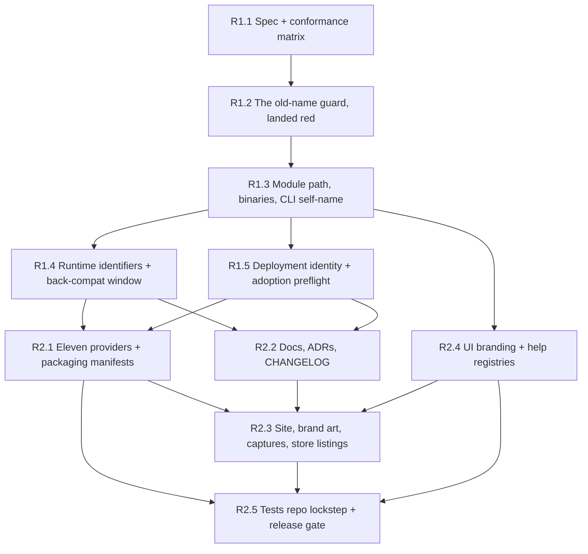

# Rename the Product to `retnd`

## Status

**Type:** EPIC / Detailed implementation specification
**Repository:** `backupdproject/backupd`
**Parent / predecessor EPICs:** #794 (the `RM_`/`bm_` runtime-identifier rename and the brand-drift guard it left behind), #687/#699 (the two earlier renames and everything they missed)
**Primary implementation root:** the whole tree; the load-bearing roots are `core/`, `container/`, `scripts/install/` and `ui/shared/`
**Tracker issue:** #885 (sub-issues #886 through #895)
**FR numbering:** this specification continues the product's FR series at **FR-36**, and claims **FR-36 through FR-42**. FR-1 through FR-24 are defined in `docs/EPIC.md`; FR-26 is claimed by the `version` command in `core/cmd/backupd` and `core/internal/app`; FR-27 through FR-35 are EPIC E. FR-25 is an unclaimed hole and stays one: anything citing "FR-25" today is citing nothing, and filling it would make that citation resolve to something it never meant. Nothing here renumbers an existing FR.

---

# Adversarial Review, Five-Expert Panel

Same discipline as `docs/EPIC-B-multi-nas.md` and `docs/EPIC-E-alternative-storage.md`: each reviewer was instructed to reject this EPIC if the rename could cause data loss, a silent behaviour change in an upgraded deployment, a guard that cannot fail, an unrecoverable one-way door, or a user-visible surface left claiming a name the product no longer answers to.

This is the third rename of this product. The first two are the reason the review is adversarial rather than a formality: `rclone-manager` left `RM_` environment variables behind, `backup-manager` left `bm_` cookies behind, four separate follow-up issues (#653, #658, #687, #699) exist solely to finish work a rename declared done, and the `docs/design/` directory still contains a file called `Backup Manager.dc.html`. The panel was given that history first.

## Expert 1, Go Build, Module Path and Toolchain

### Initial verdict: REJECT

Critical findings:

1. The draft treated the module-path sweep as "a big search and replace". It is 2,163 occurrences of `github.com/backupdproject/backupd` across 840 files, five `go.mod` files and `go.work`, and it is atomic: there is no intermediate commit in which the tree compiles. The draft spread it across two issues.
2. The draft renamed the module path without saying what happens to the GitHub coordinates, which are *inside* the module path. A module path that does not match its fetch location is a decision with a cost, and the draft made it by accident.
3. `container/Dockerfile` copies `core/` one named directory at a time (`apicontract`, `cliecho`, `cmd`, `internal`, `service`, `migrations`) so a stray untracked file cannot reach the build context. Renaming `core/cmd/backupd` to `core/cmd/retnd` is invisible to that COPY list (it copies `cmd`, not `cmd/backupd`), but the *binary output path* and the two build-stage `go build` invocations are not, and neither is `apps/generic/cmd/backupd-web`. `cliname.go`'s own header documents this exact trap catching `core/apicontract` once already.
4. `scripts/docs/package-doc.baseline` pins package overviews by import path. Every one of them moves. The draft did not mention it, and this repository has an open bug (#882) from a package-doc baseline not being regenerated after an unrelated change.

Required corrections, all adopted:

- the module path, the two command directories, `cliecho.Binary`/`WebBinary` and the Dockerfile's build invocations are **one issue and one commit** (R1.3), because the tree does not compile between any two parts of it;
- the GitHub coordinates are an explicit, reasoned **out of scope** with the module-path mismatch's single cost named and guarded (FR-41);
- `scripts/docs/package-doc.baseline`, the layer manifest in `scripts/architecture/layers.conf`, `go.work`, `go.work.sum` and `.golangci.yml` path patterns are named in R1.3's scope rather than discovered by a red gate;
- `verify-core-without-distribution.sh` and the architecture checks run inside R1.3, not at the phase gate, because a path-shaped check that silently stops matching anything is the failure mode here.

### Consensus position: APPROVE AFTER REVISION

## Expert 2, Packaging, Release Engineering and Provider Submission

### Initial verdict: REJECT

Critical findings:

1. `container/compose.yaml` names `/backupd-web` in four `command:` arrays and two `healthcheck:` tests, and its own header paragraph warns that an image without that path dies with `exec /backupd-web: no such file or directory`. Every operator who pinned a compose file and pulls a new image gets exactly that. The draft called this "acceptable, it fails loudly" and moved on, which is true and insufficient: a stack that will not start is an outage on a backup product.
2. The draft renamed the image to `ghcr.io/backupdproject/retnd` and *also* claimed the repository could not be renamed, without noticing that these are independent. If they were not, the image rename would be impossible and the whole epic would be branding with no operator-visible payoff.
3. `container/release-manifest.json` keys per-platform digests by binary name (`backupd-web`). Rewriting a released manifest's keys would rewrite the record of what was published.
4. The eleven providers ship nine `apps/*/compose/backupd.{yml,yaml,env}` files, two Unraid XML templates and a TrueNAS catalog template, and `distribution/packaging/{canonical,submission,conformance,compliance}.json` hold the derived truth about all of them. The draft renamed the compose files and left the manifests to the gate.
5. `docs/submission/screenshots.md` requires real hardware, a real installation and a real SFTP source. Every store listing that shows a screen with the product name on it is invalidated by this epic, and nothing in the draft said so.

Required corrections, all adopted:

- the image ships `/retnd-web` **and keeps `/backupd-web` as a one-release alias entrypoint** (a second hardlinked name in the final stage, not a shell wrapper: the image is distroless), so a pinned compose file starts on a new image and the operator's upgrade is a compose edit at their own pace (FR-37);
- verified and recorded: a GHCR package name is set by the publishing workflow, not derived from the repository name, so `ghcr.io/backupdproject/retnd` ships without touching the repository (FR-39);
- `container/release-manifest.json` entries for already-published releases are **history and are not rewritten**; the new binary name appears in new entries only, and the manifest's consumer accepts both keys for the overlap (FR-37);
- providers and their packaging manifests are one issue (R2.1), regenerated through `distribution/packaging`'s own derivation rather than hand-edited, with the gated matrix tests as the check;
- every store-listing row that shows the product name goes back to **outstanding** in `docs/conformance/submission-preflight.md` rather than quietly keeping the old picture, and R2.3 records that as its outcome instead of claiming a pass it cannot have.

### Consensus position: APPROVE AFTER REVISION

## Expert 3, Config, State and Upgrade Safety

### Initial verdict: REJECT

Critical findings:

1. **The draft's single worst defect, and it is a data-loss-class defect.** The draft renamed the container-internal state directory from `/var/lib/backupd` to `/var/lib/retnd`. An operator with a pinned compose file bind-mounts their host state directory onto `/var/lib/backupd`; the new binary looks at `/var/lib/retnd`, finds no state database, and takes the *fresh install* path. The first-run flow claims the administrator account and burns the enrollment token. A running deployment with years of journal would present a setup wizard, and the operator's first instinct — complete it — is the action that makes it worse. `docs/epic-checklist.md` §10 already documents this hazard for capture scripts pointed at a real instance; the draft reintroduced it as a shipped default.
2. `config.yaml` stores **absolute container paths**: `state.database` is `/var/lib/backupd/state.db` in every deployment that ever saved settings, and `ssh.known_hosts` is `/etc/backupd/known_hosts`. Renaming the mount point without rewriting those values leaves a config naming a path that no longer exists.
3. `Load` uses `KnownFields(true)`, so the draft's throwaway line "we could add a `legacy_paths:` key" is a one-way door: a config carrying that key cannot be parsed *at all* by an older build, which is the situation an operator rolling back an upgrade is in.
4. The draft had the installer "handle migration" with no statement of what happens to an operator who does not use the installer, which is every Unraid, Portainer, Dockge and hand-rolled-compose deployment.

Required corrections, all adopted:

- **FR-38, the state-adoption preflight, is the epic's central safety requirement**, and the panel rejected the reviewer's own first instinct along with the draft: when the resolved state directory holds no state database *and* the legacy directory holds one, the process **adopts the legacy directory** and warns on every start, naming the compose line to change. It **never** falls through to the first-run path, and it does not refuse either — refusing is a self-inflicted outage on a backup product, and an operator staring at a stopped stack reaches for the wizard as readily as one staring at a fresh install. Refusal is reserved for the genuinely ambiguous cell, two different populated directories, with a same-device-and-inode test so it cannot fire on one directory mounted twice;
- the same rule generalises: no rename in this epic may turn "the state I had" into "no state at all". Where a legacy location can be detected, detection is mandatory and the outcome is stated in FR-38's four-cell table, never left to whichever path the code checks first;
- **no new config key.** The legacy paths are compiled-in constants, not configuration, precisely because of `KnownFields(true)`: an operator who rolls back to the previous build must find a byte-identical `config.yaml` (FR-42);
- the installer (`scripts/install/install_docker_host.py` and its embedded compose copy) performs the mount move **and** rewrites the persisted absolute paths in `config.yaml`, transactionally through the same temp-file-in-the-config-directory discipline `#196` established, and the non-installer path is carried by FR-38's adoption;
- a downgrade after this epic is a supported operation for one release: the previous build meets an unchanged schema version, an unchanged `config.yaml` and its own paths still mounted, because the compose file the installer wrote mounts both.

### Consensus position: APPROVE AFTER REVISION

## Expert 4, Runtime Contract, Metrics and Back-Compat

### Initial verdict: REJECT

Critical findings:

1. The draft hard-cut the `BACKUPD_*` environment variables. Twenty of the forty-six are **exported into operator-authored Bash hook scripts** by EPIC L's workflow engine (`BACKUPD_BACKUP_STATUS`, `BACKUPD_STEP_NAME`, `BACKUPD_RECOVERY`, and so on). A Bash script reading `$BACKUPD_BACKUP_STATUS` after a hard cut does not fail: it gets the empty string. A hook that notifies on failure silently stops notifying, and a hook that branches on status takes the wrong branch. This is the **silent** breakage class, and it is worse than an outage because nothing reports it.
2. The draft hard-cut the fourteen `backupd_*` metric series. An alert rule that no longer matches anything does not fire. A dashboard that no longer matches anything is blank. Both look like "everything is fine".
3. The draft renamed `backupd_session` and `backupd_csrf` with no read-compat, signing out every browser session on upgrade — the exact regression #794 deliberately avoided with `bm_session`/`bm_csrf`, in this same repository, with a read-compat window that is still in the tree and still documented in `api/v1/openapi.json`.
4. The draft applied the same back-compat treatment to everything, including `x-backupd-proxy-error`, which is produced and consumed by two halves of the same binary served from the same image.

Required corrections, all adopted:

- the classification is **by failure mode, not by category** (FR-37). Anything whose breakage is *silent* gets a one-release compat window; anything whose breakage is *loud* is hard-cut and the loudness is the argument:
  - **hook environment**: both names exported for one release, `RETND_*` and `BACKUPD_*`, with identical values;
  - **input environment**: both names read, new wins, one deprecation warning per name per process start (the `RM_DEBUG` precedent, exactly);
  - **metrics**: `retnd_*` primary, `backupd_*` duplicated for one release. Only gauges and info series are duplicated, never a counter, and the legacy series' `# HELP` text says it is deprecated and names its replacement, so a scrape carries its own deprecation notice;
  - **cookies**: `retnd_session`/`retnd_csrf` issued, `backupd_session`/`backupd_csrf` accepted on a read, and a request arriving with only the old name has its token re-issued under the new one — the #794 mechanism, reused rather than reinvented;
  - **`x-backupd-proxy-error`**: hard cut, no alias, because `serve-ui` and the bundle it serves ship in one image and cannot disagree;
- a dual-emitted metric's double-count hazard is stated where an operator reads it, not only here: a query summing across both names double-counts, which is why only gauges are duplicated and why the deprecation window is one release;
- the deprecation window has a **named closing issue filed by this epic**, and the guard's alias list is its ledger: `check-brand-drift.sh` reports an alias entry that no longer matches anything, so the window closes by the guard telling somebody, not by somebody remembering.

### Consensus position: APPROVE AFTER REVISION

## Expert 5, The Guard, Docs and User-Visible Naming

### Initial verdict: REJECT

Critical findings:

1. The draft's guard was "grep for `backupd`, case-insensitively". This repository contains **7,774 occurrences of `BackupSet`**, 1,989 of `backup-set` and 40 of `BACKUP_DIR`, and — the case that kills the naive pattern — **50 occurrences of `BackupD[a-zA-Z]`** across nine real identifiers: `BackupDetailPage`, `BackupDefaultsPage`, `BackupDomainPolicy`, `BackupDetail`, `TestBackupDataAreSeparateMounts`, `BackupDomain`, and three test names beginning `TestBackupDoes…`. A case-insensitive `backupd` pattern flags every one of them. A guard that produces fifty false positives on the tree it ships with is a guard somebody deletes, which is the failure the existing `check-brand-drift.sh` header spends a paragraph avoiding for `CONFIRM_DELETE` and rclone's `ibm_signer.go`.
2. The draft's guard had no self-test. §12 of the checklist requires a mutation self-test for every new guard, and "three checks here were found in one day that could not fail".
3. The draft deleted the existing `RM_`/`BM_`/`bm_`/`rbm_` patterns and replaced them. Those still guard live occurrences: `RM_DEBUG` is a kept alias, and twenty-three `RM_*` token-and-path pairs are the *environment contract of another repository* (`backupdproject/backupd-tests`, pinned at `scripts/e2e/tests-repo.pin`).
4. The draft renamed `docs/design/Backup Manager.dc.html`. §5 of the checklist says design notes are a record of a decision at the moment it was taken and are deliberately not kept in step with later work. Renaming it would falsify a dated record.
5. The draft claimed the site could be re-captured. It can, but only by borrowing Playwright out of the `backupd-tests` checkout at the pinned sha, against the mock API, with the clock pinned — four constraints from §10, none of which the draft mentioned, and one of which (never against a real deployment) is the same first-run hazard Expert 3 raised.

Required corrections, all adopted:

- the guard **extends** rather than replaces: the four existing patterns stay, and the `backupd` family joins them, anchored on both sides — `backupd` followed by a non-lowercase-letter for the lowercase spelling, `BACKUPD_[A-Z]`, `Backupd` followed by a non-lowercase-letter, and the module-path token as a single named alias. `BackupDetailPage` is green because `D` is followed by `e`; `backupd_session` is red because `_` is not a lowercase letter (FR-40);
- the guard lands **red**, in Phase 1, with every surviving occurrence on its `pending` list, and each later issue deletes its own pending entries. The list going empty is the epic's completion signal, and it is mechanical rather than a judgement;
- `scripts/rename/selftest.sh` gains a red case per new pattern and a green case per lookalike above, with the nine `BackupD*` identifiers planted by name (FR-40);
- `docs/design/Backup Manager.dc.html` and the dated per-issue design notes are **not renamed**, and this document is where that decision is recorded so the next reader does not file it as a miss;
- the captures are re-recorded through the four scripts in `docs/site/tools/` against `ui/shared`'s own dev server and `createMockApi`, clock pinned, Playwright borrowed at the pin — and if the e2e gate has not run on the machine, the capture says so rather than guessing (R2.3);
- the site's "What has not been proven" section states plainly which surfaces were re-captured and which store screenshots still show the old name.

### Consensus position: APPROVE AFTER REVISION

## Five-Expert Consensus

> **A rename is judged by what it breaks silently. Every identifier in this epic is classified by its failure mode before it is touched: silent breakage earns a one-release compat window with a guard entry as its ledger, loud breakage is hard-cut and the loudness is the argument, and the one case that is both silent and unrecoverable — an upgraded deployment whose state directory moved out from under it — is answered by adopting the state that exists and saying so on every start, never by a first run, with refusal reserved for the one cell where two journals are visible at once. The repository's own coordinates stay where they are, because renaming them buys nothing an operator types and costs the one irreversible thing in the epic. The guard lands red with the whole surface on its pending list, so "finished" is a list going empty rather than somebody's opinion.**

---

# 1. Purpose

The product is renamed from `backupd` to **`retnd`**. That is 10,522 case-insensitive occurrences across 1,339 of 1,938 tracked files in this repository, 124 filenames, and a further 759 occurrences across 178 files in `backupdproject/backupd-tests`.

This epic exists because the previous two renames did not finish, and their unfinished parts are still visible:

- `rclone-manager` → `backup-manager` left `RM_` environment variables, one of which (`RM_DEBUG`) is still a kept alias today;
- `backup-manager` → `rbm` → `backupd` left `bm_session`/`bm_csrf` cookies, a compliance-docs miss (#699), a design file still called `Backup Manager.dc.html`, and four issues whose entire content was "finish the rename".

The mechanism that stops a fourth repetition already exists: `scripts/rename/check-brand-drift.sh`, with its self-test, its three-list vocabulary (aliases kept on purpose, pending deletions in transit, pre-existing occurrences pinned to a path) and its gate step in `scripts/ci-local.sh` and `.github/workflows/ci.yml`. This epic's first mechanical act is to point that guard at the name it is about to retire, **red**, with the entire surface enumerated on its `pending` list. Everything after that is deleting entries from a list a gate holds.

What this epic deliberately is not:

- It is not a re-brand of the repository. The GitHub org and repo keep their names (FR-41), and the reasoning is recorded rather than left implicit.
- It is not a functional change. No behaviour changes except the names of things, the one-release compat shims, and FR-38's adoption of state found at a legacy path, which replaces a first run that should never have happened.
- It is not a deprecation-window close. This epic *opens* windows; a follow-up issue closes them, and the guard's alias list is what reminds anybody.

# 2. Scope: the surface inventory

Counts are from `origin/main` at `6a528c98`, `git grep` over tracked files. "Hits" are occurrences, "files" are files containing at least one.

| # | Category | What changes | Files / hits | Gated? | Risk and ordering |
|---|---|---|---|---|---|
| 1 | **Go module path and imports** | `github.com/backupdproject/backupd` → `github.com/backupdproject/retnd` in five `go.mod`, `go.work`, `go.work.sum`, `.golangci.yml`, `scripts/architecture/layers.conf` and every import line | 840 files / 2,163 hits (2,058 import lines) | **Gated** — nothing compiles | One atomic sweep in one commit; no intermediate state builds. Must precede everything that reads a symbol. |
| 2 | **Binary and command name** | `core/cmd/backupd/` → `core/cmd/retnd/`, `apps/generic/cmd/backupd-web/` → `retnd-web/`, `cliecho.Binary`/`WebBinary` in `core/cliecho/cliname.go`, the dispatch table in `main.go`, `core/cliecho/routes.go`, `legacyName` in `selfname_test.go` (`rbm` → `backupd`) | 129 filenames / ~1,100 hits | **Gated** — `site_reference_test.go`, `dispatchtable_test.go`, `TestUsage_EveryRegisteredCommandIsPinned`, `routeparity_test.go`, `argv0_test.go`, `cliechogaps_test.go`, `selfname_test.go` | Same commit as row 1. `cliname.go` is the one spelling of the command and its header already enumerates the three things that look like it and are not. |
| 3 | **Container image, compose, labels** | `ghcr.io/backupdproject/backupd` → `ghcr.io/backupdproject/retnd`; `container/compose.yaml` service `backupd`, the four `/backupd-web` command arrays and two healthchecks; container names `backupd-backupd-1`/`backupd-web-ui-1`; `com.docker.compose.project=backupd`; `container/release-manifest.json` digest keys | 46 files / 121 image hits; `container/` 4 files / 95 hits | **Gated** — `distribution/compose` contract and release tests, `runtime-contract.json`, `release-gate-covers-every-job` | COMPAT-BREAKING but **loud**: a pinned compose file naming `/backupd-web` against an image without it dies at start. Mitigated by the one-release alias entrypoint (FR-37). Published manifests are history and are not rewritten. |
| 4 | **Container-internal paths and persisted config values** | `/etc/backupd` → `/etc/retnd`, `/var/lib/backupd` → `/var/lib/retnd`; the `state.database` default `/var/lib/backupd/state.db`; `known_hosts`, `ssh_keys/`, the workflow spool | 99 files / 296 + 53 files / 80 hits | Partly gated (`config` suite, compat cells) | **COMPAT-BREAKING and silent, and the one data-loss-class item in the epic**: a moved mount point makes a live deployment look fresh and hands it the first-run wizard. Answered by FR-38's adopt-and-warn table plus installer migration; refusal is reserved for two visible journals. |
| 5 | **Environment variables** | 46 distinct `BACKUPD_*` names → `RETND_*`. Two populations: engine **inputs** (`BACKUPD_DEBUG`, `BACKUPD_INCREMENTAL_ENGINE`, `BACKUPD_SIGNAL_EXIT_CHILD_MODE`) and workflow-hook **exports** read by operator-authored Bash (`BACKUPD_BACKUP_STATUS`, `BACKUPD_STEP_*`, `BACKUPD_WORKFLOW_STATUS`, `BACKUPD_RECOVERY`, `BACKUPD_RUN_ID`, …) | 84 files / 279 hits | Gated only by the extended guard | **COMPAT-BREAKING and silent**: a hook script reading a renamed variable gets the empty string, not an error. Both names exported / both read for one release (FR-37). |
| 6 | **Metrics** | 14 `backupd_*` series in `core/internal/metrics/metrics.go`, pinned in `metrics_test.go` and `snapshot_test.go` | 22 files / 76 lowercase-identifier hits | Gated (the metric-name pin) | **COMPAT-BREAKING and silent**: an alert rule that matches nothing never fires. Dual emission of gauges only, for one release, with the deprecation in the `# HELP` text. |
| 7 | **Cookies and wire identity** | `backupd_session` (`apps/common/auth/local/session.go`), `backupd_csrf` (`apps/common/csrf/csrf.go`), both in `core/internal/apiclient/client.go`, both declared in `api/v1/openapi.json`; the client's default `User-Agent` | 8 files / ~20 hits | Gated (contract drift, auth suites) | COMPAT-BREAKING: a hard cut signs every browser session out on upgrade. Read-compat window, reusing #794's exact mechanism. |
| 8 | **API contract** | `"title": "Backupd /api/v1"`, the two cookie `securitySchemes` and their prose, two CLI-quoting descriptions, `x-backupd-proxy-error` in `ui/shared/src/api/transport.ts`; both generated bindings regenerated | `api/v1/openapi.json` 8 hits; 2 files for the header | **Gated** — `check-contract-drift.sh`, `check-client-paths.sh`, `contract.conformance.test.ts` | **No error code carries the brand** — verified, and it removes a whole category from this epic. `x-backupd-proxy-error` is hard-cut: producer and consumer ship in one image. |
| 9 | **systemd units and the installer** | `backupd-bridge.service`, `backupd-bridge.timer`, `backupd-workflow-runner.service`; `scripts/install/install_docker_host.py` (embedded compose, unit names, compose-label parsing), `embed_compose.py`, `test_install_docker_host.py` | 50 files / 585 hits in `scripts/` | **Gated** — installer suite, embedded-compose equality | The installer is the only automated migration path for rows 3, 4 and 9 together; it owns the mount move, the unit rename and the persisted-config rewrite. |
| 10 | **The eleven providers and packaging** | Nine `apps/*/compose/backupd.{yml,yaml,env}`, `apps/unraid/template/backupd{,-ui}.xml`, `apps/truenas/catalog/templates/docker-compose.yaml`, `apps/ugos`/`casaos`/`zimaos` icons; `distribution/packaging/{canonical,submission,conformance,compliance}.json` and their derivation | `apps/` 183 files / 893 hits; `distribution/` 47 files / 501 hits | **Gated** — `apps/common/tests`, the packaging matrix tests | Manifests are **derived**, so they are regenerated, never hand-edited. Filenames move, which makes this a rename-detection-sensitive diff. |
| 11 | **Store listings and submission** | `docs/submission/*.md` (11 provider listings plus `description.md`, `release-notes.md`, `permission-rationale.md`, `privacy-disclosure.md`), `docs/submission/icon.svg`, `docs/conformance/submission-preflight.md` | 10 files / 14 hits | **Ungated** | `screenshots.md` requires real hardware and a real SFTP source and **cannot be regenerated here**. Every listing screenshot showing the name goes back to outstanding. |
| 12 | **Docs and ADRs** | `README.md`, 56 `docs/*.md` (`install.md`, `deployment.md`, `runtime-contract.md`, `recovery.md`, `recovery-without-a-terminal.md`, `storage-mediums.md`, `ssh-setup.md`, `incremental-engine.md`, …), 13 of 22 ADRs, `docs/api/contract.md`, `CONTRIBUTING.md`, `CONTRIBUTOR-LICENSE-AGREEMENT.md` | 92 doc files; `docs/*.md` 436 hits, ADRs 41 | Partly gated (`reference.html` command table, package-doc baselines) | `CHANGELOG.md` is the **record of the renames** and is not rewritten; it gains an entry. A new ADR records FR-41. |
| 13 | **Site, brand art and captures** | Five pages and their `<title>`s, `topbar.js`, `copy.js`, `tooltip.js`, `theme.css`; the split wordmark relettered `retn` + the two-tone daemon `d` (which survives the rename intact) across `assets/logo-mark.svg`, `docs/assets/logo-{dark,light}.svg`, `docs/site/assets/{icon,logo-mark-light}.svg`, the three favicons and `apple-touch-icon.png`, `ui/shared/public/favicon.svg`, `docs/submission/icon.svg`, three provider icons; 44 `docs/site/screens/` files, 10 animated, re-captured through the four scripts in `docs/site/tools/` | `docs/site` 12 files / 139 hits; 10 art files | Partly gated (`site_reference_test.go`) | Captures run against `createMockApi` on `ui/shared`'s own dev server, **never a real deployment** (the first-run hazard again), clock pinned, Playwright borrowed from the `backupd-tests` checkout at `scripts/e2e/tests-repo.pin`. |
| 14 | **UI branding and help copy** | 201 files containing `Backupd`: `App.tsx` titles, `failure.ts`'s operator-facing sentences, `BackupdError`, `ErrorBoundary`, `LoginPage`/`EnrollmentPage` copy, `mock.ts` strings, `ui/shared/src/tooltips/tooltips.json` (425 entries), `fieldHelpCopy.ts` | 201 files / 757 hits | **Gated** — tooltip copy and wiring tests, typecheck, eslint, vitest, build | The nine `BackupD[a-zA-Z]` identifiers (`BackupDetailPage`, `BackupDefaultsPage`, …) **must not move**; they are the guard's principal false-positive risk. |
| 15 | **The separate black-box test repository** | `backupdproject/backupd-tests`: `suites/cli` (105 files), `suites/web-ui` (29), `suites/equivalence` (13), `fixtures/`, `tools/getbuild`, `tools/equivstate`, `build-under-test.json`, `Makefile`, `scripts/gate-local.sh`; and this side's `scripts/e2e/tests-repo.pin` | 178 of 230 files / 759 hits | Gated on both sides, out of step by construction | Two-repository lockstep with a pin bump in the middle. Their `RM_*` environment contract is **not** renamed by this epic and stays on the guard's `preexisting` list. |
| 16 | **Repository coordinates and URLs** | GitHub org `backupdproject` + repo `backupd`; `https://backupdproject.github.io/backupd/*` (8+ links); four `raw.githubusercontent.com/backupdproject/backupd/main/…` installer and icon URLs; cosign `certificate-identity`; `.github/workflows/*` | 2,369 `backupdproject` hits (206 outside the module path); `.github/` 3 files / 11 hits | Gated (release gate, Pages workflow) | **OUT OF SCOPE (FR-41)**, allowlisted with reasons. A rename here invalidates the documented `cosign verify` identity, four bookmarked install URLs and the Pages origin, and buys nothing an operator types. |
| 17 | **Compliance and provenance** | `NOTICE` (6), `distribution/packaging/compliance.json` (23), `provenance/{checksums.txt,release-provenance.json,sbom.spdx.json,third-party-licenses.json}` (285) | 5 files / 314 hits | **Gated** — licence-inventory regeneration | `provenance/**` records **released artifacts** and is append-only history; it is regenerated forward, never rewritten. The guard already excludes it for this reason. |
| 18 | **The guard itself** | `scripts/rename/check-brand-drift.sh` gains the `backupd` family and three list entries per surviving occurrence; `scripts/rename/selftest.sh` gains a red case per pattern and a green case per lookalike; the `gate_step` wording in `scripts/ci-local.sh`; `.github/workflows/ci.yml` | 4 files | **Gated**, and it is the gate | Lands **red** in Phase 1 with the whole surface on `pending`. The list emptying is the epic's completion signal. |

# 3. Functional Requirements

## FR-36, The Product Is `retnd`, and One Constant Spells It

The product, the command, the daemon and the image are named `retnd`. The web host binary is `retnd-web`.

`core/cliecho/cliname.go` is already the single spelling of the command, and its existing header enumerates the three shapes in this tree that look like the name and are not: filesystem paths, the project/image/service identity, and wire identity. That separation is the reason this epic is a specification rather than a sweep, and every row of section 2 is classified against it.

- `cliecho.Binary` becomes `retnd`; `cliecho.WebBinary` becomes `retnd-web`.
- The command directories become `core/cmd/retnd` and `apps/generic/cmd/retnd-web`.
- The Go module path becomes `github.com/backupdproject/retnd` (see FR-41 for why the org segment does not move).
- The product's display name, everywhere a human reads it, is `retnd` in running text and `retnd` in a heading: lowercase, like the command, because it is a daemon and the wordmark is lowercase. There is no `Retnd`. The 757 occurrences of `Backupd` collapse to lowercase `retnd` rather than being title-cased, and `BackupdError` becomes `RetndError`.
- The split wordmark is relettered `retn` + the existing two-tone daemon `d`. The `d` survives the rename unchanged, which is the one lucky thing about this name.
- `legacyName` in `apps/generic/cmd/retnd-web/selfname_test.go` moves from `rbm` to `backupd`: that test's job is to hold the binary to not calling itself by the *previous* name, and the previous name changes.

## FR-37, The Back-Compat Window Is Decided by Failure Mode

Every renamed runtime identifier is classified before it is touched, by what an upgraded deployment experiences if the rename is a straight cut:

| Identifier | Failure mode of a hard cut | Decision |
|---|---|---|
| Hook environment (`BACKUPD_BACKUP_*`, `BACKUPD_STEP_*`, `BACKUPD_WORKFLOW_STATUS`, `BACKUPD_RECOVERY`, `BACKUPD_RUN_ID`, …) | **Silent.** A Bash hook reads the empty string; a failure notifier stops notifying | Both names exported for one release, identical values |
| Input environment (`BACKUPD_DEBUG`, `BACKUPD_INCREMENTAL_ENGINE`, `BACKUPD_SIGNAL_EXIT_CHILD_MODE`) | **Silent.** The setting reverts to its default | Both read, new wins, one deprecation warning per name per process start |
| Metrics (`backupd_*`, 14 series) | **Silent.** An alert rule matches nothing and never fires | `retnd_*` primary; `backupd_*` duplicated for one release, gauges and info only, `# HELP` naming the replacement |
| Session and CSRF cookies | **Loud-ish, and rude.** Every browser session is signed out mid-task | `retnd_session`/`retnd_csrf` issued, `backupd_*` accepted on a read, token re-issued under the new name |
| Image entrypoint `/backupd-web` | **Loud.** `exec /backupd-web: no such file or directory`; the stack does not start | `/retnd-web` primary, `/backupd-web` kept as a hardlinked alias for one release |
| Container-internal state and config paths | **Silent and unrecoverable.** A live deployment presents a first-run wizard | Renamed; FR-38 adopts state found at the legacy path and warns on every start. Not a name alias: see FR-38 |
| `x-backupd-proxy-error` | **None.** Producer and consumer ship in one image | Hard cut, no alias |
| `User-Agent` | Cosmetic; a log or audit filter matching on it stops matching | Hard cut, named in the CHANGELOG because somebody's log filter may care |
| API `title`, operation prose, docs, UI copy, art | **None** | Hard cut |

Rules that hold across the table:

- Every alias is **primary nowhere.** The new name is what the product writes, mints, exports and documents; the old name exists only so an upgrade does not break, exactly as #794 required of `RM_DEBUG`.
- Every alias appears on `check-brand-drift.sh`'s `aliases` list, with the issue that closes it. The guard reports an alias entry that matches nothing, so the window closes when the guard says the shim is gone, not when somebody remembers it exists.
- Dual-emitted metrics are gauges and info series only. A counter cannot be duplicated safely, and a query summing across both names double-counts; that caveat is documented in `docs/deployment.md` where the metrics are, not only here.
- The window is **one release**, and this epic files the issue that closes it as its last act.

## FR-38, No Silent First Run: the State-Adoption Preflight

This is the requirement the epic exists to get right.

An upgraded deployment whose state directory is mounted at the legacy path, running a binary that defaults to the new path, observes "no state database". Every other branch of that condition is correct — a fresh install really does have no state database — and the consequence of taking it on a live deployment is that the first-run flow claims the administrator account and burns the enrollment token. A deployment with years of journal presents a setup wizard, and the operator's first instinct, completing it, is the action that makes it worse.

Before any first-run decision, the process resolves both locations and decides from facts it can observe:

| New path (`/var/lib/retnd`) | Legacy path (`/var/lib/backupd`) | Outcome |
|---|---|---|
| holds a state database | absent, empty, or the **same directory** (same device and inode) | Use the new path. Normal operation |
| absent or empty | holds a state database | **Adopt the legacy path**, serve from it, and warn on every start, naming the compose line to change and the installer command that changes it |
| absent or empty | absent or empty | Fresh install. First run, exactly as today |
| holds a state database | holds a **different** state database (different device and inode) | **Refuse to start**, naming both paths. Two journals are visible, and choosing one silently is the worst option available |

The rules that make that table a requirement rather than a sketch:

- The forbidden transition is a single cell and it SHALL be unrepresentable: **the new path empty, the legacy path holding a state database, and the process proceeding to first run.** No flag, environment variable or configuration may reach it.
- **Adoption rather than refusal**, in that cell, because refusing to start is a self-inflicted outage on a backup product and the operator has done nothing wrong: their compose file is the one this project published. They get a working deployment and a warning with the fix in it, which is what a deprecation is for. A refusal there would also be the second-worst outcome available, because an operator staring at a stopped stack reaches for the wizard as readily as one staring at a fresh install.
- **Refusal is reserved for ambiguity**, and the same-directory test is what keeps it from firing on the installer's own rollback window: the installer writes a compose file mounting one host directory at both container paths, so both look populated — and both are the same device and inode, which is not ambiguity.
- The same table governs the **configuration** directory and `config.yaml`, asserted separately, because the two directories are resolved by different code and the configuration directory also holds the SSH key store and `known_hosts.d/`.
- The adopted path is reported through the surfaces that already report every other resolved path (`retnd check`, the deployment-check route, the startup log), so an operator can see which one is live without relying on a warning they have scrolled past.
- The warning and the refusal are both captured as compat cells, so their wording is pinned: an operator meets either one once, in an incident, and reads whatever the cell says today.
- The **planted violation** is a build that first-runs when the legacy path holds a database; the compat cell must go red on it, and that red run is recorded in the landing PR. Its **positive control** is a genuinely empty deployment that still first-runs, so "it adopted the legacy path" cannot be satisfied by a product that can no longer be installed.
- Adoption is a **shim with a closing date**, listed on the guard's alias list like every other one. The follow-up issue that closes the window deletes it, and replaces the cell pinning the warning with one pinning a refusal.

## FR-39, Deployment Identity and the Upgrade Path

- The image is `ghcr.io/backupdproject/retnd`. Verified and recorded: a GHCR package name is chosen by the publishing workflow and is not derived from the repository name, so the image moves without the repository (FR-41). The previous image name is published as a mirror for one release so an unedited compose file keeps pulling.
- `container/compose.yaml` is the canonical definition; the service becomes `retnd`, the UI service stays `web-ui`, and the default container names become `retnd-retnd-1` and `retnd-web-ui-1`. `scripts/install/embed_compose.py`'s embedded copy moves in the same commit, and the existing equality gate is the check.
- systemd units become `retnd-bridge.service`, `retnd-bridge.timer` and `retnd-workflow-runner.service`. The installer stops, disables, renames and re-enables in one step; a half-migrated host with both units enabled is refused rather than tolerated.
- The installer performs, transactionally: the compose mount move, the persisted `config.yaml` absolute-path rewrite (through the temp-file-in-the-config-directory discipline #196 established), and the unit rename. An operator who does not use the installer is carried by FR-38's adoption, and has a documented manual procedure.
- `container/release-manifest.json` entries for already-published releases are not rewritten. Its consumer accepts both binary-name keys for the release range that spans this rename.

## FR-40, The Old-Name Guard

`scripts/rename/check-brand-drift.sh` gains the `backupd` family. It **extends**; nothing existing is removed, because `RM_DEBUG` is still a kept alias and the twenty-three `RM_*` pairs are still another repository's environment contract.

New patterns, anchored on both sides, because the domain word `backup` is everywhere in this product:

```text
backupd[^a-z]      the lowercase spelling: backupd_session, backupd.yml, /var/lib/backupd
BACKUPD_[A-Z]      the environment prefix
Backupd[^a-z]      the display spelling: Backupd, BackupdError
```

The right-hand anchor is the whole design. These must stay green, and the self-test plants every one of them by name:

- `BackupDetailPage` (26 occurrences), `BackupDefaultsPage` (7), `BackupDomainPolicy` (4), `BackupDetail` (4), `TestBackupDataAreSeparateMounts` (4), `TestBackupDataOnEveryClaimedPlatform` (2), `BackupDomain` (1), `TestBackupDoesNotReturnWhileAWorkerIsStillReading` (1), `TestBackupDoesNotLeaveItRunningForever` (1) — 50 occurrences that a case-insensitive pattern flags and this one does not, because `D` is followed by a lowercase letter;
- `BackupSet` (7,774), `backup-set` (1,989), `BACKUP_DIR` (40), `backup_status` (12) — the domain word, untouched by all three patterns.

The three lists keep their existing meanings exactly:

- **`aliases`** — the shims FR-37 and FR-38 keep on purpose, allowed anywhere, each with its closing issue;
- **`pending`** — every occurrence this epic is deleting, allowed anywhere, expected to disappear. **The guard lands red in R1.2 with the whole surface here**, and each later issue deletes its own entries. The script already reports a list entry that matches nothing without failing, which is what makes this workable;
- **`preexisting`** — token-and-path pairs out of scope: the module path's org segment, the repository coordinates, the `backupd-tests` repository name, `provenance/**`'s released-artifact records, and `docs/design/Backup Manager.dc.html` and the dated design notes.

`scripts/rename/selftest.sh` gains a red case per new pattern and a green case per lookalike, in throwaway repositories rather than mutant copies of this tree, the shape it already uses. A guard whose only evidence is that it passes on the tree it ships with has proven nothing.

## FR-41, The Repository's Coordinates Do Not Move

The GitHub org `backupdproject` and the repository `backupd` keep their names. The Go module path becomes `github.com/backupdproject/retnd`, which does not match its fetch location, and that mismatch is a decision with a stated cost rather than an oversight.

Why the coordinates stay:

1. **It buys nothing an operator types.** What an operator types is the image name, the command and the config path. All three move in this epic. Nobody types the module path, and nobody types the repository name except to read the source.
2. **The cosign identity is a supply-chain contract.** The documented `cosign verify` command pins `certificate-identity` to a workflow URL under the current coordinates. Renaming means new releases verify under a new identity while every shipped release's documented command verifies under the old one, and a verification policy that accepts both is a supply-chain change deserving its own review — not a line in a rename.
3. **The redirect is not free twice.** GitHub redirects renamed repositories, so `#N` references, PR links and the 66 KB of `CHANGELOG.md` and 2,183 lines of `docs/EPIC.md` that cite them keep resolving. That redirect is also the argument for spending it once, when it buys something, rather than now, when it does not.
4. **Four bookmarked URLs are install paths.** `raw.githubusercontent.com/backupdproject/backupd/main/scripts/install/install_docker_host.py` appears in the README, the site and two provider listings, and an operator may have it in a runbook.

The mismatch's cost, in full: `go install github.com/backupdproject/backupd/...` and `go get` on the module path stop resolving. Verified against the tree — nothing in this repository, its docs, its scripts or its workflows tells anybody to `go install` or `go get` this module. It ships as a container image and an installer script, built from a checkout inside a `go.work` of five local modules. R1.3 adds a check that no doc, script or workflow acquires such an instruction, so the cost stays at exactly one thing and stays paid.

A follow-up epic moves the coordinates with cosign dual-trust, a redirect audit and a Pages-origin migration. This epic's job is to not pretend it did that.

## FR-42, Compatibility: What an Existing Deployment Sees

- A deployment upgraded with an **unedited pinned compose file** starts and works: the old image name still resolves through the one-release mirror, the image still contains `/backupd-web`, the service and container names are the operator's own, and the mounts still land on `/etc/backupd` and `/var/lib/backupd`, which FR-38 adopts. The only change they see is a warning on every start naming the compose line to change and the installer command that changes it.
- A deployment upgraded with the **new compose file** finds its state at the new path, because what moved is the container-internal path and the host directory is the operator's own `STATE_DIR`, untouched.
- A deployment that ends up with **two different populated directories**, one at each container path, is refused with both paths named, rather than served from whichever the code happened to check first. One host directory mounted at both paths — which is what the installer writes for the rollback window — is not that case and starts normally.
- A deployment upgraded **through the installer** has its mounts, units and persisted config paths migrated, and sees nothing but new names.
- **No new config key.** `Load`'s `KnownFields(true)` means a config carrying a key an older build does not know cannot be parsed at all, so a rollback must find a byte-identical `config.yaml`. Legacy paths are compiled-in constants, not configuration.
- **Browser sessions survive.** A session established before the upgrade is accepted and re-issued under the new cookie name.
- **Hook scripts keep working**, unedited, for one release, because both variable names are exported with identical values.
- **Dashboards and alert rules keep working**, unedited, for one release, because the gauges are emitted under both names.
- **A downgrade is supported for one release**: unchanged schema version, byte-identical `config.yaml`, and a compose file the installer wrote that mounts both paths.
- No API response shape changes. No CLI output changes except the name in it and the usage block's first line, and both are pinned by the compat corpus, so the diff is reviewed rather than discovered.
- This FR is a Phase 2 exit-gate line, not an aspiration, and its planted violation is defined there.

# 4. TDD Contract and Planted Violations

`docs/EPIC.md` §4B applies to every child issue unchanged: SPECIFY, RED, GREEN, REFACTOR, INTEGRATE, REGRESSION, ACCEPT, with the §82 child-issue template mandatory. Invariant 3 (destructive behaviour needs positive and negative safety tests) governs FR-38, and invariant 6 (migrations need forward and failure tests) governs the installer's path migration, which is a migration in everything but the word.

**Every guard this epic adds must be shown to fire.** Each gate below names the planted violation, and the landing PR for the issue that builds the gate records that violation actually failing.

| Guard | Planted violation that proves it fires |
|---|---|
| No surviving old identifier (FR-40) | A new file containing `backupd_newthing`, `BACKUPD_NEW_THING` and `BackupdWidget`; `check-brand-drift.sh` must go red on each, naming file and line |
| The guard's right-hand anchor (FR-40) | A file containing all nine `BackupD[a-zA-Z]` identifiers, `BackupSet`, `backup-set` and `BACKUP_DIR`; the guard must stay green. Without this control the guard has 50 false positives and gets deleted |
| No silent first run (FR-38) | A build whose startup takes the first-run path when the new state directory is empty and the legacy one holds a database; the compat cell pinning the adoption warning must go red. **Positive control:** a genuinely empty deployment still first-runs |
| Config directory adoption (FR-38) | The same mutation for `config.yaml` rather than the state database, asserted separately because the two directories are resolved by different code |
| Two journals refused, one directory mounted twice not refused (FR-38) | A build that drops the same-device-and-inode test; the installer's own rollback-window compose file, which mounts one host directory at both container paths, must stop starting |
| Hook environment compat (FR-37) | A build that exports only `RETND_*`; the hook-environment test must fail on the absent `BACKUPD_*` name, asserted on a script that reads it rather than on the exported map |
| Metric dual emission (FR-37) | A build that emits only `retnd_*`; the metric-name pin must fail. Its control: a counter added to the duplicated set must also fail, because only gauges may be duplicated |
| Cookie read-compat (FR-37) | A build that rejects `backupd_session`; the session-survival test must fail, and the re-issue half asserted separately |
| Alias entrypoint (FR-37) | An image built without `/backupd-web`; the unedited-pinned-compose start test must fail |
| No new config key (FR-42) | A variant adding a `legacy_paths:` key; the older-build parse test must refuse it under `KnownFields(true)`, which is the proof the key was never safe |
| No `go install` instruction (FR-41) | A doc line saying `go install github.com/backupdproject/retnd/core/cmd/retnd@latest`; the check must go red |
| CLI surface unchanged but for the name (FR-42) | A variant that also reorders the usage block; the compat corpus must go red on a line it already holds |
| The dispatch table and the reference page agree (row 2) | A verb renamed in the dispatch table only; `site_reference_test.go` must go red |

# 5. Phases

Two phases, five sub-issues each. Numbering is `R<phase>.<n>`.

## Dependency graph



**Dependency order:** R1.1 → R1.2 → R1.3 → {R1.4, R1.5} → {R2.1, R2.2} · R1.3 → R2.4 · {R2.1, R2.2, R2.4} → R2.3 → R2.5.

R1.2 before R1.3 is deliberate and is the one ordering choice in this epic worth arguing about. Landing a red guard whose `pending` list enumerates 10,522 occurrences before any of them move looks like ceremony. It is the opposite: it is the only moment at which the surface can be enumerated by a machine rather than by somebody's reading of this document, and every subsequent issue's exit condition becomes "my entries are gone from the list" instead of "I think I got them all". The previous two renames had no such list, and both needed four follow-up issues.

## Phase 1, the product renames itself

Nothing a user reads changes in Phase 1. The module path, the binaries, the runtime identifiers, the deployment identity and the guard all move; the docs, the site, the UI copy and the store listings still say `backupd`, on purpose, so that the mechanical half can be reviewed without 10,000 lines of prose diff in the way.

- **R1.1** — This specification, adversarially reviewed and landed, with `docs/conformance/epic-r-matrix.md` seeded (every row `BLOCKED`, each naming the issue that unblocks it)
- **R1.2** — The old-name guard: `check-brand-drift.sh` gains the three anchored `backupd` patterns and the alias/pending/preexisting entries, `selftest.sh` gains a red case per pattern and a green case per lookalike, and the gate lands **red** with the whole surface on `pending`
- **R1.3** — The module path, the command directories, `cliecho.Binary`/`WebBinary`, the dispatch surface, the Dockerfile build invocations, the package-doc baselines, the layer manifest, and the no-`go install` check (FR-36, FR-41)
- **R1.4** — Runtime identifiers and the back-compat window: environment (both populations), cookies, metrics, the proxy-error header, the API title and cookie declarations, both regenerated bindings, and every alias registered on the guard's list with its closing issue (FR-37)
- **R1.5** — Deployment identity and the state-adoption preflight: image name and mirror, compose service/project/container names, container-internal paths, systemd units, installer migration of mounts + units + persisted config, and FR-38's four-cell adoption table with its pinned messages, planted violation and fresh-install control (FR-38, FR-39)

### Phase 1 entry gate

- This specification is merged and `docs/conformance/epic-r-matrix.md` exists with one row per exit-gate line, every row `BLOCKED` and naming its issue.
- The tracker issue and its ten sub-issues exist with the §82 template.
- The name `retnd` is confirmed unused in this tree (`git grep -i retnd` is empty on `origin/main` — checked) and the image name is confirmed available on GHCR.

### Phase 1 exit gate

Checkable claims, not intentions. Each box is held to the outcome `docs/conformance/epic-r-matrix.md` records for the matching row, in both directions.

- [ ] `check-brand-drift.sh` is green, and `selftest.sh` goes red for each of `backupd_newthing`, `BACKUPD_NEW_THING` and `BackupdWidget` and green for a file containing all nine `BackupD[a-zA-Z]` identifiers plus `BackupSet`, `backup-set` and `BACKUP_DIR`.
- [ ] No `pending` entry remains for anything Phase 1 owns: the module path, the binaries, the runtime identifiers, the deployment identity. The guard reports the emptied entries rather than failing on them, and the report is in the landing PR.
- [ ] `go build ./...`, `go vet ./...`, the architecture checks, `verify-core-without-distribution.sh`, `scripts/docs/package-doc.baseline` and `.golangci.yml` all resolve the new module path, and no file in the tree instructs anybody to `go install` or `go get` it.
- [ ] `retnd --help`'s usage block, every verb in the dispatch table, and every row of `docs/site/reference.html` agree, by `site_reference_test.go` and `TestUsage_EveryRegisteredCommandIsPinned`; the compat corpus's CLI cells differ from their previous capture in the name and nothing else, and that diff is reviewed line by line in the landing PR.
- [ ] A container built from this tree starts from an **unedited** pre-rename compose file (via `/backupd-web`) and from the new one (via `/retnd-web`), proven by two runs of the compose contract test.
- [ ] An operator's hook script reading `$BACKUPD_BACKUP_STATUS` and one reading `$RETND_BACKUP_STATUS` observe identical values, asserted by executing both scripts, and a build exporting only the new name fails that test.
- [ ] `retnd_*` and `backupd_*` gauges are both scraped with identical values, the legacy `# HELP` names its replacement, no counter is duplicated, and a build emitting only the new name fails the metric pin.
- [ ] A session cookie minted before the upgrade authenticates after it and is re-issued under `retnd_session`; a build rejecting the legacy name fails that test.
- [ ] **FR-38 holds in all four cells of its table**: state at `/var/lib/backupd` with nothing at `/var/lib/retnd` is adopted, served and warned about on every start, and creates no administrator account and no enrollment token; two different populated directories are refused with both named; one host directory mounted at both paths is *not* refused; a genuinely empty deployment still first-runs. The planted violation — a build that first-runs when the legacy path holds a database — turns the compat cell red, and that red run is in the landing PR.
- [ ] `scripts/ci-local.sh` is green, `check-contract-drift.sh` and `check-client-paths.sh` pass with the regenerated bindings, and the release gate's `needs` list still covers every job.

## Phase 2, everything a user, a store reviewer or a contributor reads

- **R2.1** — The eleven providers and packaging: per-provider compose/env/templates/catalog and icons, `distribution/packaging/{canonical,submission,conformance,compliance}.json` regenerated through their own derivation, the cross-provider conformance suite, per-provider acceptance docs
- **R2.2** — Docs and ADRs: `README.md`, 56 `docs/*.md`, 13 ADRs, `docs/api/contract.md`, `CONTRIBUTING.md`, the CLA, `NOTICE`, the `[Unreleased]` CHANGELOG entry naming what an existing deployment sees, a new ADR recording FR-41, and `docs/submission/*.md` listing copy
- **R2.3** — Site, brand art and captures: five pages and titles, `topbar`/`copy`/`tooltip` JS, the relettered wordmark and ten icon/favicon assets, 44 re-captured `docs/site/screens/` files through the four capture scripts against the mock with the clock pinned, the "What has not been proven" section, and every store-listing screenshot row returned to outstanding in `submission-preflight.md`
- **R2.4** — UI branding and help copy: 201 files, `App.tsx` titles, `failure.ts` operator sentences, `RetndError`, `mock.ts`, `tooltips.json`'s 425 entries and `fieldHelpCopy.ts`, with the nine `BackupD*` identifiers left untouched and a test that says so
- **R2.5** — The tests repository and the release gate: `backupdproject/backupd-tests` suites (cli, web-ui, equivalence), fixtures and tools renamed on their side, `build-under-test.json` and `scripts/e2e/tests-repo.pin` bumped in lockstep, nightly-e2e and the release gate green, provenance and the licence inventory regenerated, the guard's `pending` list drained to empty, the matrix swept to `PASS`, and the deprecation-window-close issue filed

### Phase 2 entry gate

- Every Phase 1 exit line holds.
- The `backupd-tests` side has an issue open for its half of R2.5 before R2.1 starts, because the pin bump is a two-repository operation and a pin that cannot be bumped blocks the release gate rather than one issue.
- The e2e gate has run on the machine doing R2.3, so there is a `backupd-tests` checkout to borrow Playwright from. If there is not, R2.3 stops and says so rather than hand-taking a picture.

### Phase 2 exit gate

- [ ] `check-brand-drift.sh` is green with an **empty `pending` list**, and every remaining occurrence of the old name in the tree is on the `aliases` list with its closing issue or on the `preexisting` list with its written reason. No third category exists.
- [ ] Every one of the eleven providers' packaging manifests is regenerated through `distribution/packaging`'s derivation rather than hand-edited, the cross-provider conformance suite passes, and the packaging matrix tests are green.
- [ ] `docs/site/reference.html`'s command table matches the dispatch table; all five site pages, their `<title>`s and the wordmark say `retnd`; 44 screens are re-recorded through the four capture scripts against `createMockApi` with the clock pinned, and the landing PR names the pin the Playwright was borrowed at.
- [ ] Every store-listing row in `docs/conformance/submission-preflight.md` whose screenshot shows the product name is **outstanding**, not passing, and `docs/submission/screenshots.md` says why it cannot be satisfied here.
- [ ] The site's "What has not been proven" section states which surfaces were re-captured, which store screenshots still show the old name, and that no provider store listing has been re-reviewed.
- [ ] `tooltips.json` has no entry nothing names and no control that needs explaining without one; typecheck, per-provider typecheck, eslint, vitest and build are green; the nine `BackupD[a-zA-Z]` identifiers are unchanged, asserted by a test that names them.
- [ ] `backupd-tests` suites pass against a stamped build of this tree, `tests-repo.pin` and their `build-under-test.json` name each other, and nightly-e2e is green.
- [ ] `NOTICE`, the licence inventory and `provenance/**` are regenerated forward; no already-published record is rewritten.
- [ ] **FR-42 holds**, proven four ways: an unedited pinned compose file starts, works and warns; the new compose file finds its state at the new path; two different populated directories are refused while one mounted twice is not; an installer upgrade migrates mounts, units and persisted config and shows only new names. The planted violation (a build that first-runs when the legacy path holds a database) fails the first of those.
- [ ] The CHANGELOG `[Unreleased]` entry names the issue, what changed, why, and what an existing deployment sees, including the one-release windows and the double-count caveat.
- [ ] `docs/conformance/epic-r-matrix.md` has no `BLOCKED` row, and every `PASS` row's falsification has been run and watched to fail.
- [ ] The deprecation-window-close issue is filed, naming every alias list entry it deletes.

# 6. What I cut to fit two phases, and why

- **The GitHub org and repository rename**, and everything bound to it: the module path's org segment, the Pages origin, the four `raw.githubusercontent.com` install URLs, and the cosign `certificate-identity`. This is FR-41, and it is a reasoned reject rather than a scheduling decision: it buys nothing an operator types and it is the only irreversible item on the list. A follow-up epic does it with cosign dual-trust, a redirect audit and a Pages migration.
- **Closing the deprecation windows.** Deleting the `BACKUPD_*` exports and reads, the cookie read-compat, the duplicated metric gauges, the `/backupd-web` alias entrypoint, the image-name mirror and FR-38's legacy-path adoption is one release away by construction. R2.5 files the issue; the guard's alias list is the ledger, and it reports each entry the moment the shim behind it is gone.
- **Renaming the `RM_*` e2e environment contract.** Twenty-three token-and-path pairs that are another repository's interface, already out of scope in #794 for the same reason, and renaming them is a two-repository change with a pin bump in the middle that has nothing to do with this name.
- **`docs/design/Backup Manager.dc.html` and the dated per-issue design notes.** Deliberately not renamed. §5 of the checklist says these record a decision at the moment it was taken; renaming them falsifies a record. They go on the `preexisting` list with that sentence.
- **`CHANGELOG.md` and `provenance/**`.** History and released-artifact records. Regenerated forward, never rewritten; already excluded by the guard for exactly this reason.
- **Re-reviewing the eleven store listings.** The listings are updated (R2.2) and the screenshots cannot be regenerated here (R2.3). Submitting eleven updated listings and shepherding eleven reviews is its own piece of work with its own calendar, and pretending otherwise would put a row in the matrix that nobody can make green.
- **A migration of host-side directory names.** `STATE_DIR`, `CONFIG_DIR` and `BACKUP_DIR` are operator-chosen host paths; the `/volume1/backupd/...` values in `container/.env.example` and the docs are examples and are updated as prose. Nothing renames a directory on somebody's NAS.

# 7. Compatibility and migration summary

An existing deployment upgrades in place. An unedited pinned compose file still starts and works, because the old image name still resolves through the mirror, the image keeps `/backupd-web`, and FR-38 adopts the state it finds at the mounted legacy path; the operator's signal is a warning on every start naming the compose edit, not an outage. The new compose file finds the same state at the new path, because what moved is the container-internal path and the host directory is the operator's own. Two different populated directories are refused with both named; one directory mounted at both paths is not. Nothing anywhere first-runs over an existing journal. An installer upgrade migrates the mounts, the units and the persisted absolute paths in one transaction. Browser sessions survive, hook scripts keep working unedited, dashboards and alert rules keep matching, and `config.yaml` is byte-identical so a rollback to the previous build is supported for one release. Every shim is on the guard's alias list with its closing issue, so the window closes because a gate said so.
